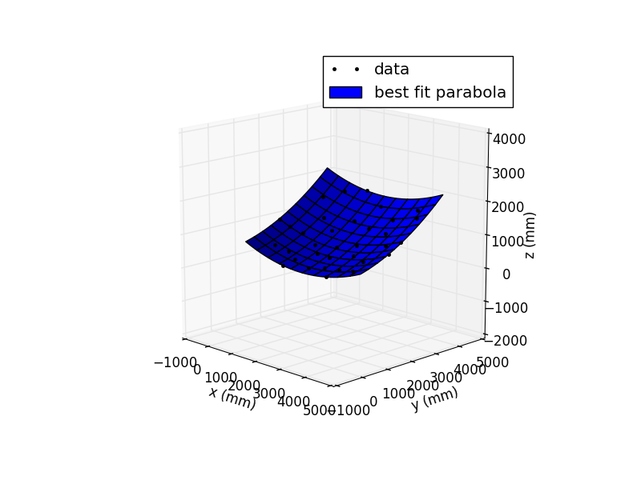
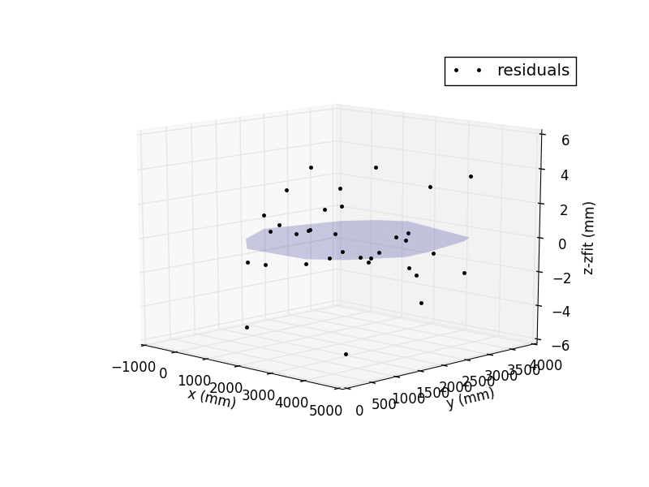

## 7 November 2017 - Dish Surface Shape

### How do we Characterize the Dish Shape?

The idea is to take the data output from PhotoModeler -- an x, y, z point cloud that we hope will form the shape of a parabolic dish -- and fit it to a paraboloid given by

`z(x,y) = (x^2 + y^2) / (4f)`

where `f = 290 cm` is the focal length of our dish (see [this posting](../20160906_dish_parab_params.md) by Paul Stankus).

### With Python, of Course.

Chris Sheehy and I wrote a code `bmxproject/dish/fit_photomodeler_parab3d.py` that uses the scipy.optimize curve_fit function in order to fit our data to a paraboloid.  

The usual prescription for fitting a three-dimensional dataset to a known shape is `T*R*S` where * denotes matrix multiplication.  That is -- scale, then rotation, and lastly translation.  Since the scale is already taken care of in PhotoModeler, we move onto rotation.  This part is described in detail in my [previous posting](../20171107_rotation_matrix_demo/index.md).  Once the data and paraboloid axes are lined up, the code finds the correct translation so that the origins coincide.  The location of the data origin is described in [this posting](../20171106_photomodeler_repeatability/index.md).  

Using all 8 photos from my [previous posting](../20171107_rotation_matrix_demo/index.md), I used the code to create plots of the best fit and of the residuals in z:

