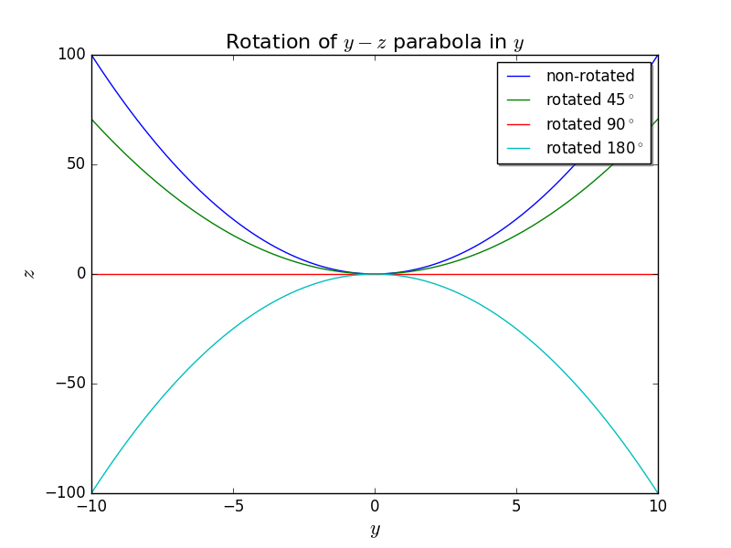
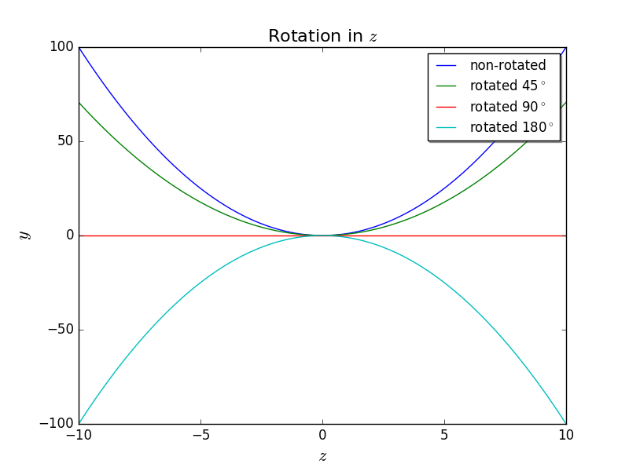

## 7 November 2017 - Rotation Matrix Demo

### The Rotation Matrix and 'U'

If we wish to rotate some matrix U around either the x, y, or z axes (in the CCW direction as defined by the right-hand-rule) -- or all three -- we utilize the three-dimensional rotation matrices

`R(x) = ([1,0,0] , [0, cos(x), -sin(x)], [0, sin(x), cos(x)])`

`R(y) = ([cos(y), 0, sin(y)], [0,1,0], [-sin(y), 0, cos(y)])`

`R(z) = ([cos(z), -sin(z), 0], [sin(z), cos(z), 0], [0,0,1])`

Putting it all together, we rotate some matrix U by the operation

`R(z)*R(y)*R(x)*U`

where * denotes matrix multiplication.

### Rotating Some Data

In fitting the PhotoModeler dish-surface-data to a paraboloid to verify the shape of the dish, it became apparent the confusing nature of rotating objects in python and hence the need to verify that we are doing this properly.  I have written a code `bmxproject/dish/rotation_test.py` that takes the rotation functions from our fitting code and rotates a two-dimensional parabola around x, y, and z axes by angles of 45, 90, and 180 degrees.  One can easily see if the parabola is rotated properly by looking at plots.

It is important to note that, for example, `R(z)*R(y)*R(x)*U` reduces to `I*I*R(x)*U = R(x)*U` in the case that the z and y rotation angles are zero.  That is, a rotation matrix becomes the identity matrix when the angle equals zero.  This is why we can simply use the same `rotmat(x,y,z)` function in our code to rotate a two-dimensional parabola by one axis at a time by letting two of the angles equal zero.

It is clear from these plots that the rotation functions are working properly.

