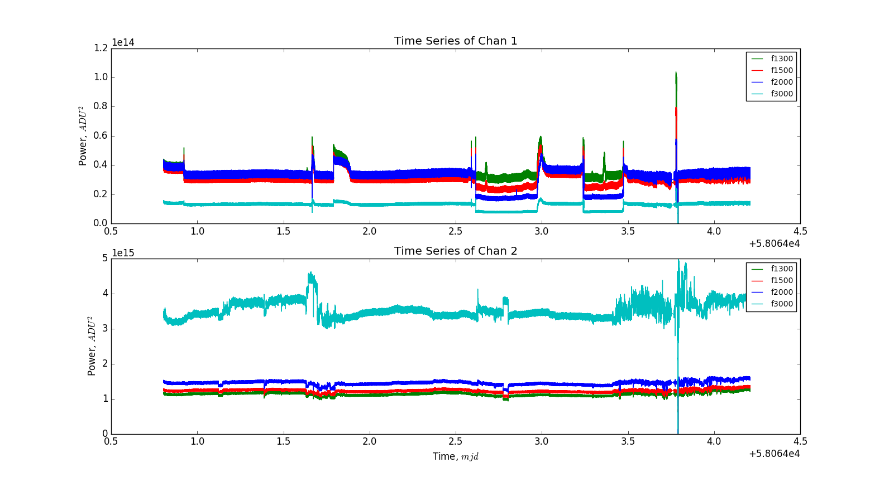
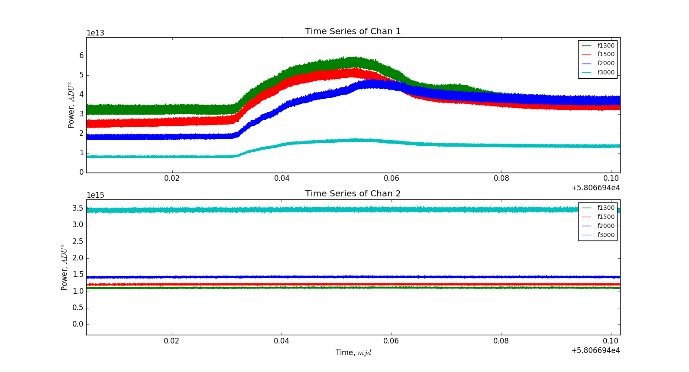
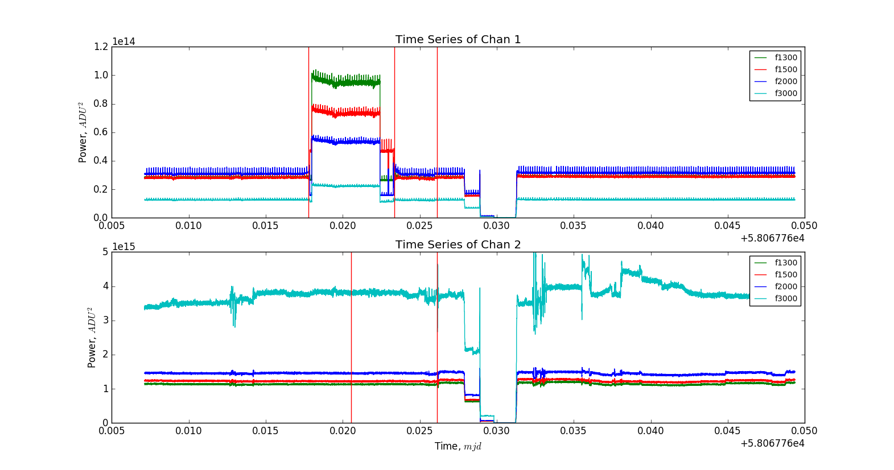
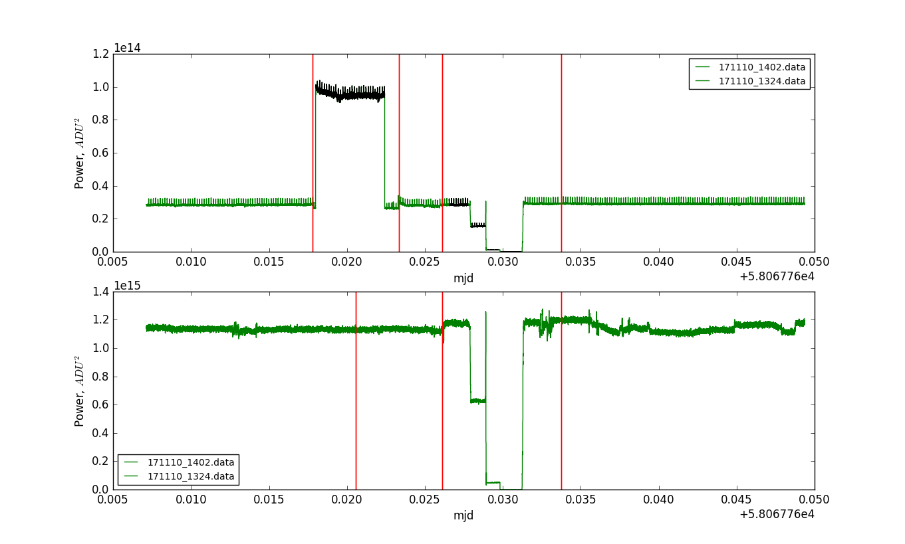
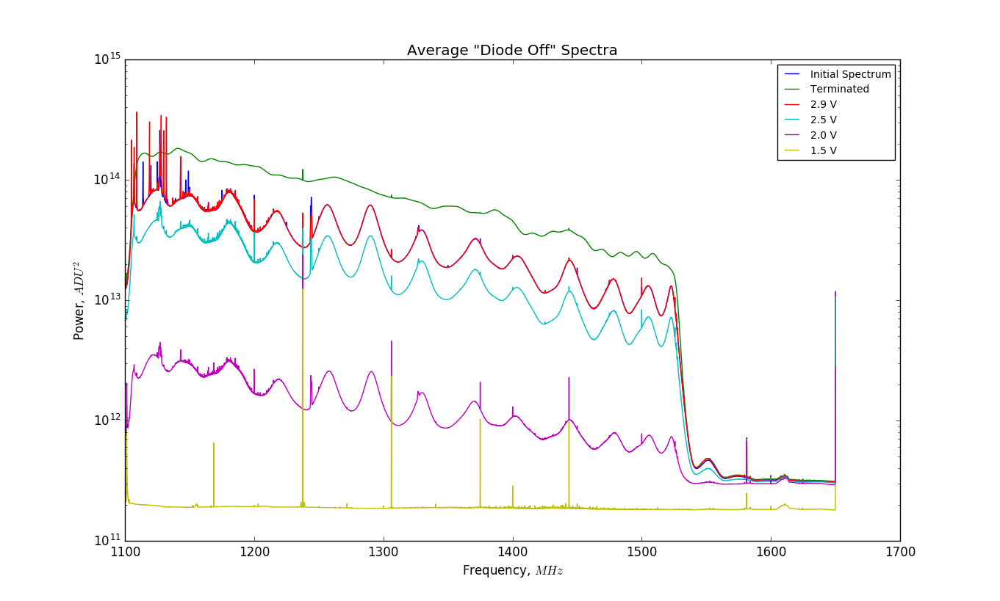
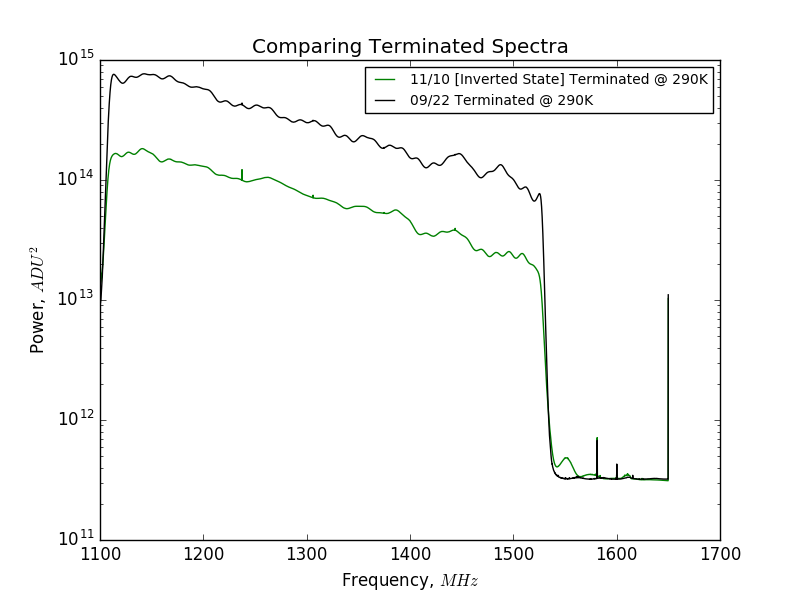
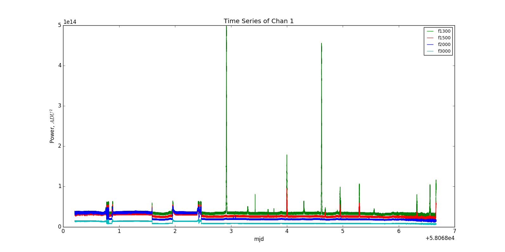

## Nov 17, 2017 - System Behavior in Inverted State

### Current Configuration:

As before, the OMT+Horn is connected via low-loss cable to the output port of a
30dB coupler operating in reverse. The noise diode is connected to the 30dB
port. The input port of the 30dB coupler is connected via low-loss cable to the
amplifier chain as follows:

BP -> LNA1 -> 3dB -> LNA2 -> LP -> Amp3 -> 3ft Cable -> BP -> Data Cable

This data cable connects to a 3dB attenuator, which is attached to the digitizer
card port.

### Data Acquisition from 171107 - 171110:

In my [last posting](../20171106_ResolvedPortIssues/index.md) I determined that
the digitizer card/spectrometer was functioning properly after some initial
hiccups. I allowed the data acquisition to run over the weekend, and examined
the data the following wednesday. The time series of this data acquisition seems
to favor the 'Inverted State', where the collected spectra do not reflect the
expected signal. In order to examine any correlated changes, I plot both channel
1 (SKY) and channel 2 (Terminated inside the front-end box).

The plotted frequency bins are:

1) f1300 = 1274.62MHz - (Green)
2) f1500 = 1301.48MHz - (Red)
3) f2000 = 1368.62MHz - (Blue)
4) f3000 = 1502.89MHz - (Cyan)

**Figure 1: Time Series of Spectrometer Acquisitions (11/07) - (11/10)**

The important plot is the channel 1 behavior, which contains the data from the
OMT+Horn on sky, with the noise diode. It should be clear that the system is
predominantly residing in the 'Inverted State', but something interesting
happened when it made some transitions between states.

Observe the transition from the 'Stable State' to the 'Inverted State' at
approximately 3.0 on the MJD axis. Zooming in for a closer look:

**Figure 2: Slow System Inversion**

We can see the system inverts slowly, instead of an instantaneous change, as
typically observed in the past.

### Probing the System in the Inverted State:

In my discussions with Chris, we outlined several tests we could perform on the
system in the 'Inverted State' to attempt to diagnose this unfortunate
systematic change.

On Friday Nov 10, I was able to perform several tests on the system in the
'Inverted State'. These tests took place at approximately 3.6 on the MJD axis in
figure 1. Here is the time series for the tests, and a description of what transpired.

**Figure 3: Inverted State Tests**

Initially, the system was in the 'Inverted State'. I removed the OMT+Horn from
the 30 dB coupler, and replaced it with a terminator, shown in the first red vertical
line on the channel 1 plot. I later removed the terminator, and reconnected the
OMT+Horn to the sky at the second red vertical line in the channel 1 plot. 

The coincident red lines at 0.027 on the MJD axis in both plots indicates the
time I began power cycling the amplifier chain.

The first vertical line on the channel 2 plot indicates some odd behavior I saw
in plotLive, but didn't amount to anything.

Around 0.034 on the MJD axis, there is a missing Noise Diode chirp, because the
data acquisition was restarted after these tests were concluded. The system
remained in the 'Inverted State' for most of these tests.

In this plot, I will show the regions of the plot I chose as candidates for
spectral analysis, only showing the f1300 curve.

**Figure 4: Candidate Regions**

The regions plotted in black signify selected candidate regions. Additionally, I
took spectra from the 'Inverted State' behavior before these tests were
conducted. (The region near the origin, before the first black region.) The
first region is the terminated spectra, then each power level used when power
cycling the amplifier chain.

The power cycling of the amplifiers included 4 voltages:

1) 2.9V (Typical Value for our System)
2) 2.5V
3) 2.0V
4) 1.5V (Power is so minimal, I stopped here)

The spectrum for these tests is shown here:

**Figure 5: Candidate Region Spectra**

Clearly the spectra indicate that the system remained in the 'Inverted State'
for the duration of the power cycle test, but had different power levels, which
we should expect because we are reducing the gain of the amplifiers by reducing
the offset voltage. 

Additionally, I believe the system remained in the 'Inverted State' when the
terminator was placed on the input, because the terminated spectrum looks quite
different when compared to previous terminated spectra. See these other examples
for a comparison:

1) [Joined Dish Calibration](../20170908_Joined_Dish_Spectrum/index.md)
2) [Calibration from 09/22](../20170922_Calibration/index.md)

**Figure 6: Compare Terminated Spectra**

Here is a direct comparison. I still believe this is the spectrum of the
terminator in the Inverted state, as opposed to a change to the stable state
when the terminator is applied, and a subsequent change when the sky is
reconnected.

### Summary:

In short, despite conducting a number of tests that significantly altered the
state of the system, I was unable to induce a change from the 'Inverted State'
to the 'Stable State'. By attaching a terminator to the input instea of the sky
signal, it initially appeared as though a system change had occurred, but in
comparing this spectrum with previous terminated spectra, I do not believe this
to be the case. 

### Recent Data: Stable State Dominates:

To add to the joys of the unstable system, here is a plot of the data over tthe
past week, which shows early fluctuation and then the system settling into the
'Stable State' for several days! I will also post a plot of the state for all
data combined, with lines separating each data file.

**Figure 7: Time Series from 11/11 - 11/17**

