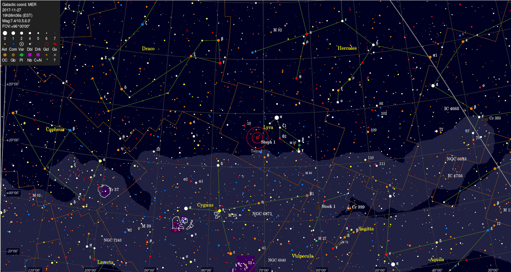

## Nov 27, 2017 - Identifying the Blobs

###Many of the signals on the waterfall plots in the data browser track with the sidereal rate. Let's see what they are:

-The hourly "Calibrated, downsampled" waterfall plots (data) were manually browsed for signals with sidereal recurence. Only data from 11/8 to 11/16 was considered. "Exact"  
 times obtained by eying waterfalls.

-A [python script](https://github.com/jhaupt/Sidereal-Time-Calculator) was written to calculate the local apparent sidereal time for BMX's location, because why not. The longitude for BMX: W 72&deg; 51' 57". 

-The sidereal time for each signal was taken as RA and lattitude (N 40&deg; 52' 8") taken as Dec. An (optical) sky chart shows the corresponding location with a galactic coordinates grid. 

-Sources arranged by apparent source ID. I haven't been able to ID the blips in Lynx (too far from Crab Nebula), Lyra, or Hercules.

-At the bottom find two radio survey images with our target coordinates marked.

-Paul O'Connor points out that all these sources should either be very broadband or correlate well with the 21cm line, and neither is the case. The way the signal "bunches" in frequency is extremely suspicious to me (symmetrical features in frequency, periodicity in frequency, possibly dependence of frequency on flux).

### M31:

Appears on day / local time:  |   Local Sidereal Time 
----------------------------- | ----------------------
20171108 / 21:16 | 00:34:24 
20171109 / 21:12 | 00:34:20
20171110 / 21:08 | 00:34:16
20171111 / 21:04 | 00:34:12
20171112 / 21:00 | 00:34:07
20171113 / 20:56 | 00:34:03
20171114 / 20:52 | 00:33:59
20171115 / 20:48 | 00:33:55 
20171116 / 20:44 | 00:33:51

**Waterfall Sample (20171108 2100):**

**Sky chart centered on RA 00h 34' 24", Dec 40&deg; 52' 8":**

###  Cygnus A / galactic plane:

Appears on day / local time:  |   Local Sidereal Time 
----------------------------- | ----------------------
20171108 / 16:45 | 20:06:36 
20171109 / 16:41 | 20:06:32
20171110 / 16:37 | 20:06:28
20171111 / 16:33 | 20:06:24
20171112 / 16:29 | 20:06:19
20171113 / 16:25 | 20:06:15
20171114 / 16:21 | 20:06:11
20171115 / 16:17 | 20:06:07
20171116 / 16:13 | 20:06:03

**Waterfall Sample (20171108 1600):**

**Sky chart centered on RA 20h 06' 36", Dec 40&deg; 52' 8":**

###  Unknown source in Lyra:

Appears on day / local time:  |   Local Sidereal Time 
----------------------------- | ----------------------
20171108 / 15:41 | 19:02:25
20171109 / 15:37 | 19:02:21
20171110 / 15:33 (in 1402 set) | 19:02:17
20171111 / 15:29 | 19:02:13
20171112 / 15:25 | 19:02:09
20171113 / 15:21 | 19:02:05
20171114 / 15:17 | 19:02:01
20171115 / 15:13 | 19:01:57
20171116 / 15:09 | 19:01:53

**Waterfall Sample (20171108 1500):**

**Sky chart centered on RA 19h 02' 25", Dec 40&deg; 52' 8":**

### Unknown source in Hercules :

Appears on day / local time:  |   Local Sidereal Time 
----------------------------- | ----------------------
20171108 / 13:15 | 16:36:01
20171109 / 13:11 | 16:35:57
20171111 / 13:03 | 16:35:49
20171112 / 12:59 | 16:35:45
20171113 / 12:55 | 16:35:41
20171114 / 12:51 | 16:35:37
20171115 / 12:47 | 16:35:33
20171116 / 12:43 | 16:35:29

**Waterfall Sample (20171108 1300):**

**Sky chart centered on RA 16h 36' 01", Dec 40&deg; 52' 8":**

### Unknown source in Lynx? 

Appears on day / local time:  |   Local Sidereal Time 
----------------------------- | ----------------------
20171108 / 04:34 | 07:53:36
20171109 / 04:30 | 07:53:32
20171110 / 04:24 | 07:51:27
20171111 / 04:20 | 07:51:23
20171112 / 04:16 | 07:51:19
20171113 / 04:12 | 07:51:15
20171114 / 04:06 | 07:49:11
20171115 / 04:02 | 07:49:06
20171116 / 03:58 | 07:49:02

**Waterfall Sample (20171110 0400):**

**Sky chart centered on RA 07h 51' 27", Dec 40&deg; 52' 8":**

### Galactic plane?

Appears on day / local time:  |   Local Sidereal Time 
----------------------------- | ----------------------
20171110 / 00:51 | 04:17:52
20171111 / 00:47 | 04:17:48
20171112 / 00:43 | 04:17:44
20171113 / 00:39 | 04:17:40
20171114 / 00:35 | 04:17:36
20171117 / 00:23 | 04:17:24

**Waterfall Sample (20171110 0000):**

**Sky chart centered on RA 04h 17' 52", Dec 40&deg; 52' 8":**

##408MHz and 21cm Survey Maps:

**408MHz Sky from NRAO (thank you POC), source locations shown:**

**21cm Sky from EBH1S and GASS as compiled by H14P1, M31 shown:**

