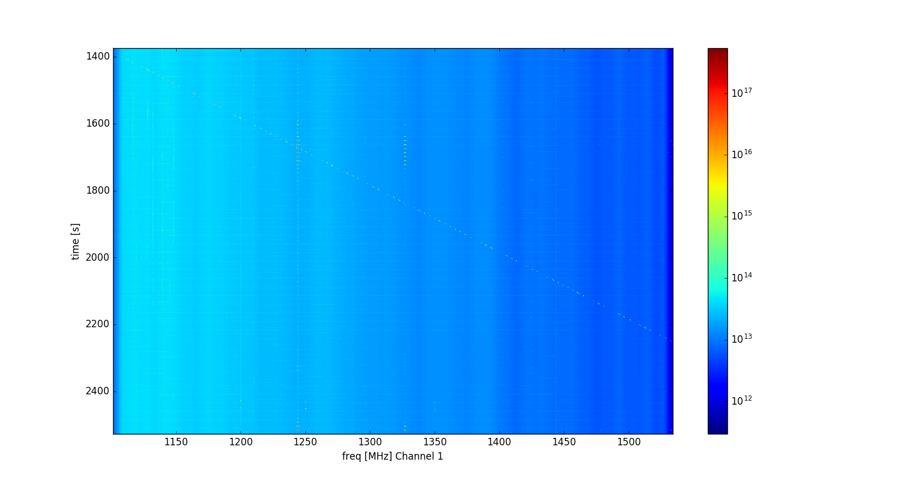
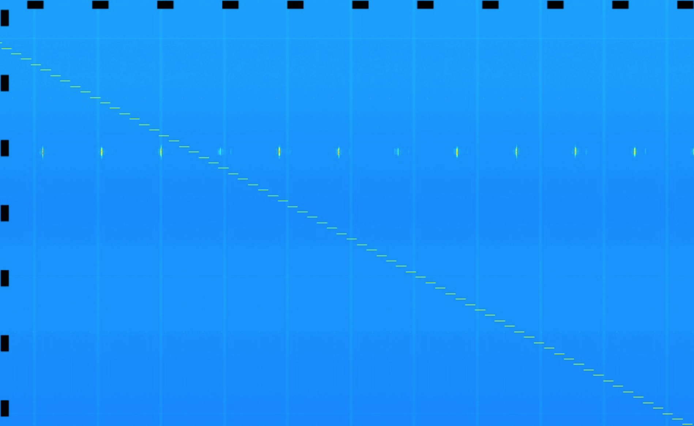
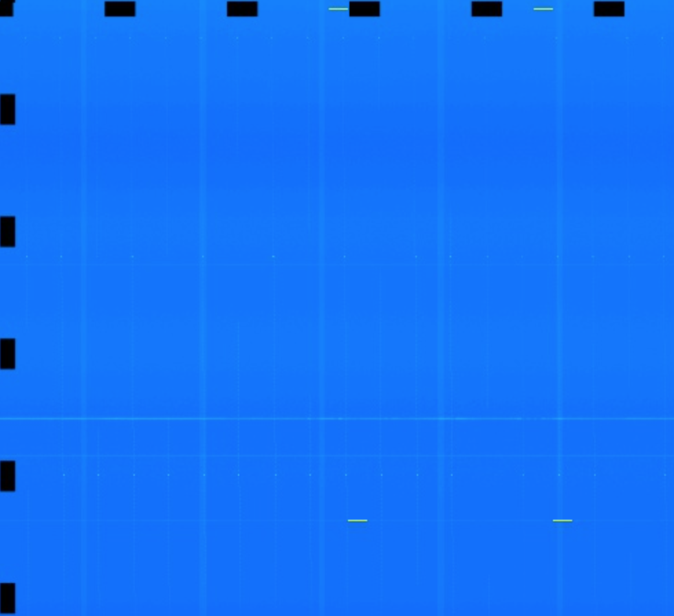

## Dec 04, 2017 - Frequency Sweep

### Basin Signal Generator Tests:

On 11/29/17, I repaired the noise diode by removing the indicator LED. After the
system was back to normal, there was discussion of taking a signal generator out
to the basin, and attempting to broadcast a tone into the dish to see if we
could measure a controlled source of RFI.

On 12/01/17, Paul S, Paul O, Justine, and I ventured out into the basin to
perform these tests, around 9:30 - 11:00 AM. The file in which these tests were
performed is '171201_1514.data'. The easiest way to interact with this data is
via the [BMX data browser](http://www.cosmo.bnl.gov/www/bmx/databrowser/).

Before this data was uploaded, Paul S. and I had a brief discussion of the
waterfall plot, and were able to see the diagonal line of the fine frequency
sweep. Unfortunately, on my waterfall plot it was difficult to locate the coarse
frequency sweep.

**Figure 1: Fine Frequency Sweep**

Here it is visible, but nothing compares to the resolution of the images on the
data browser, which I will take several screenshots of, and include below.

To view the raw, undownsampled waterfall plot in full resolution, please visit
[this link](http://www.cosmo.bnl.gov/www/bmx/databrowser/plots//171201_1514_chan1_0_wfraw_nomask.jpg). 

**Figure 2: BMX Data Browser Fine Frequency Sweep**

This fine frequency sweep begins just before 25 minutes into the data file, and
ends just before 40 minutes. It is clear that the sweep appears as a perfect
diagonal line cutting through the data. The top left corner of this image is the
intersection of the f = 1300MHz gridline, and the t = 30 minute gridline.

**Figure 3: Coarse Frequency Sweep**

It is still somewhat difficult to find the coarse sweep at first glance, but it
occurs shortly after 40 minutes into the data file. The frequency ticks align
perfectly with the spectrometer bin, as Chris stated via Email. This top left
corner here is the intersection of the f = 1400MHz gridline, and the t = 40
minute gridline.

### Summary:

To conclude, the spectrometer detected the emitted signal in real-time, while we
were present in the basin! The system appears to be working as intended, and
moreover,  the digitizer is accurately detecting signals in the proper frequency
bin as demonstrated by the coarse frequency sweep.

To give credit where it is due, Chris's data browser is truly a wonderful
resource, and includes incredibly high resolution pngs of the waterfall plots,
for those inclined.