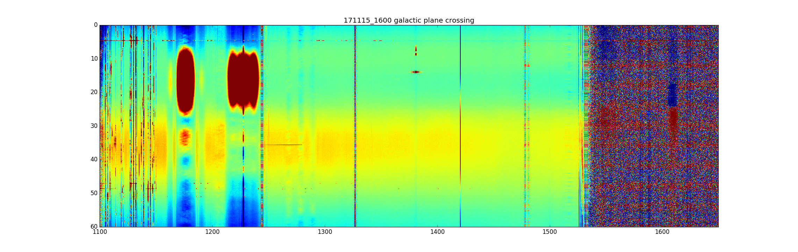
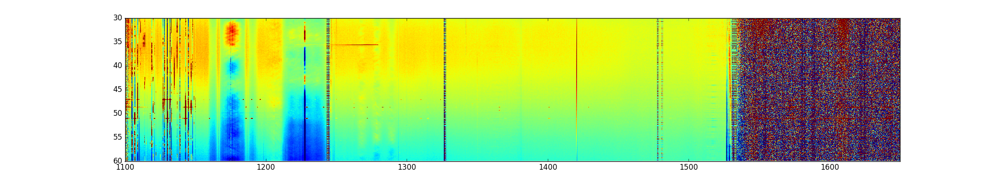

## Dec 04, 2017 - Galactic plane crossing

Chris Sheehy

### 1 - Introduction

The data browser mean filter is plotted on a +/- 1 K color scale. When a source
crosses the beam, the filter drags all the other time ordered data in that
frequency range below the saturation limit of the color scale. Here I look at
the galactic plane crossing of 171115_1600 and expand the color scale. I also
did a median filter instead of a mean filter. This is shown in **Figure 1**.

**Figure 1: Galactic plane crossing on different color scale**

The vertical stripe at 1420 MHz is galactic 21-cm. The galactic synchrotron is
clearly visible as a falling spectrum with frequency at all frequencies. There
is also a point source peaking at t ~ 15 min. The presence of this point source
saturates the galactic synch in the data browser, but here it is visible. The
median filter also reduces the effect of the point source on the galactic synch
after the filter. I also

I then re-did this plot but excluding t<30 min data so that the
point source does not affect the filter at all. This is shown in **Figure 2**, and
the structure looks the same. 

**Figure 2: Same as Figure 1 but only using t>30 min**

We can assume that, at least at this level, galactic synchrotron is a smooth
power law. 
The current observation that it does not appear so in distinct frequency bands, along with the observation
that the point sources have humps in these same bands (always on either
side of 1200 MHz) indicates to me that there is just something we don't
understand about the instrument througput in these frequency bands. The time
structure of the galactic synch in these bands also indicates to me an
interferometic, multipath effect. The horn sees the source reflected off the
dish, but also either directly or reflected off some other object. This might
explain the banding effect we also routinely see in the 1270-1300 MHz band.

