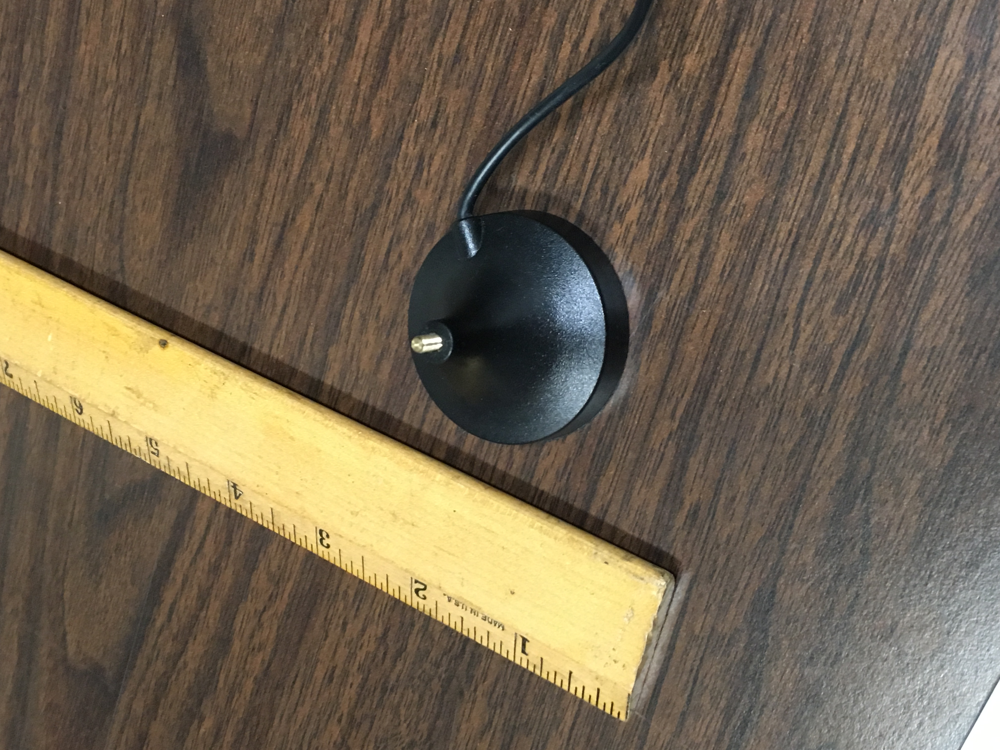
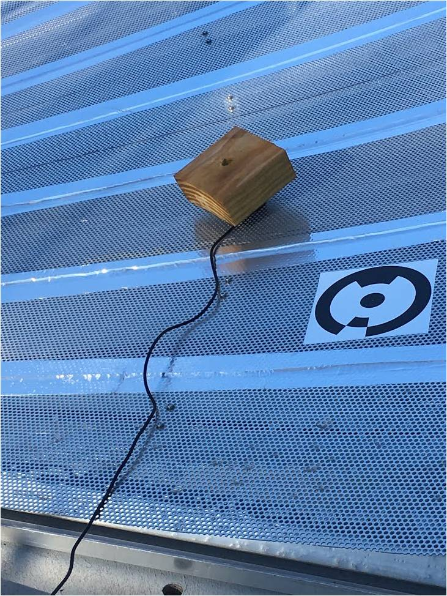
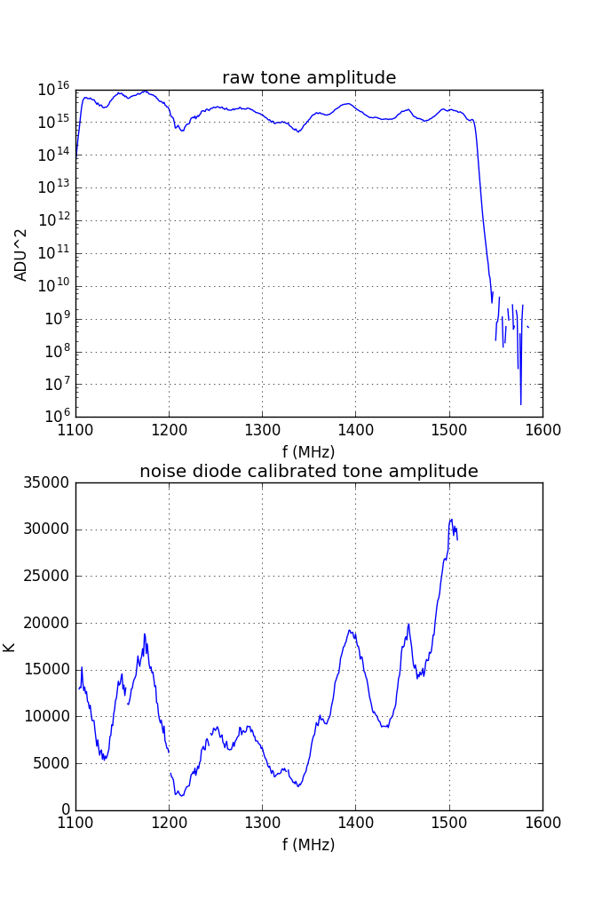

## Dec 7, 2017 - Tone amplitude test

Chris Sheehy

### 1 - Introduction

We are seeing weirdness in the spectra of point sources, and in fixed bands of
the data. See [this posting](../20171204_galplane_crossing/index.md). In
particular, there are two bands at 1200 +/- 25 MHz where point sources appear
very bright. What's more, the galactic synchrotron also looks weird in this
region, and even oscillates in time. I have hypothesized a multipath fringing. I
am investiaging in HFSS and will continue. (So far, putting in a reflective sheet 
beneath the dish+tower does nothing to the beam at 1175 MHz.) In
the meantime, it seems that we might be able to see something in the tone sweep
data that we have.

Paul, Paul, and Will went out to the basin and broadcast a tone sweep using a
dipole antenna. From POC:

>To recoup what was done:
>Laptop + tone generator + whip antenna.
>
>10:15AM tone at 1200MHz, Spartant power -27dBm, + 19dB attenuation. (Too) strong signal seen on the live spectrum display.
>
>10:30 sweep 1100 - 1600MHz in 5MHz steps, 2sec/step, whip antenna 5' away from dish on ground behind absorber box. . Signal clearly seen on the live spectrum, still a little too strong.
>
>10:34 unscrew whip antenna from base, place base on dish, 1 or 2 sweeps. Power now in good range
>10:37 same setup, sweep 1MHz steps 2s/step.
>
>10:54 sweep 1100-1600MHz, 50MHz steps.
>
>10:57 done.

**Figure 1-2: Setup**
 

Will posted images of the waterfall plot from this data. See [this
posting](../20171204_FreqSweep/index.md). 

### 2 - Results
I loaded in this data and
plotted it. (I computed tone on minus off, but this makes almost no difference
because the tone is so bright.) The noise diode was operating, so I computed the gain using the
bmxreduce pipeline code, interpolated it to the frequency comb, and calibrated
the tone amplitudes (ADU^2 -> K). The results are shown in **Figure 3**. 

**Figure 3: Tone sweep amplitude**

There is an inflection point at 1200 MHz, but I don't see anything particularly
funny about 1175 MHz or 1225 MHz. There is an order of magnitude variation in
the calibrated temperature of the tone which we do not see in calibrated on sky 
data when there is no obvious source in the beam (i.e. calibrated LNA noise temperature). 
The noise diode does not calibrate the
horn throughput, but HFSS does not predict significant S11 for the horn, and
[measurements of the OMT + horn S11 bear this
out](../20170915_S-Parameter_Measurements/index.md). It could be multipath
fringing from the dipole antenna reflecting off the dish or other objects, or it
could be polzarization angle effects of the dipole antenna. Or it could be
something else. 
