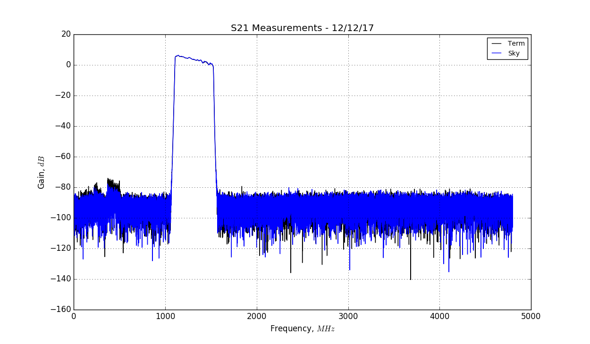
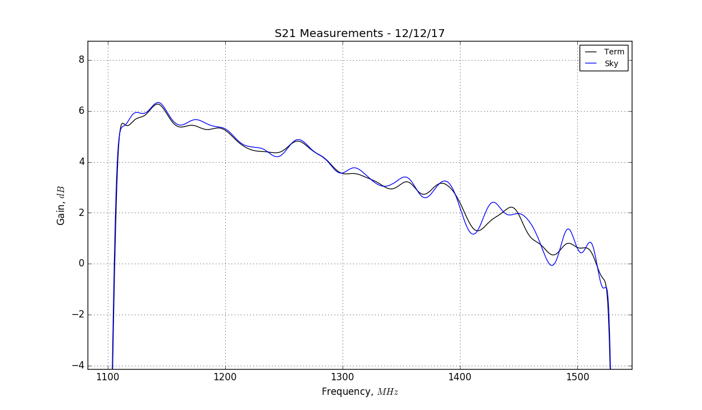

## Dec 13, 2017 - S21 Measurements across 30db Coupler Ports

### Experimental Motivation:

Chris and I were considering possible causes for the state changes, and
identified the 3rd stage amplifier as a potential problem. This amplifier has
the lowest accepted input power of any amplifier in the chain, and seems like
the most likely candidate to be driven non-linear if external RFI is
high. If this amplifier is driven non-linear from bright out of band RFI (this
would have to be strong enough to get past the first band-pass filter,
admittedly) this amplifier could be responsible for gain suppression for in band
frequency signals.

In order to test whether or not this was likely, we devised a VNA test, which
would take measurements of S21 for a signal that originated on the 30dB coupled
port, and was received through the amplifier chain. More specifically, the VNA
signal is emitted from port 1 of the VNA, which is attached to the 30dB
coupled port. This signal is sent through the filters and the amplifier chain,
before being received by port 2 of the VNA.

The only thing that changed from one test to another, is what was placed on the
output port of the coupler. In the first test, the output port was connected to
a terminator at ~298K. In the second test, the output was connected to the
OMT+Horn through the low loss cable. 

If some RFI contamination through the horn was responsible for changing the
response of the amplifier chain (gain suppression), we should see a stark difference between the
S21 signals, depending on what is placed at the output port of the 30dB coupler.

### VNA Measurements:

On the windy, wet, and frigid night of Dec. 12, 2017, from 4:00-6:00 PM, I had the
immense privilege of conducting this test. I first stopped the data acquisition,
and then ran a full calibration of the VNA. The windows laptop decided that a
system update was in order, so I had ample time to prepare the VNA. 

Port 1: Connected to 30dB Coupled Port + 29dB of Passive Attenuators.
Port 2: Connected to Bandpass Filter outside front-end box.
30dB Coupler Output Port: connected to terminator, then to OMT+Horn (as usual).

The VNA signal was emitted from port 1 of the VNA at 20,000 points, across the
full frequency band of the VNA (from ~0.01 MHz to 4800 MHz). I took ameasurement
of S21, the received power at port 2, emitted from port 1.

**Figure 1: S21 Measurement with Terminator and on Sky**

This plot shows the S21 measurement at all frequencies of the VNA. as expected,
the bandpass filter judiciously removes signals outside the desired band. To see
anything of interest, we have to zoom in.

**Figure 2: S21 Measurement in Band**

This plot shows the S21 measurement recorded within our band, and shows some
slight differences between the curves. It is obviously useful to decrease the
vertical scale once more to capture the subtle differences a bit more clearly.

**Figure 3: S21 Measurement in Band (Zoomed)**

At last, we can see the finer details of the in band response at different
frequencies, and identify some subtle changes between the terminated and on sky
system response. 

Unfortunately, I didn't save a trace for when the system had nothing on the
coupler output port. When I disconnected the terminator, oscillatory features
appeared on top of the in band plateau, and resembled a sine wave with a
relatively constant amplitude and wavelength. In addition, these features were also
visible in the rise and fall of the band. One sinusoidal oscillation was present
around -30 dB on either side of the band, near 1080MHz and 1540 MHz. This
oscillatory behavior disappeared when I reconnected the low-loss cable to the
port, which connected the OMT+Horn to the amplifier chain. 

It seems that the on-sky response has some clear oscillatory features,
especially at higher frequencies within the band. However, it doesn't seem like
the terminated and on sky system response is all that different. This test does
not seem to indicate the presence of gain suppression due to the RFI
environment, and may eliminate that explanation.