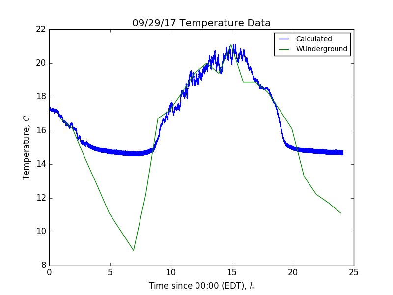
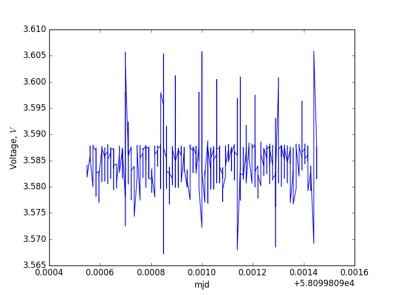
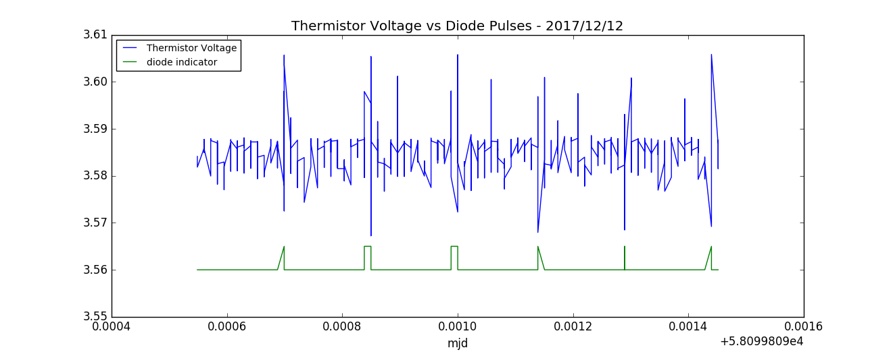
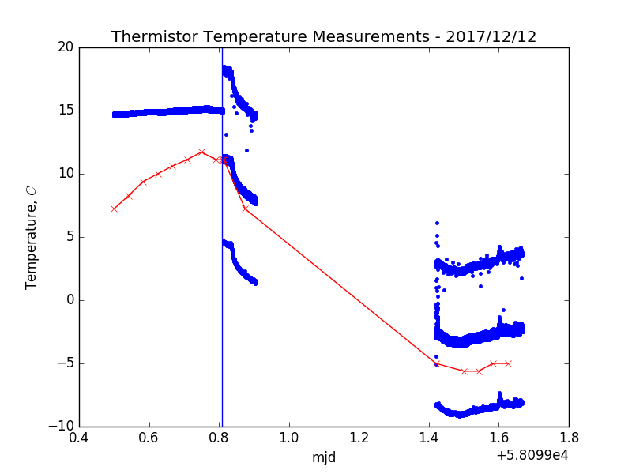

## Dec 13, 2017 - Thermistor Update

### Previous Measurements:

The thermistor was installed and tested on Sep. 29, 2017, further discussion of
the thermistor and these initial tests can be found in the [initial
posting.](../20171002_Thermistor/index.md) The important takeaway from this
posting was that the voltage read across the thermistor was equal to the product
of the fixed current source (200UA) and the resistance of the thermistor, which
decreased as the temperature increased (NTC - Negative Temperature
Coefficient). The voltage measured by the labjack would reach some critical DC
level and saturate, meaning we could not resolve the temperature below around
15C without reducing the resistance or the current. The plot below shows the
temperature as a function of time, for the day of installation. (This plot
appeared in the previous posting:)

**Figure 1: Sep. 29, 2017: Temperature Measured via Thermistor Resistance**

The temperatures are matched fairly well, except when the outside temperature
drops below the saturation limit of the labjack for measuring DC voltage.

### Changing Fixed Current:

On Dec. 12, 2017, I reduced the measured DC voltage by reducing the fixed current
source, from 200UA to 10UA (both of these ports are present on the labjack.)
This reduced the measured voltage as expected, but may have introduced some other
problems. The measured voltage has a typical level, and sharp negative and
positive spikes which occur routinely (correlated with the diode?)

**Figure 2: Dec. 12, 2017: Measured Voltage vs Time**

In order to examine if these pulses were somehow correlated with the noise diode
pulse, I directly compared the two on the same axis using their MJD flags. There
was some rescaling to show the voltage fluctuations and the diode indicator
height (normally a delta function, height of 1). 

**Figure 3: Dec. 12, 2017: Measured Voltage and Diode Pulses**

It seems clear that the erratic changes in diode voltage are well correlated
with the diode duty cycle. There are other erratic spikes in between these
pulses as well, which I don't have an explanation for just yet. The inconsistent
shape in the diode pulses (delta, tophat, sloped rise) are all due to the mjd
flagging being discretized in such a way that two or more adjacent data points
may share the same mjd value (this is okay).

One potential problem which was noted in the last posting, was that the 'minimum
current' listed for the thermistor is 600UA. We were previously operating at
200UA, which is below this threshhold. Now, we are operating at 10UA, which is
even lower. However, we still are able to measure temperatures via the
thermistor, as shown in the next section.

### Temperature Measurements at Lower Fixed Current:

This plot compares the temperature values from
[weatherunderground](https://www.wunderground.com/history/airport/KHWV/2017/12/13/DailyHistory.html?req_city=&req_state=&req_statename=&reqdb.zip=&reqdb.magic=&reqdb.wmo=)
to the temperature calculated from the measured labjack voltage across the
thermistor.

**Figure 4: Dec. 12, 2017: Temperature Comparison to WUnderground**

The red line, with points marked by X, is the temperature reported by
weatherunderground. The blue data points represent the temperature calculated by
the Beta-parameter equation (see last thermistor posting linked above) for our
thermistor. 

The blue vertical line indicates the time when I changed the current source, and
restarted the data acquisition. 

Prior to changing the fixed current source, the measured voltages were
completely flat at the saturation value. This corresponded to a measured
temperature of ~15C, which was higher than the temperatures reported by the
weatherunderground website for Shirley, a few miles from BNL. After changing the
source, we see three distinct populations of points which appear as continuous
bands in temperature vs time plots. The top population (high temp) is from the sharp
negative spikes in voltage which occur as the noise diode pulses (Low V implies
Low R implies High T). The bottom population (low temp) is from the sharp positive voltage
spikes which also occur with the diode pulses (High V implies High R implies Low
T). The middle population is likely the most accurate of the three, as it comes
from the consistent background voltage that isn't correlated with the diode
pulses.

The large gap in the data is from when I couldn't restart data acquisition and
needed someone else (Anze) to restart remotely. Data points to the right of this
divide are from Dec. 13, 2017.

I think these measurements show good agreement with the reported temperatures,
which themselves aren't entirely accurate for our purposes and are recorded at a
somewhat different location. I could potentially mask out voltage points recorded near the diode,
but there would still be some strong outliers due to seemingly uncorrelated pulses.