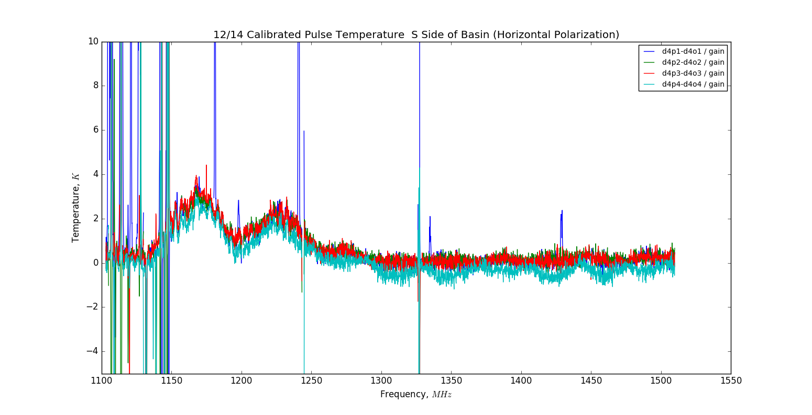

## Dec 15, 2017 - Noise Diode Tests: 'Optical Gain'

### Experimental Motivation:

Chris and I wanted to examine the telescope's response to a broadband signal, so
we used the log-periodic antenna in the basin to broadcast an amplified signal
from a noise diode. 

### Broadcast Equipment/Setup:

**Figure 1: Log-Periodic Antenna + Power Supply + Noise Diode + Amplifier **

These images show the equipment utilized to conduct this test.

### Waterfall Plot of Spectrometer Data from the Experiment:

**Figure 2: Waterfall Plot from Data Aqcuisition**

The colorscale of this plot is highly exaggerated in order to show the detected
signal, which was not very strong relative to the background level.

Notice the horizontal lines running across the waterfall plot. These lines are
the broadcast signal from the diode, recorded by the spectrometer at various
positions. The duty cycle for these tests is described in Chris's notes:

	   3:48 New file
	   Going to blast with noise diode + 0-1500 MHz amp (the one we use with the yogi and the inc cable)

	   Test procedure:
	   10s on, 10s off for 1 minute, starting with yagi in horizontal plane
	   Then repeat with yagi in vertical plane

	   Viewing from underneath tower, facing dish (north)
	   3:59 - yagi in NE corner lip of basin
	   4:10 - N edge of basin (directly behind dish)
	   4:20 - E edge of basin
	   4:29 - S edge of basin (directly behind me when facing dish

	   4:34 stop daq

In order to extract the spectra from these tests, I first identified the
timestamps for each 10s on/off pulse, and extracted the middle 6 seconds in
order to eliminate the rise/fall of the noise diode signal. The process is shown
visually here:

**Figure 3: Waterfall Plot for a Single On/Off Pulse Location**

This plot shows the diode pulsing on and off for the horizontal polarization at
the NE corner of the basin. This is just an example of how the spectra were
extracted for the other locations.

**Figure 4: Waterfall Plot for a Single On/Off Pulse Location w/ Indicator Lines**

Each horizontal blue line marks a time used to separate the start/stop of the
pulse on/off which had extracted spectra.

### Raw Spectra:

Here I will show the extracted mean spectra for the horizontal polarization
pulse tests at all four broadcast locations (NE, N, E, S). For each plot, there
are 4 mean spectra for the diode on, and four mean spectra for the diode off, to
show the consistency between these pulses. These spectra are the raw data from
the spectrometer.

**Figure 5: Raw Spectra from Pulse Tests (Horizontal Polarization)**

### On - Off Spectra:

Here, I show the difference between the spectra shown previously. The background
level (diode off spectrum) is subtracted from the broadcast+background spectrum,
to yield the contribution from the diode pulse broadcast.

**Figure 6: On - Off Spectra: Contribution from Diode Pulse**

### 12/14 Inverted State Gain Calculation from BMX Data Browser:

We want to remove the amplifier gain from this measurement, and calculate the
brightness temperature of our detected signal. The spectra above are in squared
analog-digital units (power), so dividing by the gain (squared analog-digital
units / K) will yield the brightness temperature for each frequency in our
bandwidth. This gain curve comes from 171214_1500_reduced.data.npz.

This gain curve was calculated from the calibrated noise diode pulses for a
different data file, which are inserted after the OMT+Horn. 

**Figure 7: Gain Curve for the Amplifier Chain**

### Calibrated Pulse Temperatures:

**Figure 8: Calibrated Pulse Temperatures**

