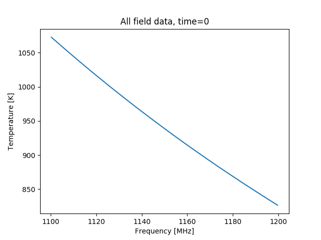
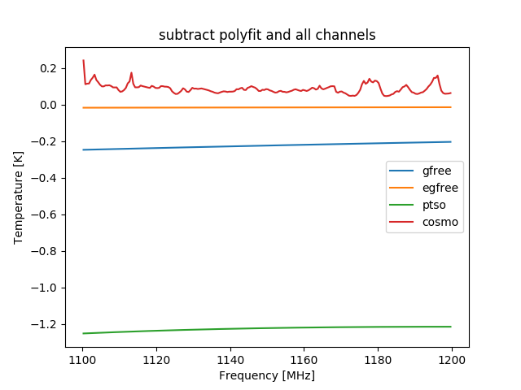

# Dec 15, 2017 - Simulation Data

The simulation data is generated with bmxsim from CRIME data. The CRIME data fields include cosmo, gfree, gsync, ptso, egfree.

## 1. Full illuminated

Fig 1. Cosmo image plot:

Fig 2. All fields image plot:

To see it clearly, I plot cosmo and all field data at time 0.

Fig 3. Cosmo time 0 plot:

Fig 4. All fields time 0 plot:

We can see two features from the above plots:
- The value of all field data is much bigger than cosmo data.
- All field data is much smoother than cosmo data.

Fig 5-6. Each field data:

Foreground = gsync + gfree + egfree + ptso

Foreground and gsync have a higher magnitude, so I plotted them individually.

To get the cosmo data from all field data, I make a polynomial fit of degree 3 on each field of the data, and subtract the polynomial curve from the each field data.

Fig 7. Each field data subtracted with polynomial fit of degree 3

## 2. Infinite full illumination frequency

Fig 8. Cosmo image plot:

The cosmo image data is slightly higher than the illuminated image, although the shape is similar.

Fig 9. All fields image plot:

Fig 10. Each field data subtracted with polynomial fit of degree 3

The point source field and the galactic synchrotron field introduce noise higher than the cosmo field, so it's not possible to extract cosmo field signal from the all-field data.

## 3. Infinite nu_f from 1290MHz to 1420MHz

These figures are plotted with CoLoRe data.

Fig 11. Cosmo image

Fig 12. All field image

Fig 13. Subtracted with polyfit

