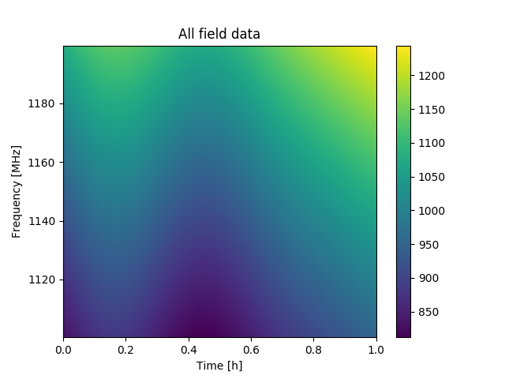
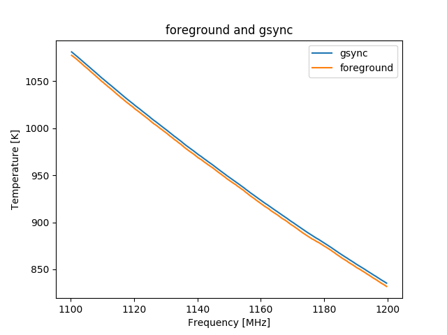

# Dec 15, 2017 - Simulation Data

The simulation data is generated with bmxsim from CRIME data. The CRIME data fields include cosmo, gfree, gsync, ptso, egfree.

## 1. Full illuminated

Cosmo image plot:

All fields image plot:

To see it clearly, I plot cosmo and all field data at time 0.

Cosmo time 0 plot:

All fields time 0 plot:

We can see two features from the above plots:
- The value of all field data is much bigger than cosmo data.
- All field data is much smoother than cosmo data.

To get the cosmo data from all field data, I make a polynomial fit of degree 3 on the all field data, and subtract the polynomial curve from the all field data.

Each field data and subtracted data:

Foreground and gsync have a higher magnitude, so I plotted them individually.

All field data minus polynomial fit gets the subpoly data normalized to zero, while the mean value of cosmo data is not zero. Note that the bias value is unknown in a real environment.

## 2. Infinite full illumination frequency

Cosmo image plot:

The cosmo image data is slightly higher than the illuminated image, although the shape is similar.

All fields image plot:

Each field data and subtracted data (polynomial fit of degree 3):

Foreground and gsync:

The point source field introduces noise to the subtracted data, so the polyfit subtraction doesn't work.

## 3. Using a plain neural network to predict the bias

To recover the bias of the cosmo field from subtracted data, I created a four-layer fully connected neural network with pytorch. The neural network takes the subtracted data as input. I generated 24-hour data, traind the neural network with 23-hour data and tested it with the rest one-hour data. The result looks good. This neural network can't deal with the ptso noise in the infinite nu_f either.

