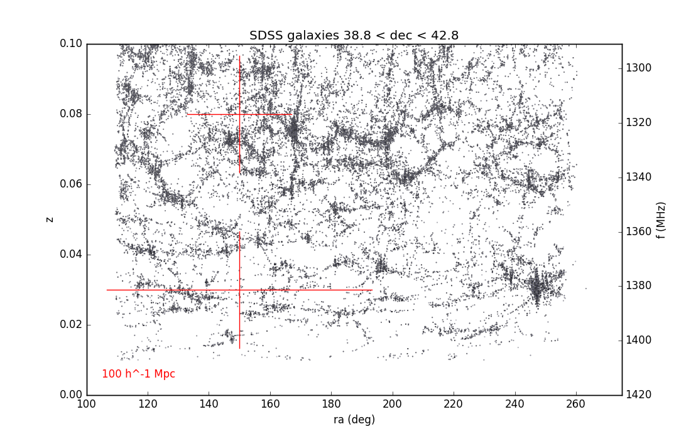
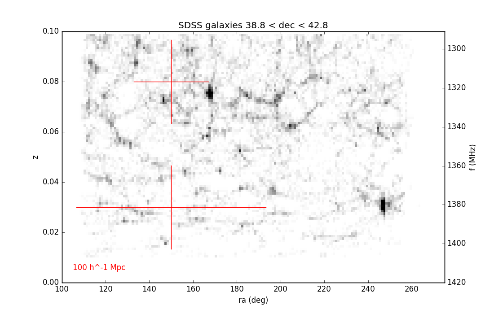
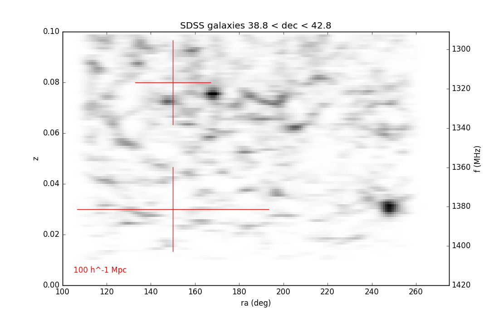

## Jan 2, 2018 - SDSS Galaxies in BMX stripe

Chris Sheehy
<hr>

### 1 - Introduction

We want to cross correlate 21-cm with the known distribution of galaxies. We do
not currently understand the response of our system, but it appears that above
1300 MHz things are pretty clean. With a month of data, we might be able to do
something. At the very least, starting a cross correlation analysis now will
help us build the machinery. As a first step, I grabbed the SDSS galaxies in our
field, made a catalog, and plotted them up to z=0.1. This is the pattern of
large scale structure we should directly see in our waterfall plots.

<hr>

### 2 - SDSS Query

I went to the SDSS DR10 webpage and generated a catalog of galaxies with the
following SQL query:

```
SELECT ALL
ra, dec, z, zErr, psfMag_u, psfMag_g, psfMag_r, psfMag_i, psfMag_z
FROM SpecPhoto
WHERE
dec>35 AND dec<45 AND
z<0.1 AND z>0.01
AND class='GALAXY'
```

This returned 44625 galaxies. They mosty fall into a range RA = 110-260. There
is another narrow stripe at smaller RA which I have excluded. BMX nominally
points at Dec = +40.8 deg and the beam is roughly 4 degrees, so I selected all
galaxies at 40.8 +/- 2 degrees in this range. I then made a scatter plot of z
vs. ra. This is shown in **Figure 1**. The z axis is corect. The frequency axis on
the right is scaled linearly between z=0 and z=0.1, which is a (pretty good)
approximation. The color scale of the points is normalized such that black
(white) are the min (max) r magnitude of the galaxies being plotted. This makes
very little visual difference. I also added lines that are approximately the LOS
and transverse physical scale 100 h^-1 Mpc (so divide this number by 0.7). 

**Figure 1: SDSS Galaxies in BMX stripe**



There is clearly a lot of structure here we can correlate with. 
Next I binned in "pixels" of delta RA = 1 and delta z =
0.001, which corresponds to about 1 MHz. This is shown in **Figure 2**. Lastly,
I approximated beam convolution by convolving each row of this image with a 4
deg FWHM Gaussian. This is shown in **Figure 3**. In reality, we will properly convolve
with the 2D beam without first collapsing the galaxies in declination, but this
should be a good approximation.

**Figure 2: SDSS Galaxies binned in "pixels"**



**Figure 3: SDSS Galaxies convolved with beam**


