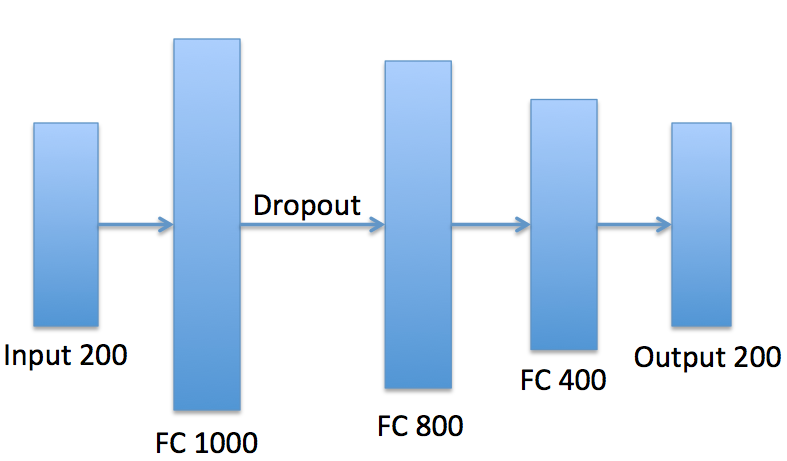
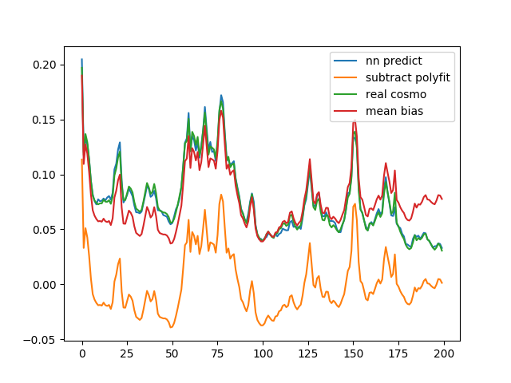
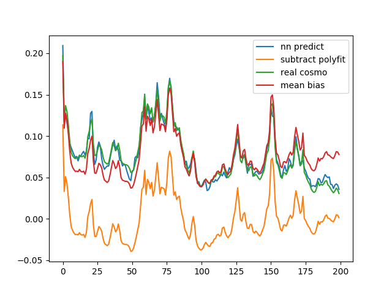

# Using a neural network to extract the cosmo field

## 1. Neural network concepts

A **neural network** consists of an **input layer**, some **hidden layers** and an **output layer**. The layer number of a neural network doesn't count in the input layer, because the input layer doesn't modify the data.

A **fully connected layer** is an affine transformation of the input followed with a **ReLU** function. The definition is .

 - Y is the output of the layer.
 - X is the output of the previous layer.
 - W (weight) and b (bias) are the parameters that are waiting for training.
 - W has the shape of (len(X), len(Y)).
 - b has the shape of (len(Y)).

The **input layer** has the same size with the input data.

The **output layer** is a fully connected layer without a ReLU function. The size of the output layer is the same with the output data.

The **ReLU** function is an activation function which adds some nonlinear factor to the network, so that the network can solve nonlinear problem. There are some other kind of activation functions. ReLU is proved to be the most efficient one in most case.

ReLU function definition

**Dropout** is an optimization method to prevent the network to be overfitting. It masks out by default 50% output of a layer. It does not have any training parameter.

**Loss function** is a measurement function of how bad the network does. In most case the lower, the better. We calculate the partial derivative of the loss function with respective to each training parameter.

The loss function I use is Mean Square Error (MSE) function, also called L2 function:

 -  is the known result.
 -  is the output of the network.

There are several optimization algorithms to update the training parameters. The one I use is **Adam**, which is introduced in [arXiv:1412.6980](https://arxiv.org/abs/1412.6980).

## 2. The neural network structure

The neural network is a 4-layer fully connected network. The function is to do a regression task to guess the real cosmo field signal.

## 3. Training and result

Since one cycle of the simulation output is 24 hours, the network takes 23-hour all-field data subtracted with polyfit as the input, 23-hour cosmo data as the known result to do the training. The rest 1-hour data is used to test the network.

I tried several network structure. These are the result for the network with and without dropout.

Network with dropout:

Network without dropout:

