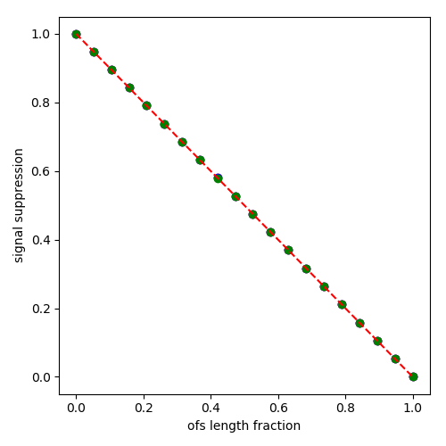
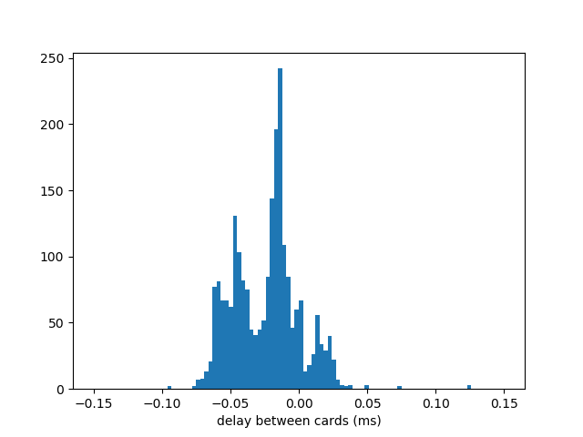

### Thoughts on digitizer synchronizations

A Slosar

If the digitizer frames are not perfectly aligned, any
cross-correlation will be lossy.  The problem is made significantly
simpler by the fact that we are completely uncorrelated noise
dominated, so any loss of SNR are coming purely from signal
suppression due to not-perfectly alignted data-frames. I confirmed
that SNR in that limit just goes down with the fraction of total
sample length that is misalinged with [explicit numerical
simulation](./syncSNR.ipynb) (and also confirmed that things are much
more complicated when variance is signal dominated).  This plot shows
this:

In Hindy's [last
post](..//20180601_ADC_Synchronization_Part_2/index.md) we see that
that intra-card timing is about 0.1ms.

So, it i seems that as long as our samples are longer than 10ms, we
should be fine. 

## Intra-machine synchronization

This is more difficult as we want to synchronize them to roughly the
same accuracy. NTP offers sub-ms synchronization, but I really think
there are simple solutions that should work.

When full array mode, one machine will be leader, the other follower. 
I suggest the following algorither:
 * On follower machine, the daq start will open socket and wait for signal from leader
 * The leader will signal master that it has come online and both will initialize their cards (this is the time consuming step)
 * the master will first exchange 10 packets with the follower, measuring the round-trip time (i.e follower waits for the packet and sends one back as soon as it comes)
 * Then the master will send a start-gun packet, wait for half the round trip time and start data aquisition
 * Follower will wait for the start-gun packet and stard data acquisition immediately.

I do think that this should lead to a pretty good synchronization, but
this is something we want to check. 

## Conclusion:

It seems that the two cards are synchronized within .1 ms of each other.                                                                                      
