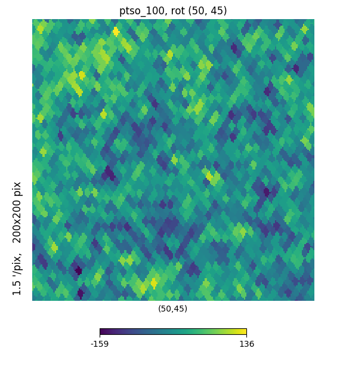
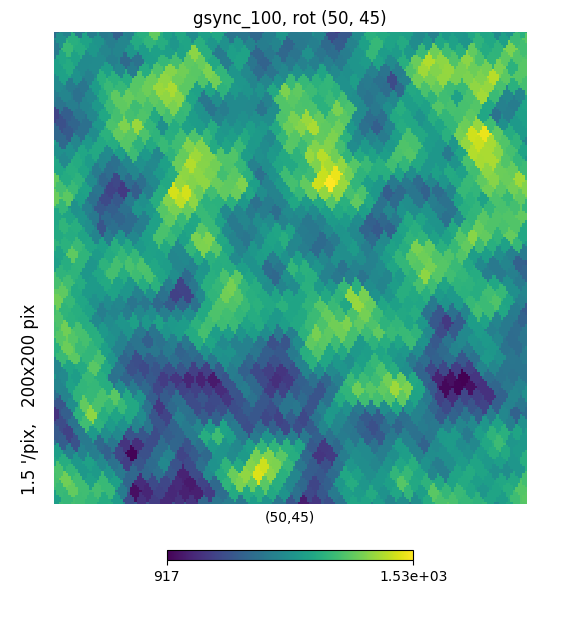
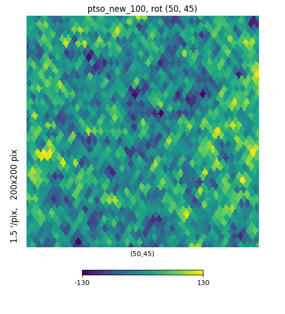
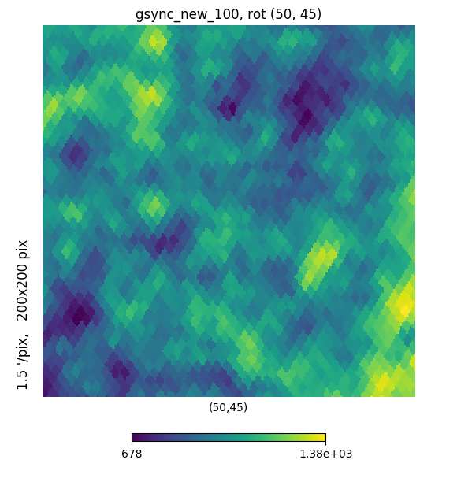
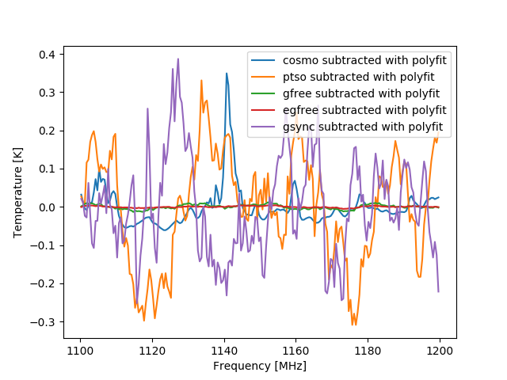
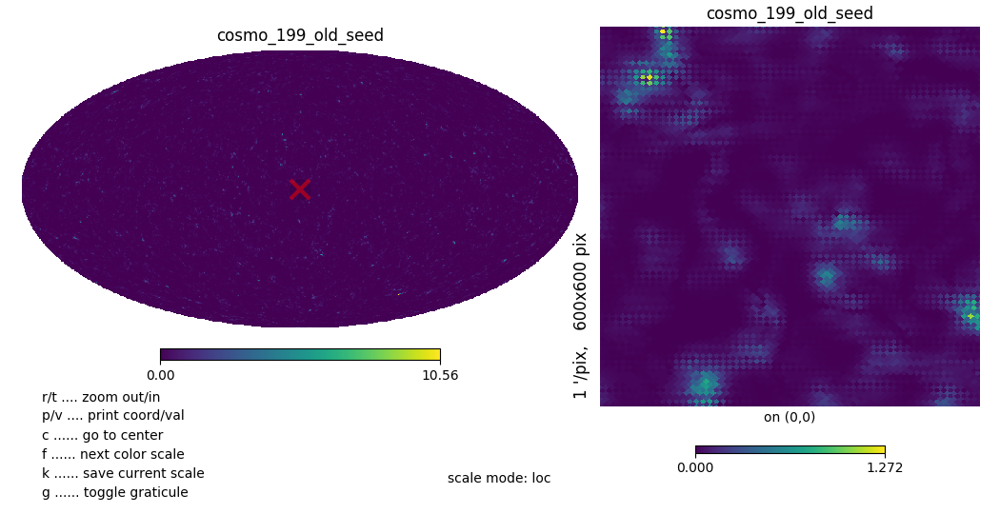
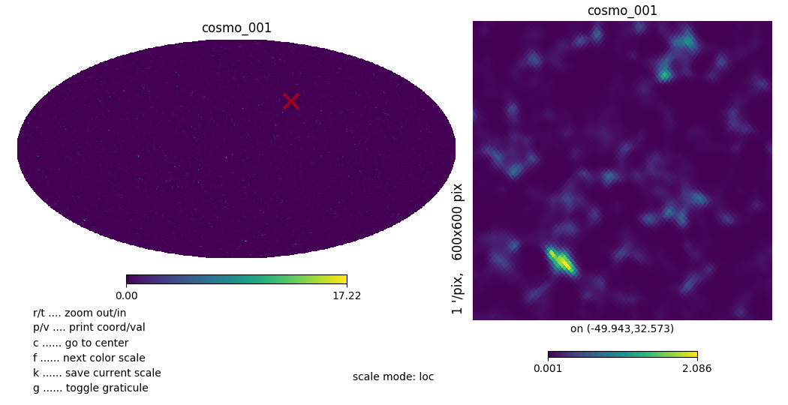
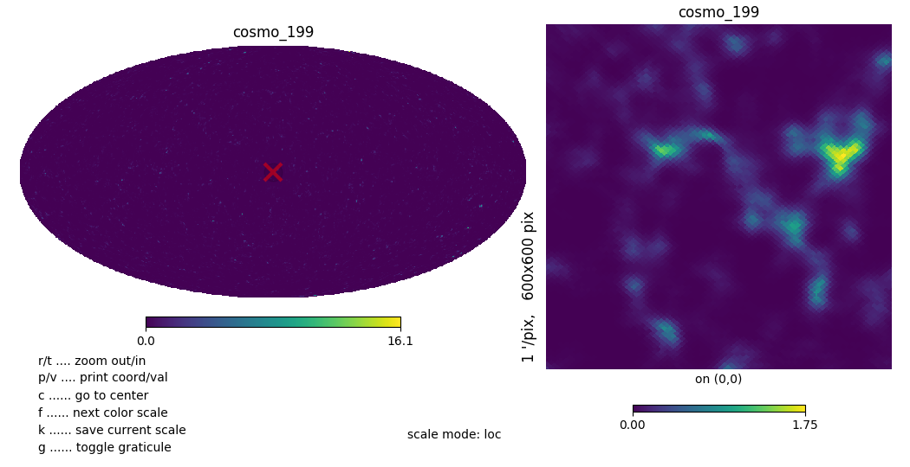

# ptso and gsync correlation

In the previous [posting](../20171215_simulation/index.md), Figure 10 shows an unexpected strong correlation between ptso and gsync. The cause is that the maps themselves are correlated, and the underlying cause is that the maps are generated with the same RNG seed.

## 1. Maps correlation between ptso and gsync

We can see strong correlation between these two maps.

Figure 1-2. The two maps generated with the same RNG seed

These two maps are

Figure 3-4. New ptso and gsync maps

## 2. Comparision of the fields subtracted with polyfit

Figure 5. Polyfit subtracted plot with old map

Figure 6. Polyfit subtracted plot with new map

The cosmo field in Figure 6 is also read from new map.

## 3. Side-effect of checkerboard artifacts

After the cosmo maps are regenerated with new RNG seed, the checkerboard artifacts disappear.

Figure 7. cosmo 001 of frequency 1100MHz with old RNG seed

Figure 8. cosmo 001 of frequency 1100MHz with new RNG seed

Figure 9. cosmo 199 of frequency 1199MHz with new RNG seed

