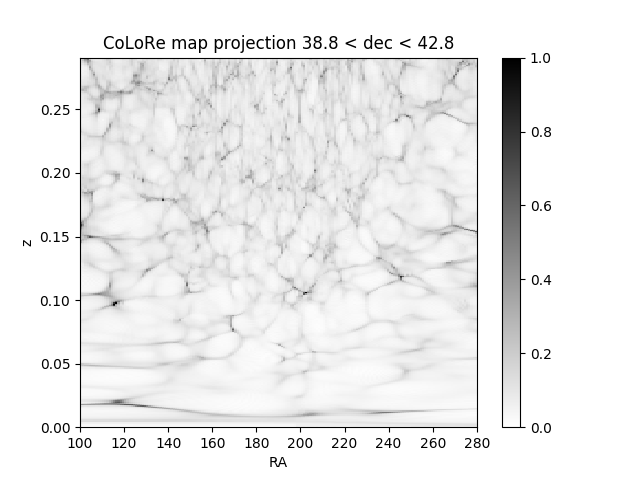
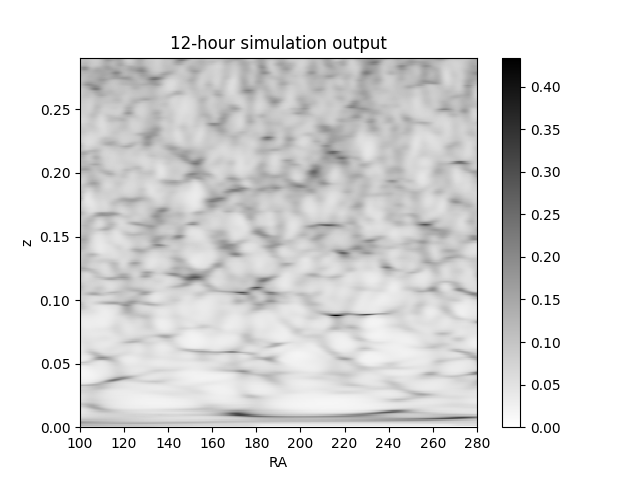
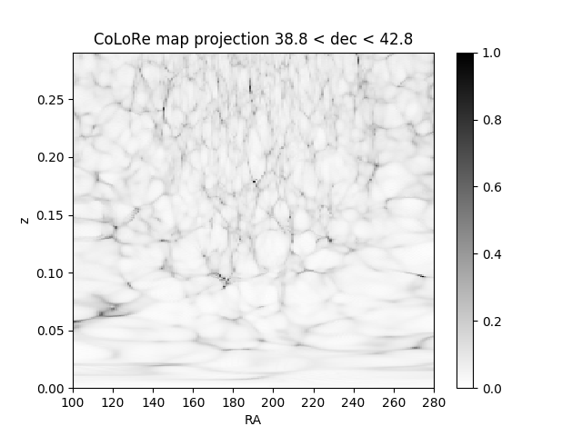
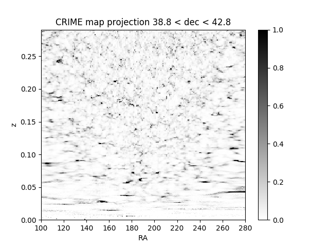

# simulation output with SDSS correlation

In this posting, I'm trying to generate similar maps

Two plots are generated from CoLoRe maps and from simulation.

Figure 1. Generated from CoLoRe and gnomonic projector

Figure 2. Generated from bmxsim

The two figures look different. The cause may be something wrong with the projector parameter. Healpy projector accepts RA range from -180 to 180, while astropy accepts RA range from 0 to 360. I choose the RA range of 100 through 180 to -80 for Figure 1 and 100 through 180 to 280 for Figure 2. The healpy resolution is 60 arcmin, so the xsize and ysize represent RA and Dec degrees. The two figures also look like a shift of each other, but not very clear.

The script to generate Figure 1 is [here](sdss_process_colore.py).

The start time of bmxsim is changed to Time('2016-08-01 00:00:00')+14.84*u.hour. Using astropy to convert the Alt Az coordinate to RA Dec, I get (100.10,  40.90). Then running bmxsim for 12 hours gives the result in Figure 2.

The script to plot Figure 2 is [here](sdss_process_sim.py), which is almost the same with Figure 1.

## RNG seed influence for CoLoRe

Figure 3. CoLoRe maps with new RNG seed

This plot is generated using the same script with Figure 1 and new CoLoRe maps.

## CRIME comparison

Figure 4. Generated with CRIME and gnomonic projector

From this figure we can find that CRIME maps have different feature with CoLoRe maps.