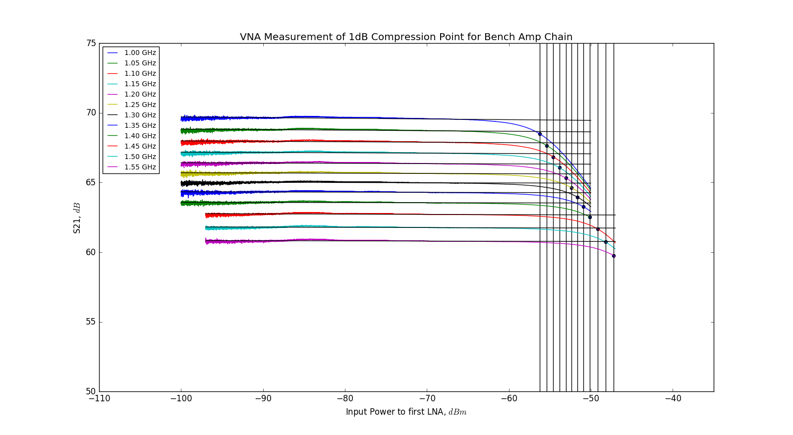
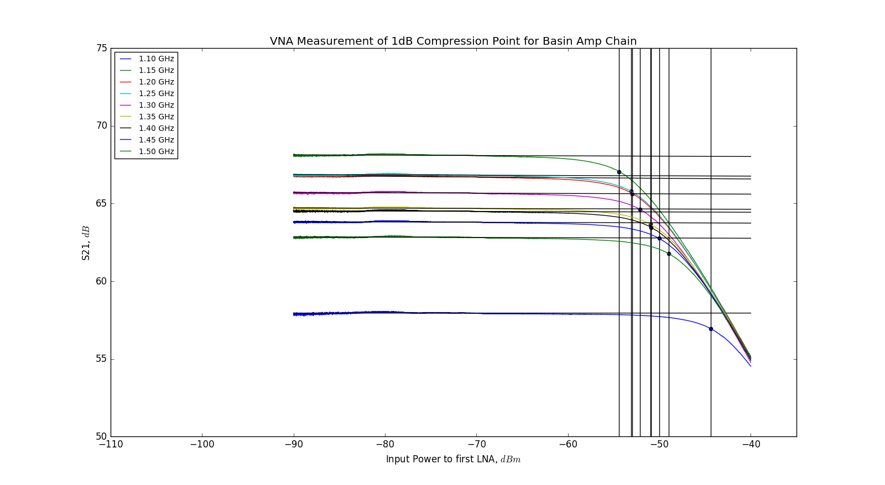

## Jan 19, 2018 - VNA Power Sweep  Measurements & Power Meter
### Current Front End Configuration in Basin (Working Channel):

Below is a list of components, in order of appearance in the front end of the
experiment:

  -------------------------
  Sky
  OMT+HORN
  -------------------------
  Low Loss Cable 1 
  30dB Coupler
  Barrel
  Low Loss Cable 2
  Front End SMA Input Port
  Band Pass Filter 1 
  Barrel
  LNA#1 	
  3dB Attenuator
  Barrel
  LNA#2
  Barrel		
  Low Pass Filter	(VLFX-1350)
  Stage 3 Amplifier
  36in Data Cable
  -------------------------
  Front End SMA Output Port
  Barrel
  Band Pass Filter 2
  156in Data Cable
  -------------------------

### Bench Amp Chain Configuration:

Chris suspected that the amplifier chain in the basin was being driven
non-linear by out of band power that was surpassing the filters. In order to
test this possible explanation, we first wanted to construct an amplifier chain
on the bench, and examine the performance of inividual amplifiers. We speculated
that the stage 3 Amplifier would be the first to approach nonlinearity, due
to its maximum accepted input power of -15dBm, whereas the LNAs accept +20dBm.

The amplifier chain I constructed on tuesday Jan 16, 2018 was as follows:

  -------------------------
  Terminator (or Open)
  LNA#1
  Barrel
  3dB Attenuator
  LNA#2
  Barrel
  Low Pass Filter (VLF-1400+)
  Stage 3 Amplifier
  -------------------------

Unfortunately, the low-pass filter used on the bench is not the same filter used
in the front-end box, and there were no band-pass filters to use. 

### Power Meter Tests:

#### Bench:

Using the Mini-Circuits USB  power meter (PWR-SEN-8GHS), I took a direct
measurement of the total power (dBm) from 1Hz-8.0GHz, at various locations in
the amplifier chain on the bench. The power meter has a recommended range from
-30dBm to +23dBm, but can take measurements below this threshhold.

For the 8GHz bandwidth, I calculated that a 300K Terminator should emit roughly
-74.9 dBm of power, which will not be read by the meter. 

  -------------------------
  Terminator (or Open)		--> power too low
  LNA#1	       			--> power too low
  Barrel			
  3dB Attenuator			--> power too low
  LNA#2				--> power = -42.24 dBm
  Barrel				
  Low Pass Filter (VLF-1400+)	--> power = -42.50 dBm
  Stage 3 Amplifier		--> power = - 9.58 dBm
  -------------------------

This indicated that the gain of the LNAs is approximately 15 dB, while the gain
of the stage 3 Amplifier is roughly 33 dB. This gives a total system gain in the
neighborhood of 60 dB, which motivated my choice of attenuators for the
subsequent power sweep tests with the VNA.

#### Basin:

I repeated these measurements for the amp chain on the functioning channel in
the basin on Wednesay, Jan 17, 2018. The results are shown below:

  -------------------------
  Sky
  OMT+HORN
  -------------------------
  Low Loss Cable 1 	--> Power Too Low
  30dB Coupler
  Barrel
  Low Loss Cable 2
  Front End SMA Input Port
  Band Pass Filter 1 	--> Power Too Low
  Barrel
  LNA#1 			--> Power Too Low
  3dB Attenuator
  Barrel
  LNA#2
  Barrel			--> Power Too Low
  Low Pass Filter	--> Power Too Low
  Stage 3 Amplifier	--> -15.92 dBm
  36in Data Cable
  -------------------------
  Front End SMA Output Port
  Barrel
  Band Pass Filter 2	--> -26.67 dBm
  156in Data Cable
  -------------------------

The results of this test indicated that the input power from the sky, after the
intense filtration is substantially reduced relative to the amplifier chain on
the bench. So, this eliminated the likelihood of saturation, because the total
power was well below the maximum accepted input power of the last amplifier.

### VNA Power Sweep Measurements:

#### Bench 1/18/18:
Chris also suggested performing power sweeps with the VNA, to test the 1dB
compression point of the full amplifier chain, and verifying that we are nowhere
near the non-linear region. I performed a power sweep from -50dBm to 0dBm on the
bench amplifier chain, and measured S21 (gain of signal emitted from port 1,
measured on port 2 of the VNA).

In order to supply enough power to drive the third amplifier non-linear, but
avoid supplying too much power to the VNA, I had to attach 50dB of attenuation
before LNA1, and an additional 12dB of attenuation after the stage 3 amplifier.

Over the course of the power sweep, the gain was suppressed at high input power,
according to the plot shown below, in figure 1.

**Figure 1: 1 dB Compression Points, Measured on the Bench:**

The gain of the system decreases with increasing frequency, providing a nice
offset. The highest curve is the 1.0GHz curve, and the lowest curve is the 1.55
GHz curve, as suggested by the legend. I had to vary the power range of the
sweep to actually find the 1 dB compression point for the higher frequencies
tested.

#### Basin 1/19/18:

These measurements were replicated for the amp-chain in the basin, which appear
below in figure 2. Port 1 of the VNA was connected to the -30 dB port of the 30
dB directional coupler, with 15 dB of attenuation. The same 12 dB attenuator
setup was connected after the output port of the front end box, inserted ahead
of the band pass filter. This was where the second port of the VNA was
attached. 

**Figure 2: 1 dB Compression Points, Measured in the Basin:**

This setup has band pass filters in place, and a different (sharper) low pass
filter. this test suggests that the amplifier chain is functioning properly, and
in order to reach the 1 dB compression point and drive the amp chain non-linear,
we would need substantial power beyond what was introduced through the horn at
the time of this test. In my opinion, this suggests that the amp chain is not
the source of our non-physical temperature measurements from transiting sources,
but that the amp chain should be operating comfortably.
