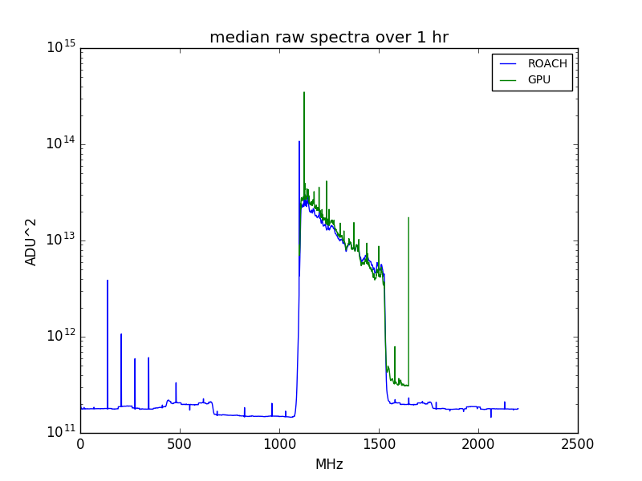

## Jan 22, 2018 - Observations with ROACH spectrometer

Chris Sheehy

### 1 - Introduction

Will and I went out to the basin and hooked up my ROACH board sampling at 4400
MHz. We split of the signal at the end of the long coax with a hybrid and made
simultaneous measurements. The ROACH integrated with 1 second samples and 2048
channels over DC - 2200 MHz. It is saving a file every 10 minutes. It saved a
file every 10 minutes. It uses an FPGA and has a polyphase filter implemented.

We set it up on the evening of Friday, Jan 19 and left it running over the
weekend. 

### 2 - Results

I chose the tag 180120_2100 to compare to because it has a transiting source
that follows sidereal time. This sources shows the clear peaks on either side of
1200 we have come to expect.

First, **Figure 1** is a comparison of the raw spectra from the ROACH and GPU
spectrometers form the last 100 seconds of this tag, chosen to avoid the
source. I normalized the ROACH spectra by a single scaling to have the same
in-band median (over both time and frequency) as the GPU spectra. That is the
only thing I did. They look very similar. The ROACH looks like it has somewhat
lower noise than the GPU.

**Figure 1: ROACH and GPU raw spectra**

**Figure 2** is a zoom in on the band of interest.

**Figure 2: zoom in of Figure 1**

Next I took the hour of data from the ROACH and calibrated it using the
ADU^2/K conversion factor from the GPU data reduction. This will only be approximate,
but Figure 2 indicates it should work fine. **Figure 3** shows the waterfall
plot of the calibrated date. **Figure 4** shows the corresponding figure from
the BMX data browser. Because of details with the time stamping of the ROACH, I
expect the ROACH data is shifted +12 minutes w.r.t. the BMX GPU data.

**Figure 3: Calibrated ROACH waterfall**

**Figure 4: BMX data browser waterfall**

You can see the cal on/off in the ROACH data, and there are no data cuts
producing NaNs, but otherwise they look pretty much the same.

**Figures 5** and **6** show the mean subtracted data.

**Figure 5: Calibrated ROACH waterfall, mean subtracted**

**Figure 6: BMX data browser waterfall, mean subtracted**

I also looked at a couple of clear state changes in the BMX data browser and
these were seen equally in the ROACH data.

