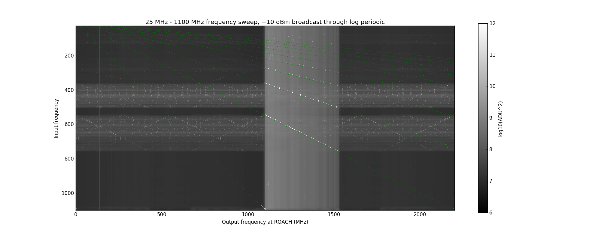
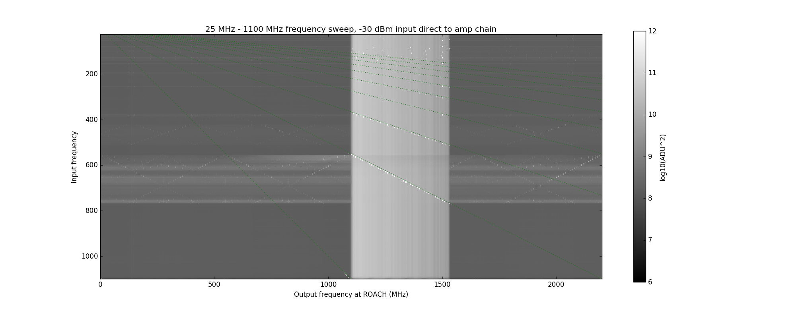

## Jan 24, 2018 - Out of band frequency sweep

Chris Sheehy

### 1 - Introduction

I went out to the basin, disconnected the GPU spectrometer, and put the output
of the amp chain (after the long coax) on the ROACH. The ROACH samples at 4400
but it's clock is at 2200. It has 4 interleaved ADCs each getting 1100. So this
is the same as the GPU spectrometer. I hooked up a signal generator to the log
periodic antenna and broadcast into the horn. I also hooked the signal generator
(at a lower power) directly into the low loss coax feeding the amp chain. I then
swept the frequency in 5 MHz steps from 25 MHz - 1100 MHz. 

### 2 - Results

There is clear power showing up both in and out of band. Figure 1 shows the results with the log period
antenna broadcasting. The dotted green lines show y=x/n, where n=1,2,3,...
You can just see the y=x tones starting to make it through the bandpass filter at
1100 MHz. These tones are spaced 5 MHz apart. The other lines intersect clear
spikes both in and out of band. The spikes along these lines are spaced n*5 Mhz
apart. I think this is a clear sign of high order intermodulation products
mixing the low frequency input signal into our band. Where they are coming from
I do not know.

**Figure 1: Frequency sweep broadcast through log-periodic**

Figure 2 shows the same thing but with the signal generator hooked directly into
the amp chain. We see very similar behavior, indicating some sort of
non-linearity in the amp chain + spectrometer itself. How this power is making
it through the bandpass I do not know. How the radiated power is making it
through the OMT (isn't there a low frequency waveguide cutoff?!) I also do not
know. Is the bandpass filter non-linear? In 
[Will's posting on linearity](../20180119_PowerSweeps/index.md) that showed very
little non-linearity, there was no bandpass filter. His posting did show a
little non-linearity, though, maybe 0.1 dB. Can that amount explain this?

Also, I note that 550 MHz seems to be a magic number in these figures. This is 1/2 the ROACH ADC sample rate. There is
also a lot of ROACH magic with phase shifting and interleaving the input 2200 MHz clock to get a 4400 MHz sample rate. Is the
ADC clock messing us up?

**Figure 2: Frequency sweep directly into amp chain**

I also note that I manually looked for signs of mixing of power from frequencies
above our band and could not find any evidence for it.
