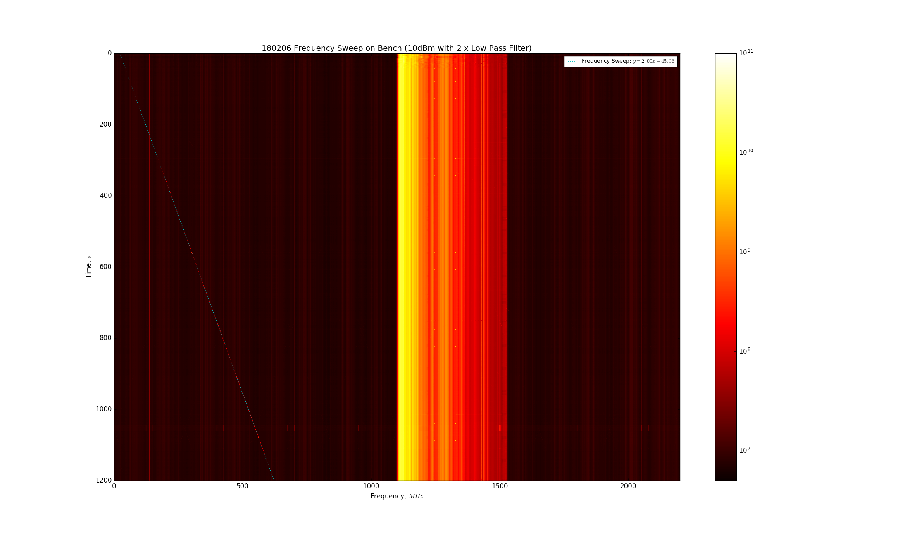
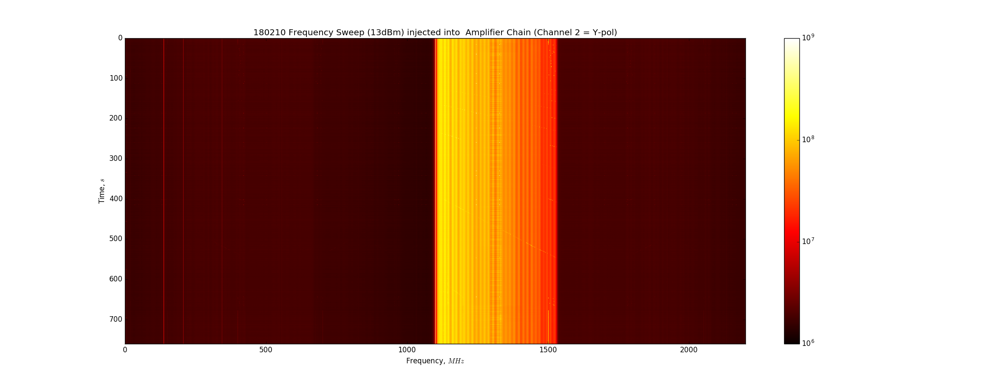
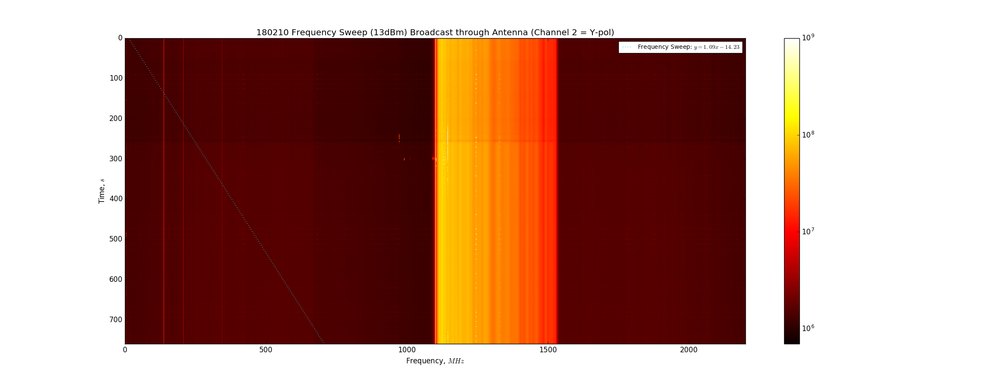
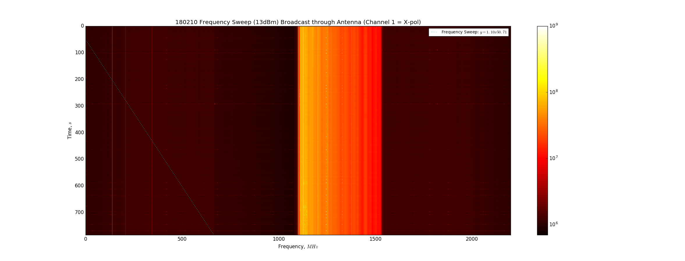

## Feb 10, 2018 - Hunting for Intermodulation Products via Broadcast Tests
### Current Configuration of Front-End Components (2 Channels, once again!):

On Feb 6, 2018, I conducted the first in a long series of broadcast tests, but
failed to acquired data because BMXDAQ had been offline. While I was there, I
figured it would be a worthwhile investment of time to reconnect the second
polarization, now that the custom band pass filters had arrived. The only major
difference in the two chains is the position of the first band pass filter. Due
to geometric constraints of the breadboard supports, I couldn't fit the bandpass
inside the front end box for the Y-polarization, and it had to be attached
immediately after the 30dB coupler. Additionally, I didn't have another noise
diode ready to go, so there is a terminator attached to the 30dB port on said 30
dB coupler. We have been acquiring data for the past several days on BMXDAQ.

#### Channel 1: X-Pol (Vertical SMA Output Port on OMT):

~~~
  -------------------------
  Sky
  OMT+HORN
  -------------------------
  Low Loss Cable 1 
  30dB Coupler + Noise Diode
  Low Loss Cable 2
  Band Pass Filter 1 
  LNA 1 	
  3dB Attenuator
  LNA 2		
  Low Pass Filter (VLFX-1350)
  Stage 3 Amplifier
  36in Data Cable
  SMA Output Port
  _________________________
  Band Pass Filter 2
  156in Data Cable
  -------------------------
  Power Divider (Splits 50%/50%)
  50% --> Terminator / Roach Board
  50% --> Channel 1 on Digitizer Card
 
~~~

#### Channel 2: Y-Pol (Horizontal SMA Output Port on OMT):

~~~
  -------------------------
  Sky
  OMT+HORN
  -------------------------
  Low Loss Cable 1 
  30dB Coupler + Terminator
  Band Pass Filter 1
  Low Loss Cable 2
  LNA 1 	
  3dB Attenuator
  LNA 2	
  Low Pass Filter (VLFX-1350)
  Stage 3 Amplifier
  36in Data Cable
  SMA Output Port
  _________________________
  Band Pass Filter 2
  156in Data Cable
  -------------------------
~~~

### Motivation for Broadcast & Injection Tests:

As previously discussed, the response of our telescope to transiting sources
features non-physical temperatures (T > 400 K) around 1225MHz +/- 10 MHz, and
1175 MHz. This pattern appears to move forward by 4 minutes per day, alongside a
seemingly physical temperature (T < 1 K) along our entire band. This daily
advance indicates that this signal is stationary with respect to the stars. This
pattern has been observed with both BMXDAQ and the ROACH FPGA, which seems to
eliminate the digitization process as a potential suspect. From the linearity
checks on the amplifier chain in my [last
posting](../20180119_PowerSweeps/index.md) it doesn't seem like the addition of
a physical source (a few K at all frequencies) would provide enough power to
drive the entire system non-linear. 

We are considering the possibility of lower frequency tones (below our bandwidth)
coming through the Horn+OMT, encountering non-linearities, and ultimately
forming intermodulation products that appear within our band as these
non-physical temperatures at the aforementioned frequencies. But why don't these
non-physical temperatures ever vary in frequency? Perhaps a bright out of band
frequency from a TV or Radio broadcast (at a fixed frequency?)  mixes with other
signals, causing these effects? If this is the case, then by performing a
frequency sweep across a range of low frequencies, should we  expect to
reproduce some intermodulation products at a range of frequencies?

### 180206 Broadcast Tests: (Antenna --> OMT+Amplifier Chain (on Bench))

In order to examine the expected response to these frequency sweep tests, I used
the spartant signal generator with the log periodic antenna to perform a
broadcast frequency sweep test through the OMT and the amplifier chain on the
bench, with data acquisition performed using the ROACH FPGA. The components of
the bench amplifier chain were similar to the amplifier chains in the basin,
with the absence of the signal from the sky.

The parameters of this frequency sweep were as follows: Frequency steps of
1MHz from 25MHz to 600MHz, at a power of 10 dBm. The total duration of this test
was approximately 20 minutes, during which I left the room in hopes of
minimizing changes to the coupling of the Antenna and OMT. Because this test was
conducted in the fast-imaging lab on the second floor, I believe there were
considerable contaminating signals from electronic devices, wifi routers,
reflections, standing waves, etc. When using the ROACH with the full
amplification from the amp chain, we were initially supplying too much power. By
placing a 10dB attenuator after the 3rd stage amplifier, the incoming signal
should be fully amplified, and power at all frequencies should be attenuated
thereafter. 

It is important to note that the signal generator produces higher frequency
harmonics, which can be diminished with the use of low pass filters with a low
maximum frequency (the one(s) used in this test diminish these harmonics above
~600 MHz). The first test used one such low pass filter, and produced some
response in band. Believing these to be higher order harmonics (3rd Order) I
repeated the test with a second low pass after the spartant signal
generator. 

The following waterfall plots are the system response to the emitted tone from
the signal generator (this appears in the data, which I have fit with the dotted
cyan line) over the full 20 minute acquisition. The only difference being the
number of low pass filters on the output of the signal generator.

**Figure 1: 180206 Indoor Broadcast Frequency Sweep Test (1 x LP Filter):**

Test 1: Frequency Sweep (25MHz-600MHz, @ 10Bm)
Broadcast Equipment: Spartant --> LP (~600MHz cutoff) --> Log Periodic Antenna
Receiver: OMT --> BP --> LNA1 --> 3dB --> LNA2 --> LP (VLFX-1350) --> Amp3 --> [10dB Atten] BP --> Roach

The frequency sweep is clearly well matched to the fit curve, which was
completed in an extremely rudimentary fashion from manually selecting two points
that appeared in the line in the Waterfall plot. Consequently, it is quite
difficult to find these lines when the power difference between the sweep and
the noise floor is not substantial enough to see the feature by eye. 

From t = 700s to t = 1000s, we first start to see a signal appear in our
band. Further analysis indicated that this is the 3rd harmonic from the signal
generator, as it has a slope of 2/3 s/MHz, whereas the sweep has a slope of 2
s/MHz. In this time range we also see a sort of grid pattern, where the
fundamental sweep and this 3rd harmonic sweep curve repeat every ~280 MHz in
both directions. ALL of these curves intersect at common points, like the one
around (450MHz,790s).

There also appears to be a repeating feature every ~250 MHz around the t = 320s
point, but a similar feature appears in the following plot at an unrelated sweep
frequency, and I believe it isn't a response to the frequency sweep test. 

**Figure 2: 180206 Indoor Broadcast Frequency Sweep Test (2 x LP Filter):**

Test 2: Repeat with 2 x LP Filters
Broadcast Equipment: Spartant --> LP (~600) --> LP (~600) --> Log Periodic Antenna
Receiver: OMT --> BP --> LNA1 --> 3dB --> LNA2 --> LP (VLFX-1350) --> Amp3 --> [10dB Atten] BP --> Roach

The addition of the SECOND low pass filter has virtually removed all harmonics
above ~600MHz, and as a result, the in band response to the frequency sweep test
has almost completely disappeared. There are some visible harmonics seen from
(1500MHz, 700s) through (1500MHz, 800s). There are also very faint
harmonics/reflections of the fundamental sweep visible near (300MHz, 1050s) and
(800MHz,1050s). 

These bench tests seem to suggest that when the harmonics from the signal
generator are greatly attenuated by additional filtration, the in band response
to the low frequency is almost negligible. However, in order to test that idea
further, this must be replicated in the basin, which is exactly what I did
next. 

### 180208 Broadcast Tests in Basin (ROACH data)

These tests were conducted on Thursday Feb 8, 2018, in the basin with Paul
Stankus. Using the spartant signal generator, we performed frequency sweeps
through the log-periodic antenna from two positions: directly beneath the horn,
and from directly behind the telescope from the rim of the basin, attempting to
reflect some signal off the dish and into the Horn+OMT. Because both
polarizations are now functioning, we positioned the antenna close to 45 degrees
relative to the Horn, in an attempt to receive both polarizations. The data
acquisition was conducted with both BMXDAQ and the ROACH board, but I have only
analyzed data from the latter thus far.

The ROACH board was connected via power splitter to Channel 1 (X-Polarization,
Vertical OMT Port) and this is the data which appears in the waterfall plots
below. 

**Figure 3: 180208 Basin Broadcast Frequency Sweep Test (Under Horn @13dBm):**

Test 1: Broadcast from directly beneath the horn (45deg polarization), a
frequency sweep from 25MHz to 600MHz @13dBm for a duration of 10 minutes. 

Broadcast Equipment: Spartant --> LP (~600) --> LP (~600) --> Log Periodic Antenna
Receiver: Channel 1 of Telescope --> Power Splitter --> ROACH

This frequency sweep also appears in the BMX data browser:  (The file is 180208_1915, Channel 1!)

Because the 10dBm frequency sweep test (from the bench test with 2 low pass
filters) indicated that the received power in band was nearly invisible in the
waterfall plot, I assumed a 13dBm broadcast would be more useful. I also didn't
use the 10dB attenuator from the bench test, because the range of the ROACH was
responding appropriately (the signal was divided by 1/2 from the power
divider). 

The fundamental of the sweep is quite dim, (power divider frequency range is
0.75-1.5GHz), but we can clearly see the 3rd harmonic and other in band harmonic
activity. It makes sense that these harmonics would be more apparent, due to two
effects. First, the sweep output power was doubled from the bench to the
basin. Second, and perhaps more importantly, the antenna beam likely had better
coupling with the OMT+Horn: (much shorter distance, but worse angular
alignment). Even so, I don't think we are seeing the impact of any low frequency
signal mixing, or any intermodulation products. I think this is again the
harmonics from the signal generator. Luckily, we also performed this same test
with a lower power.

**Figure 4: 180208 Basin Broadcast Frequency Sweep Test (Under Horn @10dBm):**

Test 2: Broadcast from directly beneath the horn (45deg polarization), a
frequency sweep from 25MHz to 600MHz @10dBm for a duration of 10 minutes. 

Broadcast Equipment: Spartant --> LP (~600) --> LP (~600) --> Log Periodic Antenna
Receiver: Channel 1 of Telescope --> Power Splitter --> ROACH

This frequency sweep also appears in the BMX data browser:  (The file is 180208_1931, Channel 1!)

In this test, we used a power level of 10dBm, exactly as in the lab on the
bench. This test was exactly the same as the previous test, but merely at a
lower power. The fundamental frequency sweep is quite faint, and its harmonics
are weaker than in the previous case, just as they were on the bench.

HOWEVER, in this data file we see the exact same puzzling response we have
typically seen with transiting sources! This is unrelated to the frequency sweep
test, however, and is merely a coincidence. In fact, this response continues as
expected into the next data file (next test!), which you can flip back and forth
between on the data browser. Looking back, the data from 15 days ago shows this
exact same signal exactly where it should be if it were locked to the stars! 15
x 4 = 60, and this signal is seen in the 180123_2000 data file, exactly 1 hour
before it appears during these tests.

I conclude that this test shows the expected response to the frequency sweep
test, and the coincidental appearance of the signal we are attempting to
replicate is explained by a previously documented signal moving forward with the
celestial sphere.

**Figure 5: 180208 Basin Broadcast Frequency Sweep Test (Behind Horn @10dBm):**

Test 3: Broadcast from behind the horn (45deg polarization) at the rim of the
basin, performing a frequency sweep from 25MHz to 600MHz @13Bm for a duration of
10 minutes.

Broadcast Equipment: Spartant --> LP (~600) --> LP (~600) --> Log Periodic Antenna
Receiver: Channel 1 of Telescope --> Power Splitter --> ROACH

This frequency sweep also appears in the BMX data browser:  (The file is 180208_1956, Channel 1!)

Here we can see almost no impact from the frequency sweep test. No in band
harmonics, and the fundamental frequency sweep itself is extremely faint. We do
see the expected tail end of the transiting source, as predicted. ]

I believe the results of these broadcast tests indicate that we are unable to
see frequency mixing/intermodulation products from our broadcast tests, and the
faint in band signals we were able to see are likely best explained as harmonics
from the signal generator.

### 180210 Broadcast & Injection Tests in Basin (ROACH data)

A final suggestion was to repeat these tests with a broadcast as well as with a
direct injection of the frequency sweep into the amplifier chain. I elected to
conduct the injection/broadcast with both amplifier chains/polarizations.

These frequency sweeps were performed through two low pass filters from 25MHz -
600MHz, at 13dBm. For the injection tests, the signal originated just after the
30dB coupler, passed through the amplifier chain and was divided by the power
divider, before being recorded by both BMXDAQ and the ROACH FPGA. For the
broadcast tests, the frequency sweep was broadcast through the antenna, directly
beneath the horn as in previous tests. The data was recorded on both
polarizations by BMXDAQ for all sweep tests, but to acquire with the ROACH on
both polarizations, the power divider had to be switched.

**Figure 6: 180210 Basin Injection Frequency Sweep Test XPOL (@13dBm):**

This frequency sweep at 13dBm was injected into channel 1 (X-pol, Vertical SMA
Port). The frequency sweep was also acquired on BMXDAQ for both
channels. 

I was unable to recover the fundamental frequency sweep, because the high input
power to the ROACH raised the noise floor(?) above the power level of the
sweep. However, it is still easy to see the harmonics in our frequency band, in
the places we would expect to see them. 

One interesting feature that hasn't been seen before is the power at 1500MHz at
the beginning and end of the test, which occurred when the frequency sweep was
stopped with the antenna broadcasting at 25MHz. 

**Figure 7: 180210 Basin Injection Frequency Sweep Test YPOL (@13dBm):**

This test is the same as the previous test, as shown in figure 6, but the amp
chain and channel has been switched to the Y-Polarization on channel 2. Again,
the fundamental frequency sweep is not obvious in the data, because of the
higher than normal input power to the roach raising the noise floor(?). The
harmonics from the signal generator are again visible, as is the power at
1500MHz, which appears when the signal generator is 'parked' at 25MHz.

The follow up to this test was to return to the broadcast configuration for
another round of frequency sweep tests. I reconnected the OMT to the Sky, and
set up the broadcast antenna, with the roach still connected to YPOL.

**Figure 8: 180210 Basin Broadcast Frequency Sweep Test YPOL (@13dBm):**

This frequency sweep was broadcast into the horn, the same way as the tests from
120208. Unfortunately, these results are not consistent with the previous
broadcast tests! The fundamental is visible, but the in band harmonics are not.

**Figure 8: 180210 Basin Broadcast Frequency Sweep Test XPOL (@13dBm):**

The final test was a broadcast through the X-polarization (all cables/amp chains
configured as they were before the test!). This test also showed the fundamental
frequency, but I was unable to locate any harmonics in the waterfall plot. This
is troubling, because two days ago I was able to resolve these
harmonics. Perhaps it is a state dependent (wiggly vs normal) sensitivity
effect. I will look into this further.

I also want to analyze the data acquired with BMXDAQ, but this has been a large
investment of time already, that didn't seem to suggest the production of
intermodulation products. 
