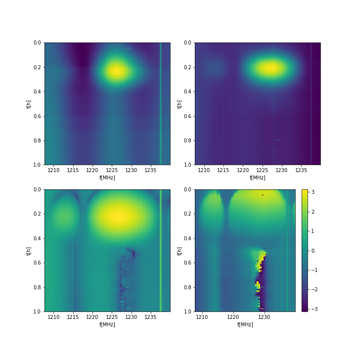

## Feb 12, 2018 - Intermodulation fringing (AS)

I took the 180210_1400 data file that has a nice transiting source.
CH1 was in the inverted state, CH2 was fine.
I did zero calibration and completelly ignored calibration diode pulses.
Averaged the data x4 in freq direction and x64 in time direction.

The plot below shows frequencies where our intermodulation appears. The top plots are auto-power for
CH1 and CH2 and the bottom plot is the amplitude and phase of cross-power.

Look at the structure around sources.

The plot below show the cross-correlation coefficient
|PX|/sqrt(P1*P2):

The plot blow shows a slice for a particular freuqency been. Here I
show the real and imaginary part of cross. It is clear here that the
phase is wrapping and the overal signal is modulated by the source.

The final plot shos the phase as a function of frequency. It is the
same information as plotted on bottom right of Fig1, but plotted
differently.

Note that for a perfect single-dish experiment the cross-power should
be U+iV. Interferometry on the other hand gives
P0*exp(i*phi*D/lambnda), and we are clearly phenomenologically closer
to the latter. What is clear is that whatever is causing this
intermodulation knows about where on the sky source is.
