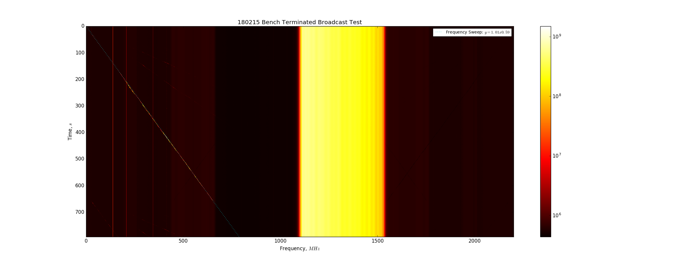
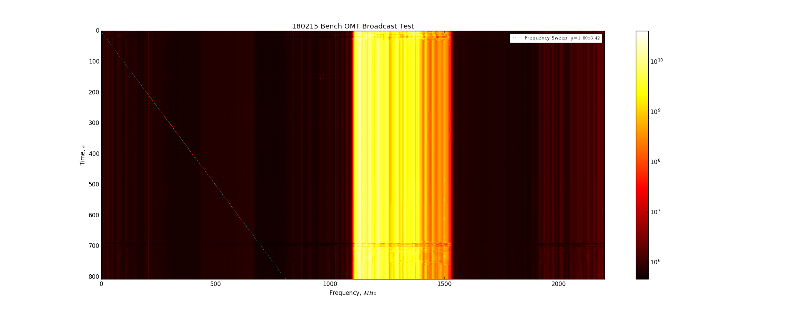
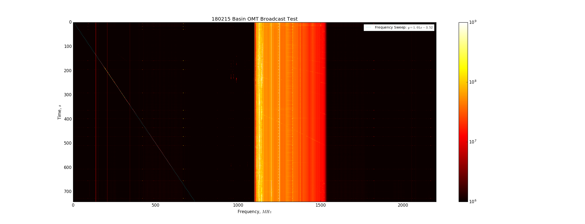

## Feb 15, 2018 - Direct Comparison of Bench & Basin RFI Environments
### Motivation: Too Many Unstable Parameters!

Over the past several weeks, I have attempted to perform frequency sweep tests
both on the bench and in the basin, and the results have been rather
inconsistent. The goal was to examine the response of our OMT/Amplifiers/Filters
to a low frequency sweep at high power, specifically looking for power mixing
and intermodulation products appearing within the band. 

### Experimental Configuration:

These frequency sweeps were all performed using the Spartant signal generator
(with 2 Low Pass filters on the RF output, to attenuate high frequency harmonics
by ~80dB,) locked to the 10MHz signal output by a lab signal generator  which
also clocked the ROACH FPGA. The frequency sweeps were all performed from 25MHz
- 600MHz with a 1MHz step, at a power of +13dBm. To keep our system consistent,
I performed these tests using the amp chain I constructed on the bench, with a
2.9V supply. The amp chain is arranged as it has been in the past, and is
identical to the amp chain on the bench:

~~~
  -------------------------
  OMT/Terminator/Spartant+2LP
  -------------------------
  Band Pass Filter 1
  LNA 1 	
  3dB Attenuator
  LNA 2	
  Low Pass Filter (VLFX-1350)
  Stage 3 Amplifier
  [**When OMT, attach 10dB Attenuator**]
  _________________________
  ROACH FPGA
  -------------------------
~~~

These tests were first conducted on the bench, and then in the basin. The
fundamental setup was the same. First, I performed a direct injection of the
frequency sweep from the signal generator directly into the amp chain. Second, I
terminated the amp chain and broadcast the frequency sweep through the log
periodic, looking for direct coupling to the amp chain components. Finally, I
connected the OMT (from the lab) into the amp chain, and broadcast the frequency
sweep directly into the OMT.

**Figure 1: 180215 Experimental Configuration in Basin:**

The differences between these tests were limited to the physical location (and
hence RFI environment,) and the receiver. On the bench, these tests were
consistent with the methods used previously, and I left the room for the
duration of the test, except once when I barged in a bit too early in order to
make it to a meeting with Andrei. In the basin, the OMT test was conducted with
the OMT in the trunk of my car, to facilitate the alignment of the OMT with the
log-perodic antenna. 

### Test Results: Waterfall Plots

**Figure 2: 180215 Bench Injection Test:**

For this test, the the signal from the spartant was directly input to the amp
chain. The colorbar limits have been set to emphasize the response in band, but
the emitted frequency sweep has been fit with the dotted line. The sweep
parameters were set (start @ t=25s, step 1MHz/s) such that the emitted signal is
almost exactly 1:1 with the time axis in seconds, evidenced by the slope of this
line, which is calculated and displayed in the legend. We clearly see the
fundamental at low frequencies, but it has been removed due to the colorbar
limits. In band, we see the 2nd and 3rd harmonics of the input signal.

**Figure 3: 180215 Bench Terminated Broadcast Test:**

This test featured a terminator on the amp chain input, while the frequency
sweep was broadcast through the log-periodic antenna. We can see the fundamental
and the 2nd and 3rd harmonics at low frequencies below the band, but in band
there doesn't appear to be any response regardless of colorbar limits.

**Figure 4: 180215 Bench OMT Broadcast Test:**

The final bench test was conducted using the OMT as the receiver. The power
reaching the ROACH was so high that the noise floor was wildly fluctuating. I
had to attach a 10dB Attenuator (after the 2nd bandpass) to constrain the power
to levels that could be accurately read by the ROACH. This attenuator was also
used for the outdoor OMT test, for consistency. This test shows some extremely
low power harmonics in the band, which are hard to identify.

**Figure 5: 180215 Basin Injection Test:**

This figure shows the same test that appears in figure 2, and almost perfectly
replicates the data from figure 2. Again the colorbar has been tuned to show the
harmonic features visible in the band, which we also saw in the bench test.

**Figure 6: 180215 Basin Terminated Broadcast Test:**

This figure repeats the test conducted in figure 3, but was performed in the
basin. Again, we see the fundamental and the 2nd and 3rd harmonic at extremely
low frequencies, but there doesn't appear to be any power in the band.

**Figure 7: 180215 Basin OMT Broadcast Test:**

This test is a direct comparison to figure 4, but some distinct differences are
present. This test was conducted with the OMT placed in the trunk of my car,
which probably acted like a faraday cage and shielded some RFI signals. I
believe the fundamentals in this plot are much more apparent, and visibly stand
out against the noise floor in the band. I think this inicates that the RFI
environment inside the lab is brighter  than the RFI environment we have in the
trunk of my car, in the basin.

### Summary:

~~~
180215 BENCH INJECTION	—> mild fundamental, in band visible 2nd and 3rd Harmonics (5e7,1e9)
180215 BENCH TERMINATED	—> Low frequencies: fund, 2nd, 3rd, 4th, 5th harmonics
			   In Band, no response
			   High frequencies: power reduction, black lines mirroring low freq
180215 BENCH OMT	—> Junk at t~0 and t~700 is from me entering and leaving the room
			   Fundamental and 2nd harmonic in low frequency range
			   very low power harmonics in band?? (1e9,1e11)
180215 BASIN INJECTION	—> mild fundamental, in band visible 2nd and 3rd Harmonics (5e7,1e9)
180215 BASIN TERMINATED	—> Low frequencies: fund, 2nd harmonics
			   In Band, no response to broadcast signal (1e8,5e9)
			   High frequencies: very faint black mirror of fund (5e5,1e8)
180215 BASIN OMT	—> strong fundamental, visible 2nd harmonic below band
			   In band: visible 1st, 2nd, 3rd, …, 9th? Harmonic visble
~~~

