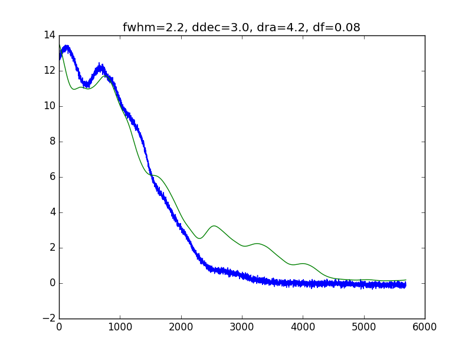
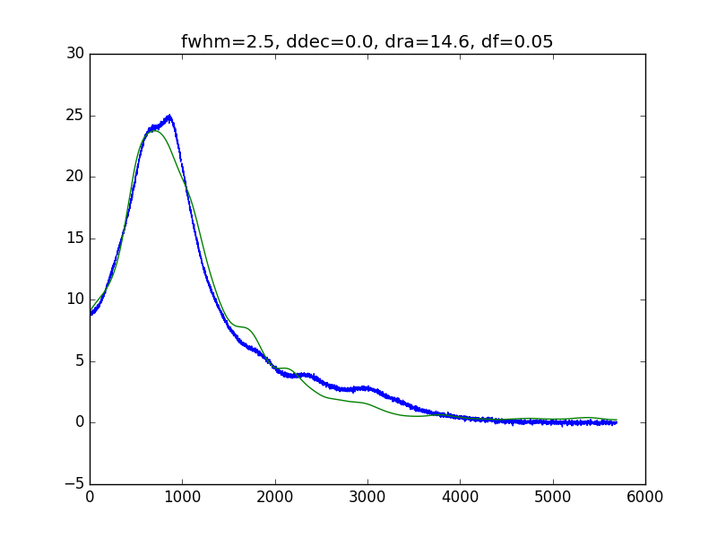
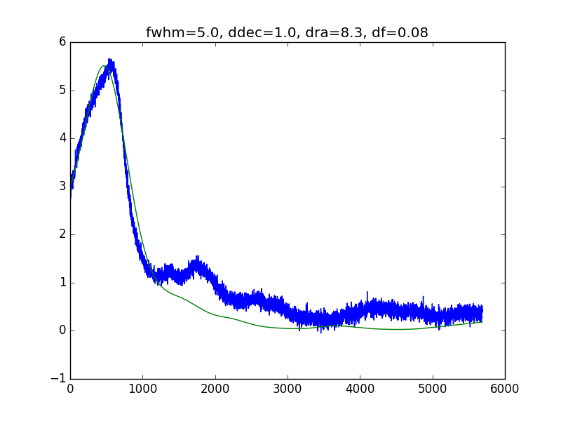
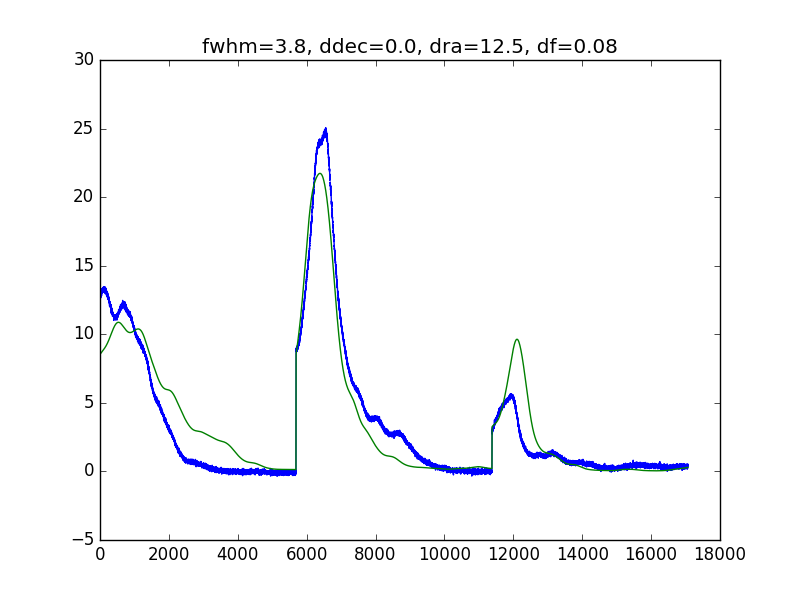
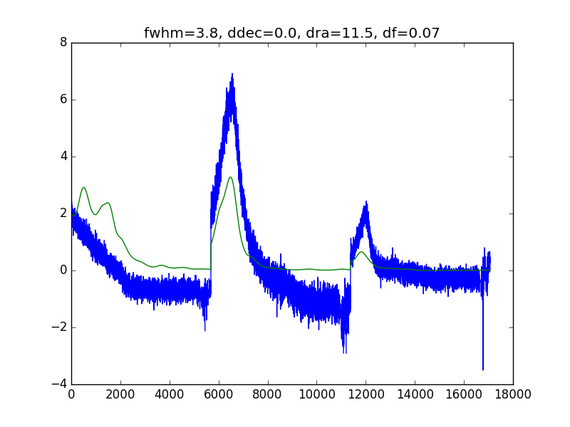

## Feb 16, 2018 - Fits to galactic HI crossing

Chris Sheehy

### 1 - Introduction

I downloaded the HI4PI galactic HI maps and wrote a full sky map per frequency
bin. The frequency bins are approx. 20x finer than the spectrometer bins. I
smoothed each map with a gaussian beam of variable FWHM. I then sampled off ech
map along different trajectories, with a variable offset in Dec. I then averaged
these templates together in a broad bin width equal to the spectrometer bin
width with a variable frequency offset to mimic the effect of the clock being
off. Then I shifted these templates in time by a variable amount to capture an
offset in RA. Below are the fits. I did three separate fits for the three bins
around 1420.4 that show significant galactic HI signal, then fit them all
simulataneously. The data spectra have a 1st order poly removed from each, so
the mean is subtracted. The data are calibrated with the noise diode and are in
Kelvin. The time axis is in samples, with 5s per sample. Code to do it is in
/direct/astro+u/csheehy/python/bmxreduce/personal/fitHI.py. 

### 2 - Results

**Figure 1: 171223, normal state, frequency bin 1**

**Figure 2: 171223, normal state, frequency bin 2**

**Figure 3: 171223, normal state, frequency bin 3**

**Figure 3: 171223, normal state, all frequency bins**

The data from different days is totally repeatable as long as the spectrometer
data is in the "normal" state. The fits are not great. I find the biggest
difference in shape comes from the "df" parameter (in MHz in the figure
titles). The fine binned spectra look very different from each other, so the
templates are very sensitive to both clock shifts and gain that varies across
the broad spectrometer bands. The amplitude of the data is around half the raw
template amplitude, which seems to much a difference to be caused by horn or OMT
throughput, which should be 95 percent.

I then fit data from the wiggly state. The peak heights are 4x smaller. All of
this data is calibrated with the noise diode, so it seems very strange that this
should be happening.

**Figure 4: 171223, wiggly state, all frequency bins**

