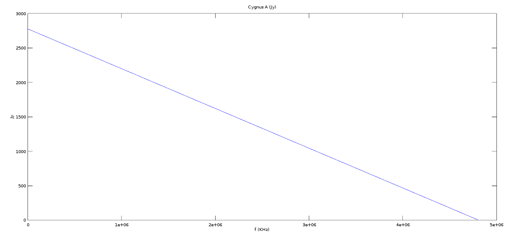
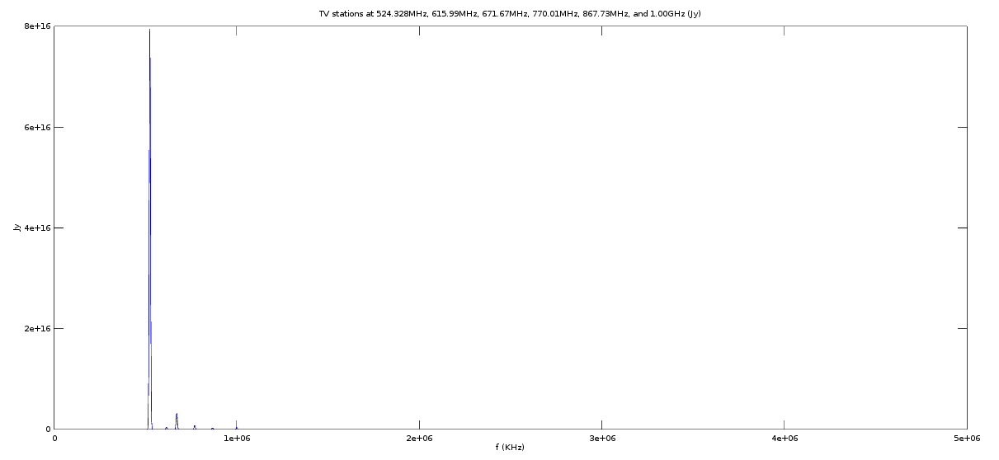

## February 26, 2018 - Modeling the Spectrometer Output

### An attempt at modeling our spectrometer output in Octave (Matlab)

Outline of code:
1. Read in the S21 data for Lorch filters (labeled AU1 and AU2)
2. Model mission sources:
The sky

RFI background

TV stations + harmonics

Cygnus A

Thermal noise (amp chain)

3. Model OMT output signal
4. Model input filter output signal
5. Model amp chain output signal
6. Model output filter output signal
7. Model aliasing
8. Results (simulated spectrometer output) for various test cases
9. What this suggests about the real data

### 1. Read in the S21 data for Lorch filters from VNA

The VNA scan was taken from 20kHz to 4.8GHz (20 - 4800000kHz)). These scans are taken as the bandpass function further down the model. The dataset contains 10008 points. A 10008 element vector ranging from 20 to 4800000 provides a frequency axis.

**Lorch filter "AU1" passband (dB):**

**Lorch filter "AU1" passband (linear):**

**Lorch filter "AU2" passband (dB):**

**Lorch filter "AU2" passband (linear):**

### 2. Model emission sources

## Cygnus A

Refer to this spectrum: http://www.cv.nrao.edu/course/astr534/images/CygAspectrum.gif 

Considering the Lorch passband starts at 1GHz I approximate the emssion with a line. It goes from 2200Jy [= 2.2e-13mW] at 1GHz to 470Jy [= 4.7e-14mW] at 4GHz. With the frequency axis in KHz I have 1730Jy/3000000KHz = -.000577Jy/KHz. Y intercept is 2777Jy [= 2.77e-13mW], so the crude "synchrotron" line looks like:

**Cygnus A emission model (Jy):**

## Sky

Set constant with frequency @ 9K.[16Jy] (assumed lambda=21cm and .5deg beamwidth using https://science.nrao.edu/facilities/vla/proposing/TBconv.)

## RFI Background hum

Set consant at 100Jy (guess, starting point)

## TV Stations

6 TV stations + harmonics were modeled as 7MHz FWHM gaussians. From POC the stations are:

524.328MHz: -61dbm [= 7.94e16 Jy]
615.99MHz: -83dbm [= 5.012e14 Jy]
671.67MHz: -75dbm [= 3.2e15 Jy]
770.01MHz: -81dbm [= 7.943e14 Jy]
867.73MHz: -85dbm [= 3.162e14 Jy]
1.00GHz: -83dbm [= 5.012e14 Jy]

Wasn't sure what to use for the power spillover into the harmonics. By experimentation I found a law that makes the output look like some of the RFI in our actual spectrometer output: The harmonics all get I/n^50, where I is the intensity of the fundamental and n is the harmonic number. 4 harmonics are modeled for each station.

**TV stations (only the fundamentals are visible at this scaling):**

## Thermal noise within amplifier chain

This is modeled as a vector of white noise averaged over 100 iterations where length = frequency vector length (10008 elements) from 20KHz to 4.8GHz. The 0-1 random numbers are scaled to 20 Jy (wild guess, starting point).

### 3. Model output from OMT by summing the modeled emission for Cygnus A, the sky, the RFI background, and the TV stations

### 4. Multiply the above by the input filter passband 

### 5. Add thermal noise to the above

### 6. Multiply the above by the output filter passband

### 7. Divde the complete dataset into component Nyquist zones

**Nyq. 1 = 0-550MHz:**

**Nyq. 2 = 551-1100MHz:**

**Nyq. 3 = 1101-1650MHz:**

**Nyq. 4 = 1651-2200MHz:**

**Nyq. 5 = 2201-2750MHz:**

**Nyq. 6 = 2751-3300MHz:**

**Nyq. 7 = 3301-3850MHz:**

**Nyq. 8 = 3851-4400MHz:**

### 8. Sum of Nyquist zones (simulated spectrometer output) for different test cases

**Simulated spectrometer output: WITH Cygnus A, input filter=Lorch AU1, output filter = Lorch AU2**

**Simulated spectrometer output: NO Cygnus A, input filter = Lorch AU1, output filter = Lorch AU2**

**Simulated spectrometer output: NO Cygnus A, input AND output filter = Lorch AU1**

**Simulated spectrometer output: NO Cygnus A, input AND output filter = Lorch AU2**

**Simulated spectrometer output: NO Cygnus A, input filter = Lorch AU1, output filter = Lorch AU2, Nyquist zones 6 and 7 SUPPRESSED**

### 9. What this suggests about the real data

**Comparison to raw spectrum from 2/25/18 at 0800 with notes**

