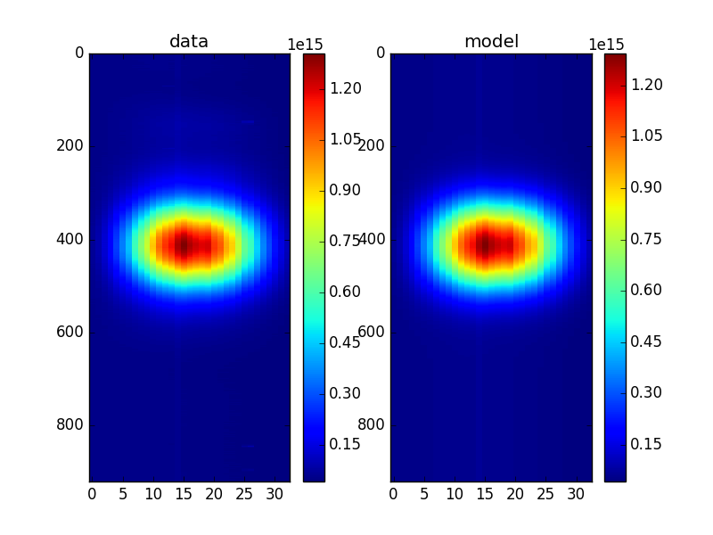
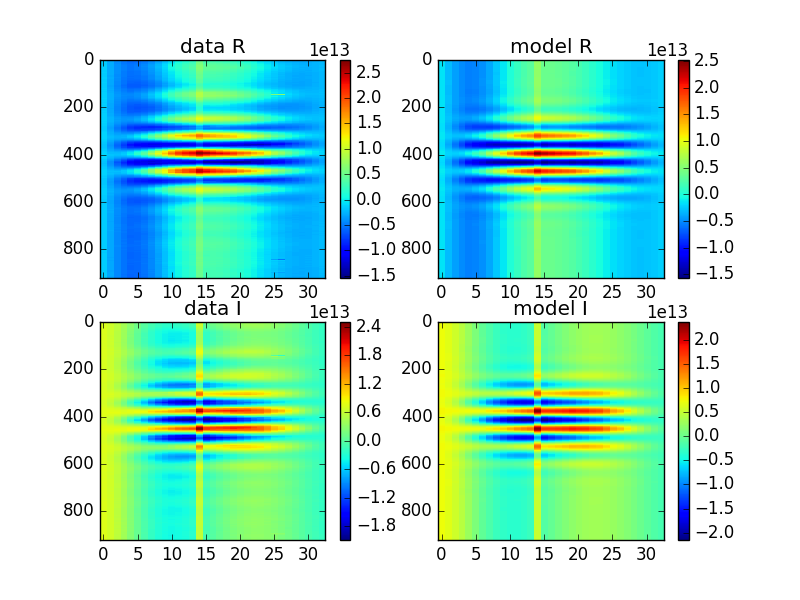
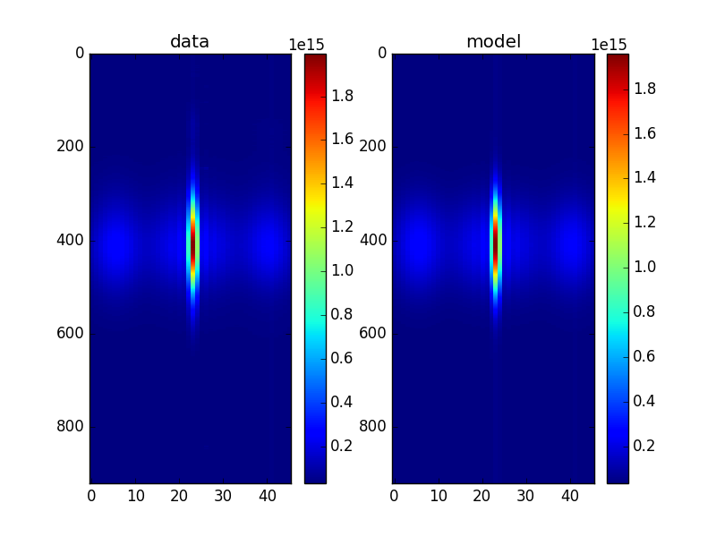
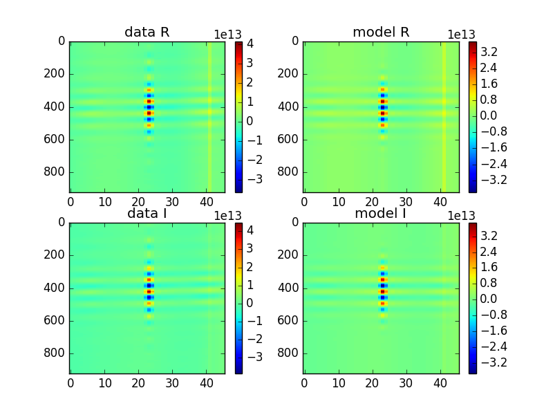
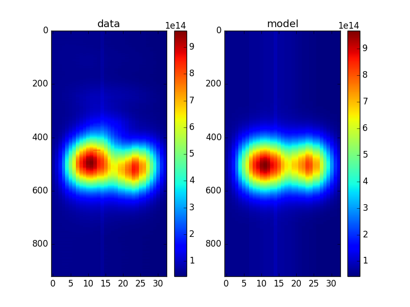
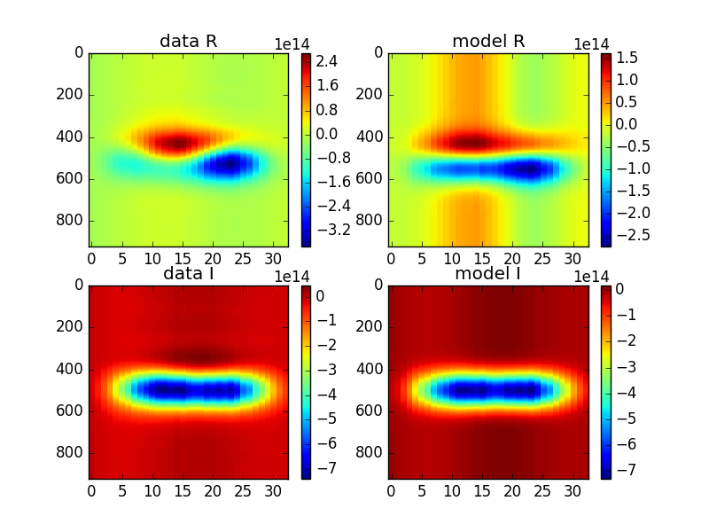
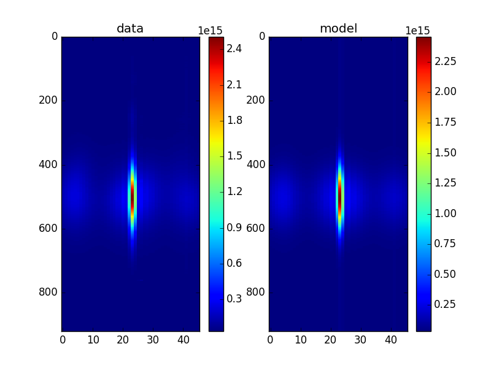
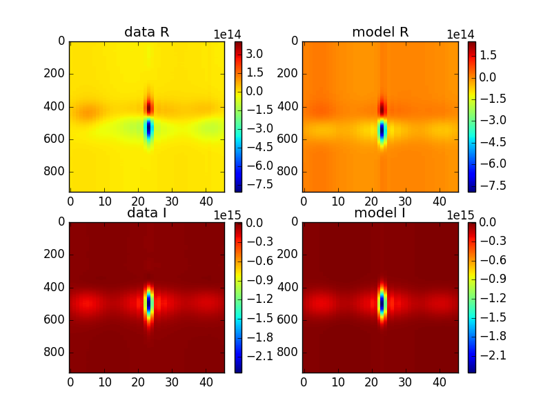

## Mar 1, 2018 - Fringe Fitting (AS)

I made a nice fitter for fringes. It takes a frequency range and fits
auto and cross and gets the beam sizes, fringe-rates, transit times,
etc.

Here is the [link](https://github.com/slosar/fringefit)


I've fitted on the first interferometric fringes and fitted both crazy
regions. Here are the results for `180214_1900`:

```
fmin / fmax : 1167.07 1184.8 
fce : 1175.87 
t0 auto/cross [s] : 1616.71 1609.5
sigma auto/cross [s] auto/cross [deg] : 245.86 268.322 0.78475 0.856445
phi: 2.79548 
omega omega_t ratio: 0.0212665 0.00617375 3.44466 /s 
fmin / fmax : 1215.01 1239.72 
fce : 1227.29 
t0 auto/cross [s] : 1607.03 1597.84
sigma auto/cross [s] auto/cross [deg] : 262.188 265.557 0.836864 0.847619
phi: -1.22941 
omega omega_t ratio: 0.0219562 0.00644377 3.40736 /s

```

Here are the results for N-S baseline on `180227_1800`:
```
fmin / fmax : 1167.07 1184.8 
fce : 1175.87 
t0 auto/cross [s] : 1975.04 1971.32
sigma auto/cross [s] auto/cross [deg] : 250.369 172.799 0.799141 0.551548
phi: -2.99555 
omega omega_t ratio: 0.0015909 0.00617375 0.257687 /s 

fmin / fmax : 1215.01 1239.72 
fce : 1227.29 
t0 auto/cross [s] : 1972.85 1969.32
sigma auto/cross [s] auto/cross [deg] : 249.398 166.443 0.796041 0.531261
phi: -2.93219 
omega omega_t ratio: 0.00143263 0.00644377 0.222328 /s 
```

And here are the corresponding plots for auto and cross on both days

`180214_1900`:







`180227_1800`:





