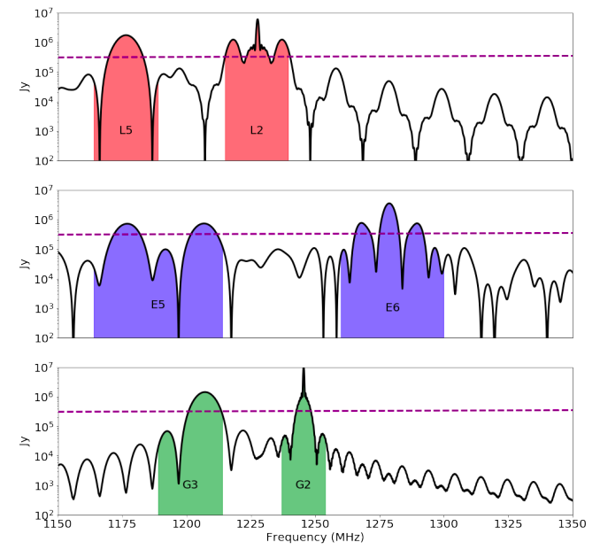

## Mar 19, 2018 - Satellite SEDs

Chris Sheehy

### 1 - Introduction

[This paper](https://arxiv.org/abs/1803.06314) just appeared on the archive
today, investigating the effect of three different navigation satellite
constellations on low redshift SKA measurements. Figure 3 of that paper shows a model for the
satellite SEDs. Here I compare our data to these plots.

### 2 - Expected satellite SED

**Figure 1** shows Fig 3 from the paper linked above. Top to bottom are (1) GPS,
  (2) Galileo, and (3) GLONASS. The shaded regions show in-band emission, and
  the black line is a model for out of band emission. The dashed horizontal line
  is the flux density from quiescent sun, so they say.

**Figure 1: GPS, Galileo, and GLONASS satellite SEDs from arxiv:1803.06314**

### 3 - 24 hours of blobby transits

I picked 180115 at semi-random. (I chose a day where the data look clean all
day.) I then picked out every blobby looking transit event I could find in that 24 hour
period. I then plot the calibrated, median subtracted spectrum from a single
time slice at the peak of the transit. (The median is taken over the hour of the
tag containing the event.) Unlike the calibrated plots in the data browser,
which sometimes flags satellites, I don't do any masking. **Figure 1** shows the
results. 

**Figure 2: Every blobby transit in 24 hours **

It looks like most events correspond to one of the satellites in
Figure 1. The spikes at 1240 and 1325 are the radar, which I have not masked. 

The GPS satellites are obvious, and these are the ones we observe to
have a sidereal (or integer multiple thereof) period. The L2 band is always
there. The L5 band appears to change in amplitude w.r.t. L5, and is sometimes
absent, like in the "1300" hour. But this one does have a sidereal period, so
GPS is likely. Also interesting are the "0400" and "1500" hour transits. The
peak is at the GPS L2 band center of 1225 MHz, but doesn't have the sinc
function-like shape. However, I checked and these transits also reoccur with a
sidereal period, so I think it's likey they are still GPS satellites.

The distinct triple hump
at 1250-1300 that we've been scratching our heads over is clearly the E6 band
of the Galileo constellation. The E5 bnad double hump is ususally visible as
well. The (second) "1700" hour transit is odd in that the E5 band double hump is
clearly the same as the others, but the E6 band triple hump is different, if
that is indeed what it is.

The GLONASS satellites are Putin's obvious attempt to influence the outcome of western
21-cm intensity mapping experiments. The G2 band looks like it's always present,
with a distinct peak just below 1250 and a bunch of sidebands on either
side. The scondary G3 hump is strong in the "1800" hour, weak in the "0200"
hour, and absent in the "1000" hour.

I think this means that every observed blobby event from this day can be
attributed to a navigation satellite.

Something else to note is that, as is obvious in the data browser waterfall
plots and from the positive baseline in these plots, is that the satellites seem
to be broadcasting at all frequencies. Certainly, Figure 1 implies out of band
power that is very significant relative to the in-band emission, only 1 or 2
orders of magnitude down. We don't see the spectral shape predicted in the out
of band model of Figure 1, but we do see smooth emission far from the band
center that we had before
mistaken for synchrotron emission from an astronomical source. (Sidereal period
*and* smooth out of band emission?! No wonder we were confused.) This is perhaps
an interesting result by itself, since the paper's model assumes much more
structured emission and thus is probably pesmisstic.

Finally, I tried to re-create Figure 1 by plotting the event visually closest to
each panel. This is shown in Figure 3. 

**Figure 3: Canonical blobby transits, picked to re-create Figure 1**

### 4 - Conclusions

I posit that every blobby transit event on 180115 is attributable to either the
GPS, Galileo, or GLONASS navigational satellite constellation. The frequency
structures appear to match well with the SEDs presented in Figure 3 of 
[Harper and Dickinson (arxiv:1803.06314)](https://arxiv.org/abs/1803.06314). The
level of out of band power looks roughly consistent with the paper, but the
observed spectral smoothness far from the band-center is inconsistent. We should
mask all times containing a satellite. We also might consider masking all the
times of all the peak frequencies, since I think the excess noise in these bands
is now explainable as satellite peak emission entering in through the
sidelobes. The sidereal period of the GPS constellation is especially pernicious
since it will not average down with time. (Though we might reject it in
interferometer data because the fringe rate is too high.)

