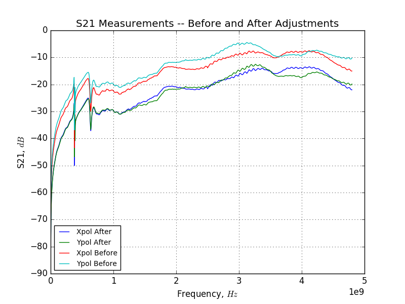
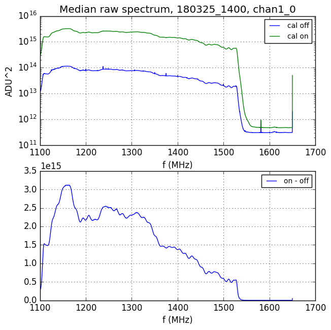
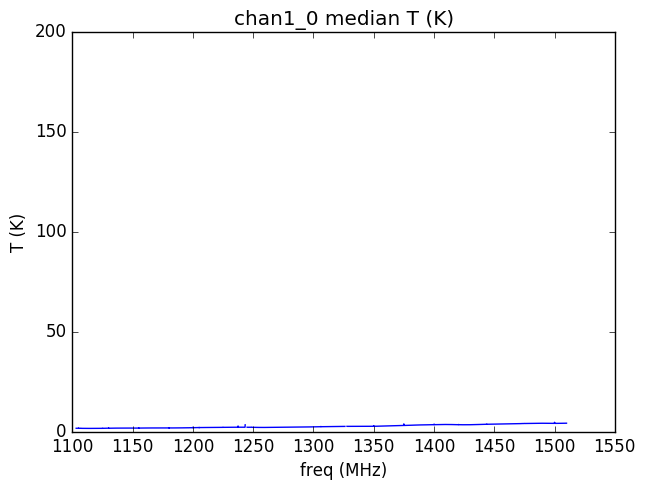
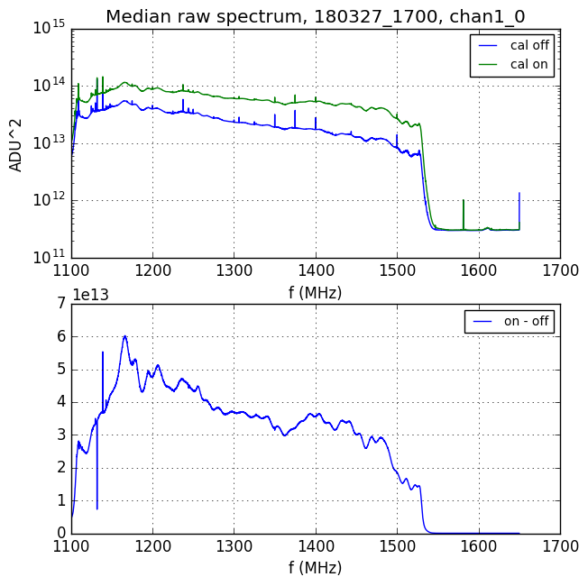
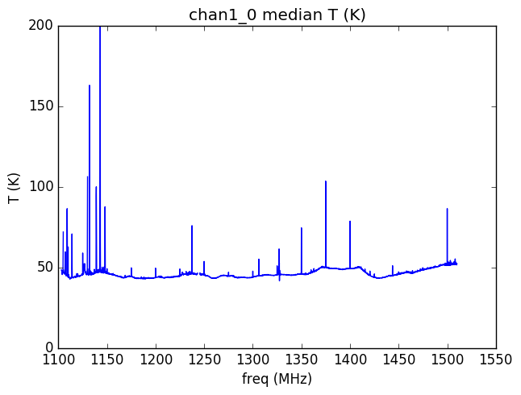
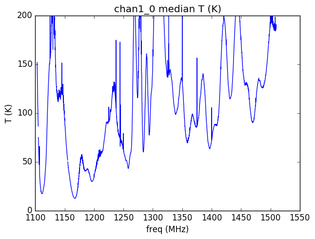
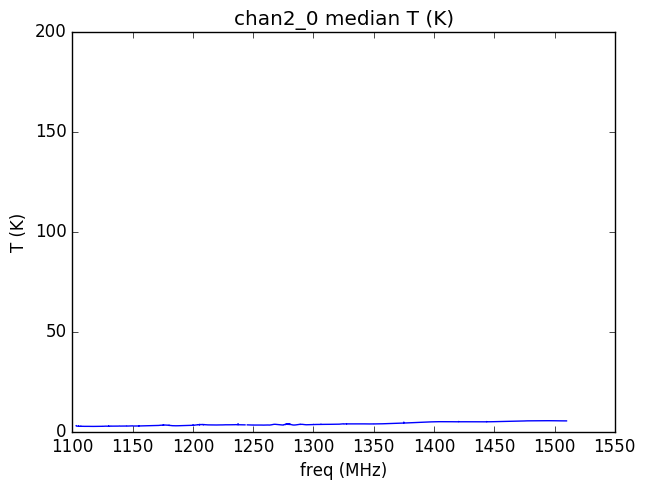

## Mar 30, 2018 - Coupled Port Measurements Indicate Instability

### Motivation: Potential Return to OMT Coupled Ports?

After our discussion a few weeks ago, we decided to remove the low loss
cable/30dB coupler/noise diode setup in favor of putting the noise diode on the
OMT coupler ports. This change was made, as mentioned previously, on March 14th
2018, when the coupling between the coupled port and receiver port were quite
high. Within the data browser, calibration methods are applied using the
measured S21 between the coupled port and receiver port, and since a change was
made, a new measurement of this parameter had to be conducted. Simultaneously,
there was a suggestion to adjust the insertion depth of the coupled
copper-jacketed coax, which injects the noise diode signal into the OMT, where
it is mixed into the sky signal. 

### Calibration Problems from 180314 - 180327:

To accomplish both of these objectives, I did the following on Tuesday, March
27th 2018. First, I removed the low loss cables and the noise diodes from all of
the OMT ports, and took S21 measurements across the coupled/receiver ports on
both channels. Then, I loosened the aluminum clamps which 'hold' the calibration
coaxial cables inside the OMT, and adjusted their depth (no more than a few
millimeters) until the VNA indicated that the S21 across the ports was roughly
-30dB within the band. I then secured the coax cables, acquired another S21
measurement across the ports, and finally reconnected the noise diodes and low
loss cables to the required ports. The results of these measurements are shown
below in figure 1: 

**Figure 1: 180327 Result of S21 Measurements across Coupled Ports:**

CLearly, the previous position of these ports permitted a very high coupling
that allowed a lot of noise diode power to enter the amplification system, as
shown the raw spectrum (diode on/off) from March 25th, 2018, shown in figure 2.

**Figure 2: 180325_1400 Browser Raw Spectrum (high diode power!):**

Because the initial changes (switching to the OMT coupler) were made to the
noise diode setup on the 15th, in order to properly calibrate this data we need
to integrate the S21 before data from figure 1 into the data browser
script. After some huffing and puffing, the S21 measurement was converted and
implemented in a new branch of the /bmxreduce repository, stored on my cluster
account and kept separate from the 'real' reduced data. After applying the
changes, the calibrated spectrum is not showing what we should expect, as shown
in figure 3.

**Figure 3: 180325_1400 Browser Calibrated Spectrum:**

This plot suggests that the conversion process from ADU^2 to K is misbehaving,
as though the reduction code believes the noise diode is far weaker than it
actually is. The other potential explanation, which seems to be correct, is that
the coupling during this time period was some value other than what I measured
on March 27th, just two days after this data (shown in the plot above) was
collected. In fact, we can see the strength of the coupling changing just hours
before I measured it on the 27th! Starting with
[180327_1200.data](http://www.cosmo.bnl.gov/www/bmx/databrowser/) and moving
forward to 1300, 1400, ..., 1700, the noise diode power drops (both in absolute
power, and power relative to the cal off spectrum). 

The initial S21 measurement (before adjusting the cal port coupling) was taken
at rougly 1:00PM EST, so just after 180327_1700.data (which is shorther than
typical files, because I interrupted the data acquisition to take this
measurement). The spectrum here is at its lowest value, relative to the previous
data files. The raw spectrum is shown in figure 4:

**Figure 4: 180327_1700 Browser Raw Spectrum (low diode power):**

Applying the same calibration methods as in the previous case, we obtain a far
more reasonable level for the calibrated spectrum (figure 5), which suggests
that this method was applied correctly, but the coupling changed
(SPONTANEOUSLY?) mere hours before I performed the measurement!

**Figure 5: 180327_1700 Browser Calibrated Spectrum:**

Because we saw the diode coupling seemingly fall by itself hours before I took
the measurement, it doesn't seem like I altered the coupling by removing the
diode, but that something stranger occured.

### Calibration Problems from 180327 - 180330:

After adjusting the ports and anchoring them in their new positions, the
calibration methods with the new S21 measurements are similarly flawed. I
believe when I completed the measurements and reconnected the diodes/low loss
cables, I must have altered the positions of the coupled coaxial cables, ruining
the calibration. It is quite tight working up there, and even though I attempted
to secure them properly I managed to mess it up! Here is a post adjustment data
file that shows the issues more clearly.

**Figure 6: 180328_1400 Browser Calibrated Spectrum X and Y polarizations:**

The inconsistency seen here has led to us reconnecting the low loss cables and
30B couplers, with the noise diode pumped in at this point. This will continue
until these calibration problems can be solved.