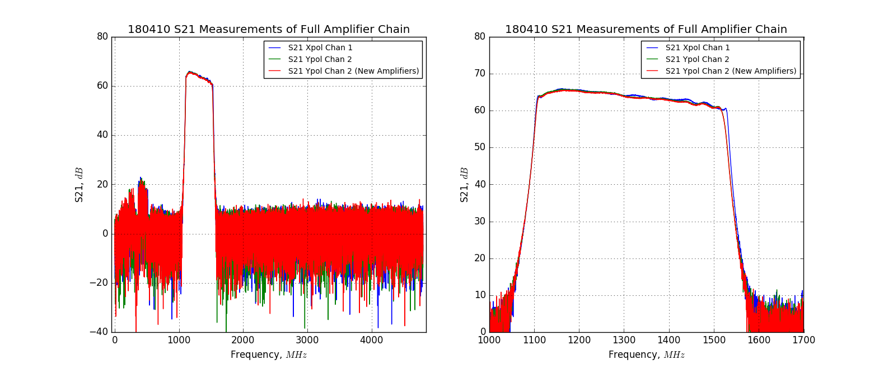
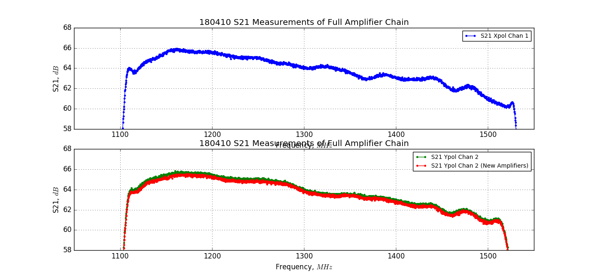

## Apr 10, 2018 - Unstable Noise Floor on Y-Polarization Data

### Identifying the Problem:

At the group meeting on Tuesday April 10, we discussed the unstable noise floor
of the y-polarization data channel. The calibrated spectrum on the
y-polarization shows two discrete states: the first (correct) state features a
noise floor (background temperature in calibrated spectrum) of approximately
55K, while the second state has a noise floor  of roughly 110K. In general, the
system will remain in one of these states for hours to days, but will switch
spontaneously. For comparison, the x-polarization data shows a stable noise
floor of about 55K, which does not appear to change. At first glance, this does
not appear to be caused by a difference in hardware, since both polarizations
are using identical front-end electronics. Moreover, the channels have the same
data transfer cables, the same model of noise diode and 30dB coupler, and all
active components on both channels are powered by the same regulated power
supply.

To try and narrow the scope of the issue, I spent some time investigating the
data browser files for the two different states. By eye it appears that from the
low noise floor data (e.g. 180408_1900.data) differs from the high noise floor
data (e.g. 180408_2100.data) in two notable ways: Different background power in
the uncalibrated spectrum (maybe a factor of 2 in ADU^2), and a subtle change in
the gain (the values are relatively similar, but the slope and structure has
changed somewhat). Between these two files, it appears that many of the other
parameters are consistent. The noise diode power in both cases is roughly
equivalent in ADU^2, because the on-off spectrum has the same value, even though
the background power increased by a factor of 2 in ADU^2. It seems as though the
background power that isn't coming from the diode has increased by a factor of
two, while the power contribution from the noise diode has remained constant. To
my understanding, if there was some change in the gain or amplification between
the two files that resulted in the overall power increasing, it should similarly
amplify the power from the noise diode, but its value relative to the background
is unchanged.

I suppose this is what we should expect if all components are functioning
properly except one, which is adding some power into the analog signal, like
white noise being emitted at the output of an amplifier. Then the original
signal should be preserved, with added garbage that is amplified by any
subsequent amplifiers along with the original signal, which would not impact the
power emitted by the noise diode.

### Debugging Procedures and Potential Solutions:

The first order of business was replacing the amplifiers in the chain,
suspecting that one of them was malfunctioning. This change in the configuration
was conducted on Tuesday April 10, starting at approximately 3:45 PM. Earlier
that afternoon, I soldered a new set of amplifiers and prepared to exchange them
with the set currently in use on the y-polarization (channel 2) data feed. The
breadboard and front-end electronics were removed from the front-end box, and
then I used the VNA to take S21 measurements of both data channels, with the old
amplifiers still connected on the y-polarization. I then replaced the
y-polarization  amplifiers, and conducted another S21 measurement with the
VNA. The results of these measurements are presented in figures 1 and 2. The
data acquisition was restarted with new y-polarization amplifiers at
approximately 180410 @ 6:07 PM.

As of Tuesday April 17, replacement of the amplifiers has not changed the noise
floor of the y-polarization data, which still switches between the low and high
background value in the calibrated spectra. In order to assess whether or not
the digitization process (at the card) is responsible, I have swapped the data
transfer cables at the outside of the PC enclosure. Now the x-polarization
should appear on channel 2, and the y-polarization should appear on channel
1. This change was implemented at approximately 180417 @ 5:07 PM.

** Figure 1: S21 Parameter Measurements of Full  Amplifier Chains **

The S21 parameter was obtained via a frequency sweep at -30dBm over the full
range of the VNA, with many data points (20,000?). 60dB of attenuation attached
to port 1 of the VNA, so the amplifier chain wouldn't approach nonlinear input
power. This 60dB of attenuation was added back to the S21 values at each
frequency sampled. Neither the long data transfer cables nor the 3dB attenuators
attached to the data ports of the digitizer card are included in the
measurement, so 3dB of 'missing' attenuation has been subtracted from the s21
values as well. The full frequency range of the VNA is shown in the left panel,
whereas the right panel shows the frequency range around our band. There are 3
curves present, for the x-polarization, and the y-polarization before and after
replacing all of the amplifiers. These curves are separated in figure 2, below.

** Figure 2: S21 Parameter Measurements (by polarization) **

These measurements are remarkably similar across both chains, and almost
identical following the replacement of the y-polarization amplifiers.