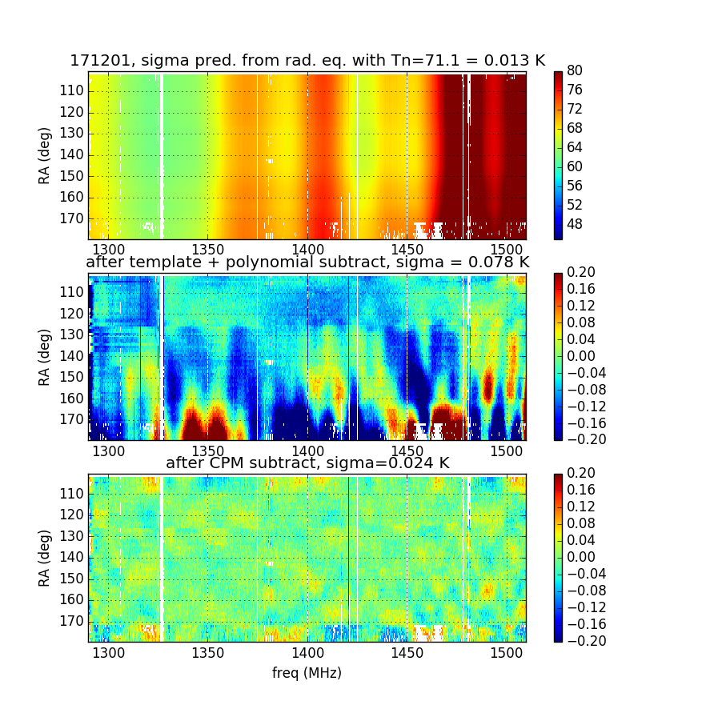

## April 10, 2018 - Causal Pixel Model filter for BMX

Chris Sheehy

### 1 - Introduction

In this posting I apply the "causal pixel model" developed by David Hogg for use
with Kepler data (to find exoplanet tranists) to try to filter out noise from
BMX data. The model is described in [this paper](https://arxiv.org/abs/1508.01853).

### 2 - Description of model

It's very simple: for each pixel in the waterfall plot, I exclude a region
around this pixel corresponding to +/-30 minutes and +/- 5 MHz. I extract the column
corresponding to the target pixel frequency, and at each time step fit the other
points in the spectrum at that time to the target frequency (again, excluding
the +/- 5 MHz strip). This yields a set of coefficients that predicts the target
frequency given the other points in the spectrum. Then I use these coefficients
with the spectrum (row) of the target pixel to predict the target pixel
value. 

The trick is do penalize large coefficients. Otherwise the data are overfit, and
while the fit to the non-target pixels is better, it has less predictive
power. Similar to the Hogg paper I use a ridge regression with alpha=1. The
alpha parameter sets a Gaussian penalty for large coefficients and is
tunable. As alpha goes to zero it becomes a regular least squares fit. 

### 3 - Results

Figures 1-3 show the results of the CPM fit for three different days. Top panel
shows the unfiltered calibrated data. Middle panel shows the data after fitting
and subtracting a 3rd order polynomial from each row, plus a template computed
as the median over time of all the spectra. This filtering is effective but
there are large residuals. In the top panel title I show the expected standard
deviation of the pixel computing using the radiometer equation and the median
zero point temperature of the spectra. In the middle and bottom panels I show
the std of the data after filtering.

The bottom panel then shows the results of fitting the CPM to the middle
panel. (It doesn't work as well fitting to the top panel directly.) This has the
result of bringing the residuals way down, and the std more in line with what is
predcited from the radiometer equation. It works better on some days than
others, but these plots are representative of the range.a

**Figure 1: CPM, day 171201**

**Figure 2: CPM, day 171226**

**Figure 3: CPM, day 180331**

### 4 - Filtering of signal

All filters will filter some signal. To test this, I substituted binned SDSS
galaxies for the data and did the poly + template fit and the CPM fit. Figure 4
shows the orignal data, Figure 5 shows the data after poly+template fitting, and
Figure 6 shows the data after CPM fitting. The poly + template fit kills large
scale modes as expected. What is very cool is that the CPM fit barely seems to
filter any signal at all. 

**Figure 4: signal**

**Figure 5: signal after poly+template fit**

**Figure 6: signal after poly+template+cpm fit**

### 5 - Conclusions

CPM fitting works well to clean our data without killing signal. I still need to
test how linear it is, i.e if CPM(a) + CPM(b) = CPM(a+b), which is basically a
requirement to be useful. I think it should be.

