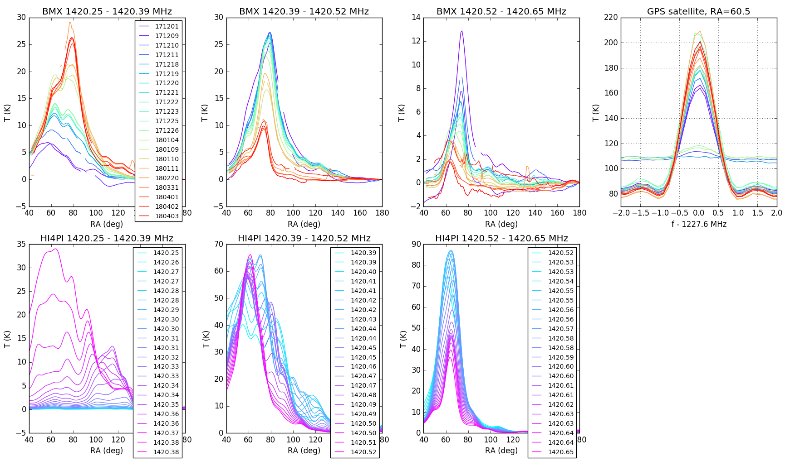
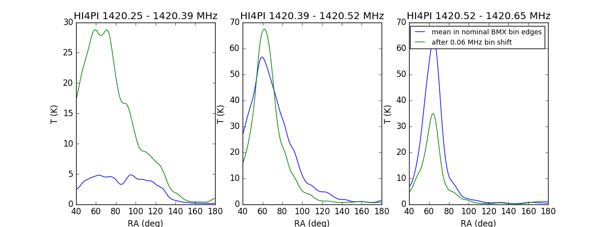

## April 10, 2018 - HI galactic plane crossing over time

Chris Sheehy

### 1 - Introduction

Here I have a look at HI in the galactic plane over time. In a [previous
posting](../20180216_hifit) I tried to fit this data to templates taken from the
HI4PI survey but was unable to get a good fit.

### 2 - Animated GIF

Figure 1 shows the galaxy crossing and one of the GPS satellites, binned in RA,
from Dec 1, 2017 to April 4, 2017. Over short time scales, the HI is very
repeatable. (Ignore the obvious bad data, and the period in late March when the
calibration is wrong and makes the data zero.) However, there is a clear shift
to lower frequencies over time. This is very strange. There doesn't seem to be a
comparable shift in the GPS satellite center frequency, though it would probably
be very difficult to tell from this plot

**Figure 1: Galaxy crossing and GPS satellite movie**

*** 3 - Plot over time

Figure 1 shows all data, including the wiggly state data, when the gain is
manifestly low. (See the previous posting linked in the intro.) I went through
by eye and picked out only regular state data and plotted the galaxy crossing
over time in three bins. I also plot the GPS satellite spectrum around 1227.60
for each of these days to try to detect a drift. This is shown in the top row of
Figure 2. In the bottom row of Figure 2 I show the HI4PI templates within each
BMX frequency bin. The HI4PI frequency bins are much narrower. There is a ton of
frequency structure in the HI that we average over in our bins. 

**Figure 2: Galaxy crossing and GPS satellite plots, and HI4PI templates**

There is a clear monotonic drift in the HI spectra over time. There is no
obvious drift in the GPS satellite spectrum.
I suppose it's possible that a sub-bin frequency shift could change the measured
spectrum by a large amount without this being obvious in the measured GPS
satellite spectrum. 

To get a feel for what a sub-bin shift might do, Figure 3 shows the change in
HI4PI templates, averaged over the nominal BMX bin, before and after a frequency
shift of approx. half the BMX frequency bin width, 0.06 MHz. There are quite
substantial changes. This does not necessarily explain our data, but it shows
that it's plausible. 

**Figure 3: Galaxy crossing and GPS satellite plots, and HI4PI templates**

### 3 - Conclusions

We see a clear evolution of the measured HI spectrum over time. Between two
closely separated days the data are repeatable. The spectra are not totally out
of line with the predicted spectrum using HI4PI templates, but I can't get a
good fit. (N.B. when fitting before I did try to fit for a bin shift.)

