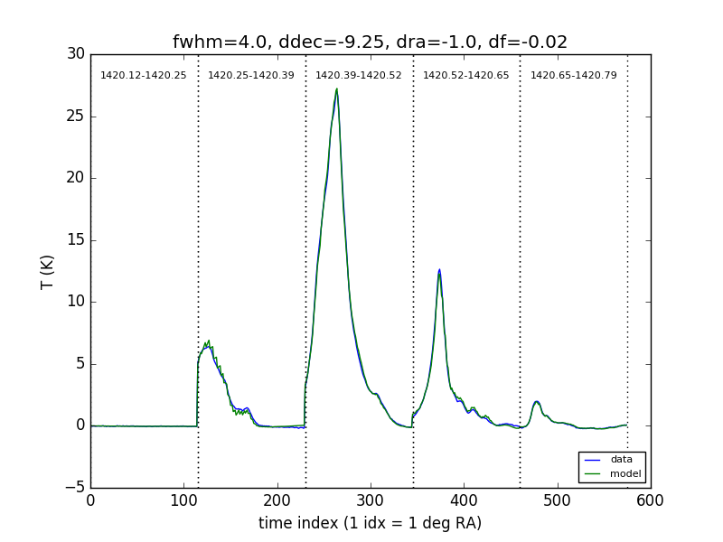
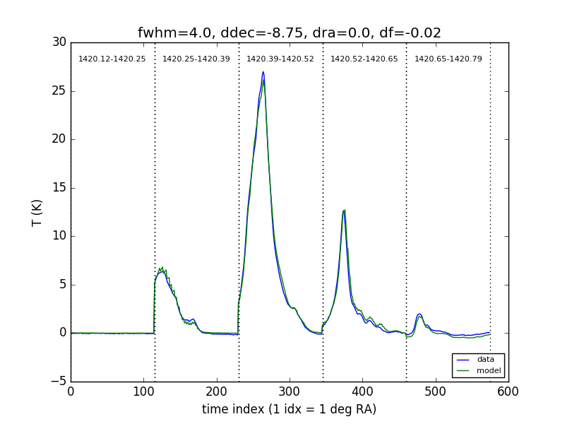
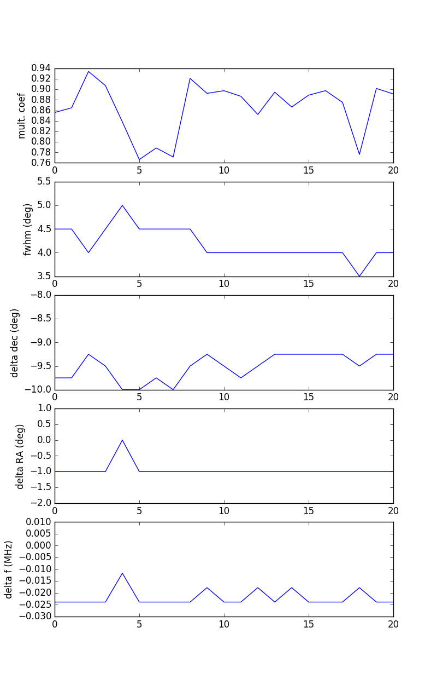

## April 17, 2018 - HI fits with velocity correction

Chris Sheehy

### 1 - Introduction

In [this previous posting](../20180410_galcrossevol/index.md), I showed the
galactic HI spectrum evolving over time. Justine pointed out that this could be
a result of redshifing and blueshifing due to the earth's motion. In this
posting I account for this velocity correction and re-fit the galactic plane
crossing data.

### 2 - Method

The HI4PI paper is clear that the spectra they publish are corrected into the
"local standard of rest" frame (LSR). This accounds for the earth's motion as
well as the sun's motion w.r.t. the LSR, which is a standard velocity and
direction of the sun w.r.t the mean motion of nearby stars. In principle this
requires detailed measurements of stellear proper motions, but in practice there
is a standard definition that is accepted.

I ended up downloading some publicly available code to do the correction into
the heliocentric frame. I tried coding this up using the equations published in
"Astrophysical Formulae" by K. Lang, but couldn't get it working. I used my own
code to correct the heliocentric velocities into LSR velocities. 

This has a very large effect. In fact, when fitting, one must update the
correction even for minor degree scale shifts in ra/dec offset to get good
fits. Once this is done, however, the fits are very good.

I fit for a few parameters. Dec offset, RA offset, beam Gaussian FWHM, a
constant shift in frequency of BMX bins w.r.t. HI4PI bins. I also fit a
multiplicative term multiplying the templates, and two nuissance term, a
constant offset and a linear drift in temperature. These last terms are small, as I
will show. 

I do not use the polynomial or CPM filtered BMX data. Instead, I choose a bin
just to the low frequency side of the lowest BMX bin I am fitting and subtract
this TOD from each of the spectra. This works quite well.

I divide the HI4PI templates by 2. I think this is kosher, since I = Ex^2 +
Ey^2, and we are only measuring Ex^2. I need to do this to get a sensible
multiplicative constant. Otherwise it is far too low.

### 3 - Results

Figure 1 shows the best fit to the 171201 crossing. It is awesome. This fit is
simultaneous to all the frequency bins shown. The x axis is time index, but the
data are binned such that each time index is a delta RA of 1 degree.

**Figure 1: Best fit to 171201 crossing**

Figure 2 shows the best fit if I do not fit a constant offset and linear drift
term. The fit is still quite good, and the fit parameters do not change too
much. 

**Figure 2: Best fit to 171201 crossing with no constant/linear terms**

I then fit data from 171201 - 180403. Figure 3 shows the best fit parameters
(including constant and lienar terms) over time. The x-axis is just index, but
can be matched to the day using the list of plots below. The y-axis limits are
the range of fit parameters I am considering. On a few days the fit paramers
reach this limit, so the true best fit might lie outside it.

**Figure 3: Best fit parameters over time**

Here are the best fits for all the days.

[1 - 171201](hifit_171201.png)

[2 - 171209](hifit_171209.png)

[3 - 171210](hifit_171210.png)

[4 - 171211](hifit_171211.png)

[5 - 171218](hifit_171218.png)

[6 - 17121](hifit_171219.png)

[7 - 171220](hifit_171220.png)

[8 - 171221](hifit_171221.png)

[9 - 171222](hifit_171222.png)

[10 - 171223](hifit_171223.png)

[11 - 171225](hifit_171225.png)

[12 - 171226](hifit_171226.png)

[13 - 180104](hifit_180104.png)

[14 - 180109](hifit_180109.png)

[15 - 180110](hifit_180110.png)

[16 - 180111](hifit_180111.png)

[17 - 180220](hifit_180220.png)

[18 - 180331](hifit_180331.png)

[19 - 180401](hifit_180401.png)

[20 - 180402](hifit_180402.png)

[21 - 180403](hifit_180403.png)

### 4 - Conclusions

The fits are very good. We are offset in dec by -9 degrees or so. We are bang on
in RA. This perhaps makes sense if the main degree of freedom in horn position
is up/down, though it seems quite large. HFSS can tell us if this is
reasonable. 

There is a constant -0.02 MHz offset. I am guessing this has something to do
with my calculation of the velocity correction. Regardless, it is small and a
constant, so I'm not too concerned.

The best fit FWHM is close to what we expected. Since we know we have elliptical
beams and I am assuming a Gaussian beam, I can imagine why there might be some
scatter over time.

Lastly, it remains to be seen how much parameter degeneracy is and how well we
are constraining any one. 

