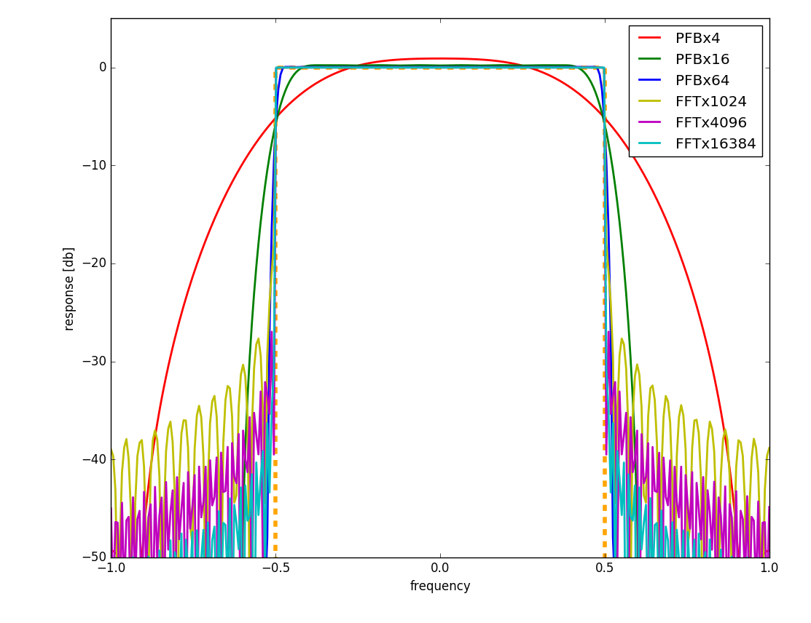
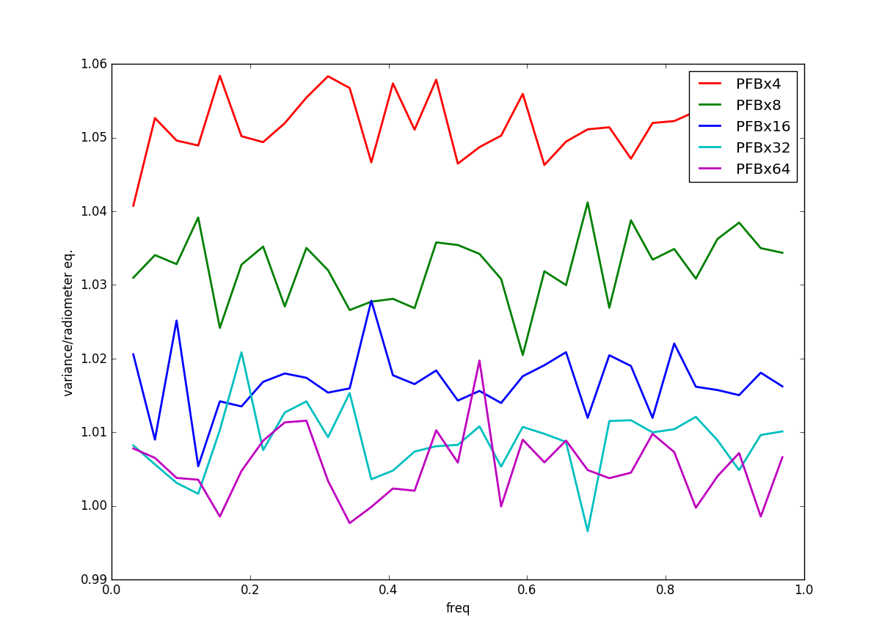
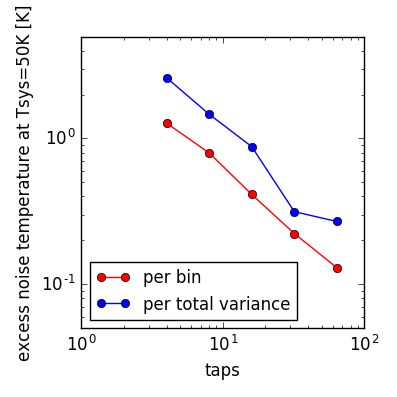

## Apr 22, 2018 - PFB theory [AS]

### Polyphase filterbank response

Polyphase filterbanks are the efficient algorithmic way of doing FFT
spectrometers. However, while they are very fast, it is still not
clear whether and how they compete with truly very large FFT
transforms. 

** Figure 1: PFB response **

The figure above shows a response of a frequency bin for both PFB
algorithm (for which we took the pedagogical implementation of
[Danny Price](https://github.com/telegraphic/pfb_introduction))

In short, we scan in frequency along the bin. A perfect spectrometer
would have 0 response outside the bin and unity response inside the
bin and is plotted as the orange dashed line. The "PFBxM" corresponds
to M tap polyphase filters using Hanning weighting. A commonly used
number of taps is 8. The "FFTxM" corresponds to FFT spectrometer using
FFTs that are a factor M longer than the minimum required for the
number of channels. There is a subtlety in that bin centers move as M
is increased. The current set-up we use at BMX corresponds to "FFTx16384"

We note that FFT spectrometer always have worse side-band response,
but also that they have much better response around the actual edges
of the bin. That is why for signal wit a lot of fine structure, such
as our galaxy 21-cm, they might be better.

### Optimality

In principle, PFB filters can also be somewhat suboptimal, because
they don't weight all the data equally. We modified the PFB to deal
with periodic data so that we could have a clean mode counting (but
the effect is negligible for sufficiently long test datavectors) and
then compared the scatter in measured power vs what is expected based
on radiometer equation or equivalently mode counting. The input vector
is always just pure white noise (uncorrelated gaussian variates).

For FFT spectrometer we nicely recover zero excess noise. 

For PFB filter, the measured variance divided by the expected variance
(i.e. radiometer equation) is plotted below

** Figure 2: Extra variance **

Additionally, the neighbouring bins are correlated at 2% level of
4-taps, but falling rapidly.

This can be converted to the excess noise temperature (by taking sqrt
of the above, subtracting 1 and multiplying by fiducal Tsys). We do
this both per bin and also per total power, for which the effect is
*larger* (becase neighboring bins are positively correlated):

** Figure 3: Excess noise **

We see that the excess noise is perhaps non-negligible for 4-taps, but
it becomes truly very small for 64 taps. The bin-bin correlations is
perhaps somewhat more worrisome. 

