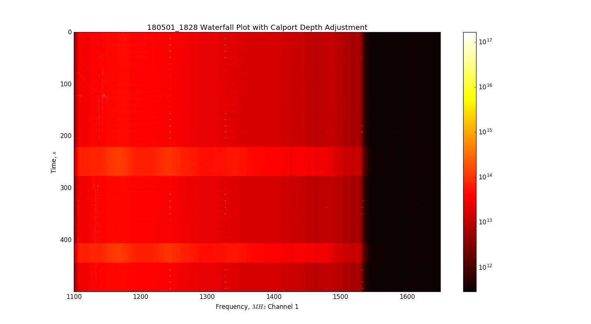
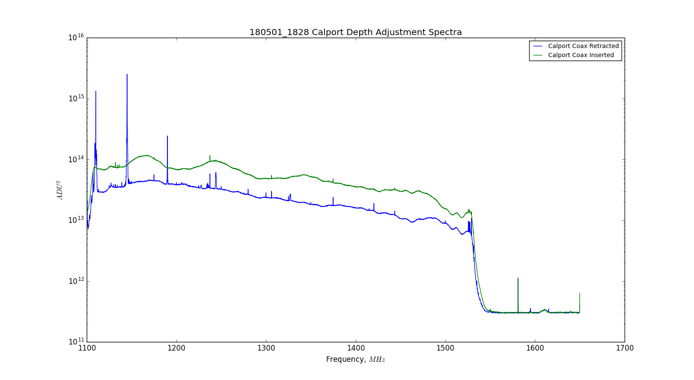
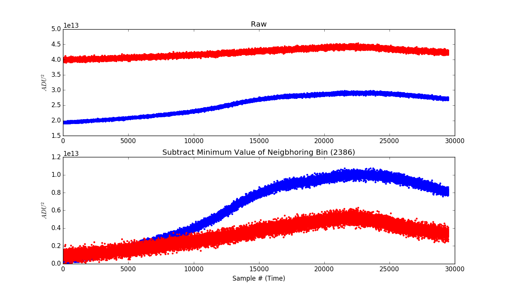

## May 01, 2018 - Fixed Unstable Noise Floor on Y-Polarization

### Problem and Solution:

As presented at length in my [previous posting,](../20180410_New_Amps_S21/index.md) there was a persisting
problem with the noise floor on one of the polarizations. on Tuesday, May 01,
2018, I identified the source of the instability and took steps to eliminate
the prroblem in the future.

Over the past three weeks, I have made a few changes to isolate the source of
the inconsistent behavior. Whenever the noise floor was high, it appeared as if
the background power was being raised by a flat source, but the noise diode
pulse appeared to be a constant level, and the gain appeared to be consistent at
all times. When the channels were switched at the enclosure, the unstable noise
floor moved over to the other channel, suggesting that the problem was not
originating in the digitization process. The cables were then returned to their
original position, and days later the low-loss cables on the two channels were
switched at the OMT output ports. Again, the noise floor instability moved to
the new channel. This suggested that the source of the instability was not in
the electronics, but coming in with the power received by the OMT. 

After examining the temporal behavior of the switching noise floor, I couldn't
discern any obvious pattern. It seemed to change rather spontaneously, sometimes
switching rapidly on and off within the same data file. Additionally, It seemed
unlikely that some flat source of RFI would be responsible for this change, and
I couldn't conceive of a reason why such a source would be present but only on
one polarization. Recalling that the coaxial leads on the OMT calibration ports
were not remaining stable but switched intermittently, I decided to test
whether or not adjusting the insertion depth of the calibration port could
trigger the high background power seen in the instability. Below is a waterfall
plot from a simple test I devised to see if this was indeed the cause of the
instability. I believe this is conclusive evidence that the calibration power
was responsible for the behavior. 

### Figures and Evidence:

Figure 1 contains a waterfall plot from the afternoon of Tuesday, May 01,
2018. I started the data acquisition with the system running as it had for the
past several days, with the XPol data on channel 2, and the YPol data on channel
1. Examining the plot, it begins with a normal noise temperature around
55K. Recall that the problematic behavior appeared to come into the system from
the Ypol OMT data port, so the unstable behavior appears on channel 1. Around
220 seconds into the data acquisition, I loosened the aluminum clasp around the
Ypol OMT calibration port, and inserted the cable until it contacted the data
coaxial cable inside the OMT ridge. At this time I saw the spectrum increase in
power, as seen in the unstable behavior. After waiting a while, I withdrew the
calibration port coax, and the spectrum returned to its original level of
power. I replicated this again around 410 seconds. Comparing this to the
unstable noise floor behavior previously observed in the data browser, we see an
identical response from this test.

** Figure 1: 180501 Waterfall Plot from Calibration Port Adjustment Test **
 

From this same waterfall plot, I decided to examine the structure of the
spectrum we see from the different behaviors. That is shown in Figure 2 below.

** Figure 2: 180501 Spectra from Waterfall Plot **

The difference in background power observed in these spectra is consistent with
the behavior observed previously when comparing the behaviors of the unstable
noise floor. When the calibration port is maximally inserted, the power is
around 1014, whereas the power with the calibration port withdrawn is
approximately 3*1013.

### Possible Explanation of Observed Changes:

In discussing this with Chris, I suggested that when the calibration port is
fully inserted, it actually makes some contact with the data port. The data port
coaxial lead is inserted from one side of the OMT, through the middle, and up to
a 'tuned length' into the OMT ridge on the opposite side. If the two ports were
connected, then the data port should see some power from the 300K terminator
currently connected to the calibration port. However, this isn't entirely the
case, and in fact the system is only seeing about 55K of additional power.

If this assumption is the correct explanation, then any power entering from the
sky is being split between the terminator on the coupled port and power that is
seen by the amplifier chain. So, when the ports are in contact, and the noise
floor is high, the sensitivity of the system to external sources should be
reduced. 

I have attempted to plot transiting HI sources observed in the data, but these
methods have been quite rudimentary to this point. Shown below are two
'transits' of duration longer than an hour, one from a file with low background
power and one from a file with high background power. To identify 'transits' I
looked for a rise and fall in the measured 1420MHz signal, which appeared to
move forward the daily 4 minutes.

** Figure 3: Transit Curves from Different States **

Unfortunately, this plot was not cooperating with the legend() function, because
it was plotting as a series of points. The lines plotted in BLUE are from
180429_1000.data when the system had a noise floor of 55K. The lines plotted in
RED are from 180430_1000.data when the system had a noise floor of 110K. In the
top panel of the plot, I show the raw time series of the two 'transits' for bin
2387th of the spectrum (the 1420MHz bin). In the bottom panel, I have subtracted
the average value of the 2386th bin from the raw curves. Both panels have had
the diode pulses removed, and are plotted as single points. Comparing the curves
in the second panel, the value of the red curve is approximately half of the
power of the blue curve, and the slope of the curve is different as well. I
think the sensitivity of the system appears higher by about a factor of two from
this result, but I don't think this is very conclusive. 