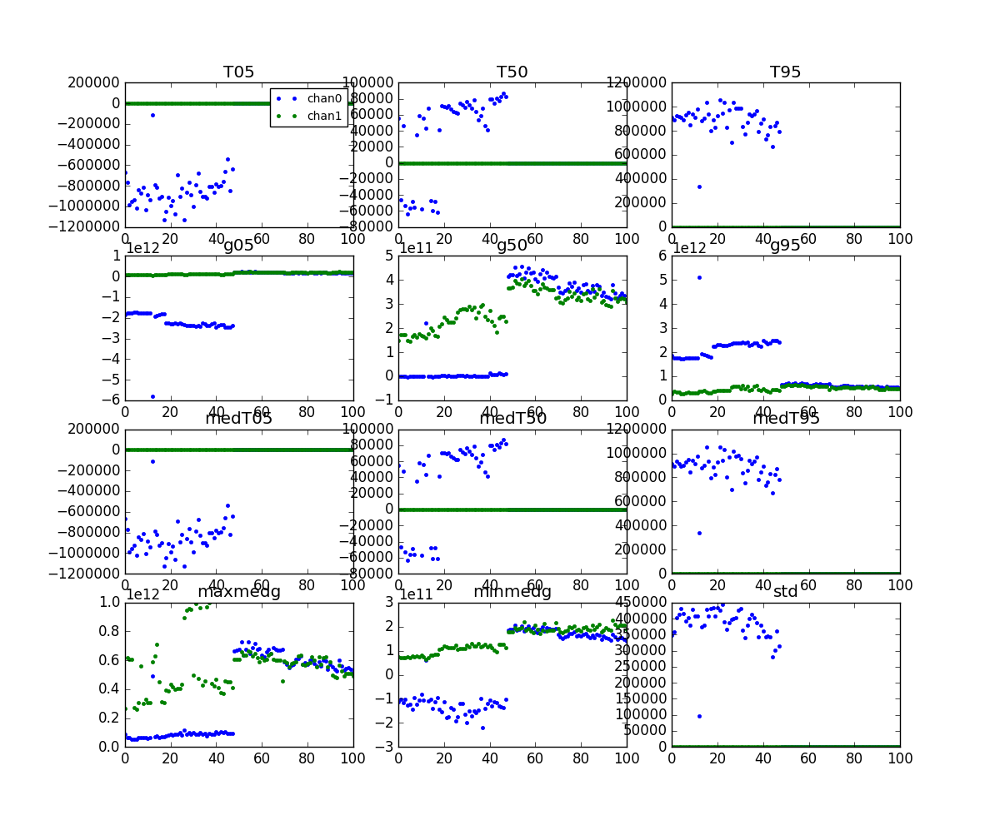
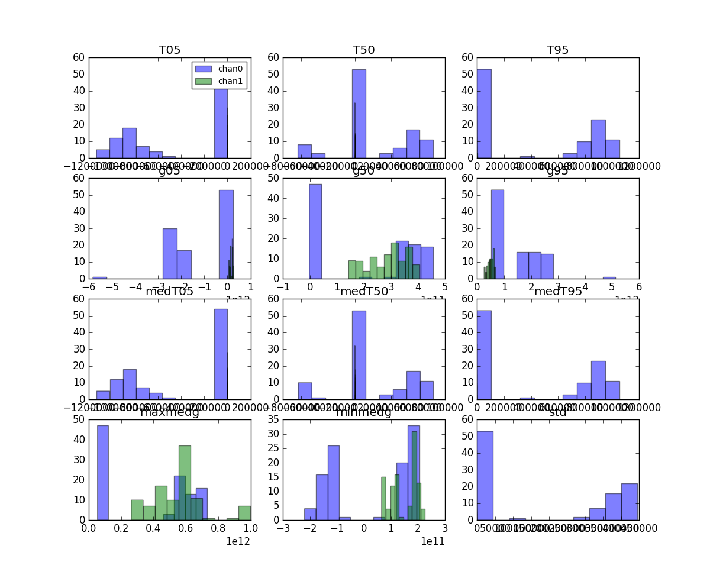
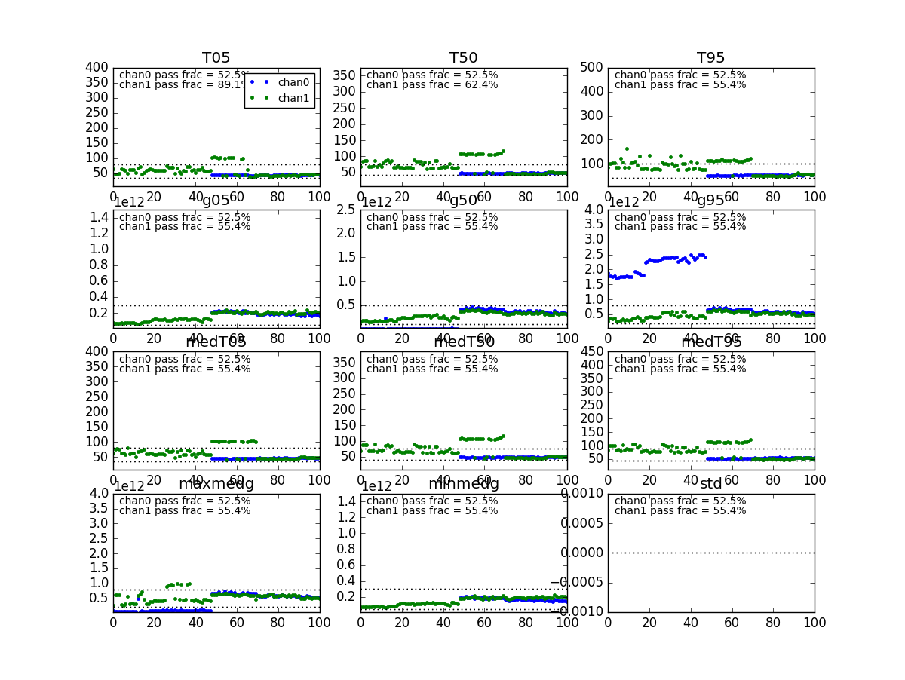
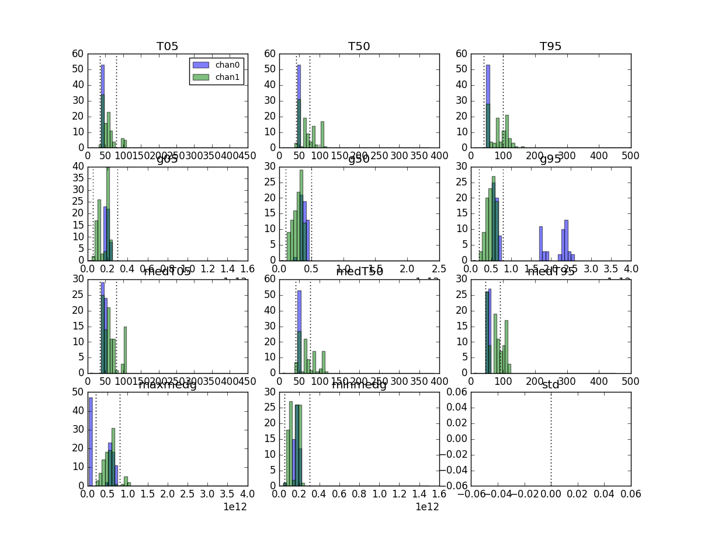

## June 11, 2018 - BMX map coadd

Chris Sheehy

### 1 - Introduction

This is a quick posting to show the first attempted coadd of BMX data. These
data span from Dec 1, 2017 to the end of the first week of June, 2018, with a
two month break from roughy Februrary - April 2017 for system debugging. There
are 100 total days, of about which 50 percent are not cut (see below). The sense
of "channel" is tied to OMT polarization, so channel 1 is vertical polarization
and channel 2 is horizontal polarization. (To add confusion, the OMT ports are
labelled Xpol and Ypol for the vertical and horizontal pol, respectively. These
have real physical meaning based on the distance of the conductor from the
backshort.)

The maps span a region of RA overlapping the SDSS galaxies shown in a
[previous posting](../20180102_SDSS_galaxies/index.md).

Apologies for the short posting, there is a lot to explain and I will add
later. I wanted to get these plots up for discussion.

### 2 - Cut framework

Cut graunularity is 1 daily map. Each day's reduced data is calibrated and filtered (template+poly, CPM,
see [this posting](../20180410_cpm/index.md). (Reduced data has calibration
applied. This is undone, and the mean gain over the day long block is computed
and applied to the whole day.) Weights are computed as 1/variance over the time domain of
the calibrated, filtered maps. This is all saved per-day. A slew of cut statistics are
computed and also saved. These single day maps are then read in and
combined in a weighted average. Pre-defined cut limits are used to cut data
based on the saved cut statistics.

Figures 1 and 2 show the cut statistics, time ordered and histograms. The plot
limits are skewed like crazy by the non-functioning channel at the beginning of
the run. Numbers like "05" and "50" refer to percentile. "med" refers to whether
this is computed after taking the median over time first, or from the entire
waterfall plot of data. "T" is calibrated temperature, "g" is gain, and
"maxmedg" and "minmedg" are the max/min gain in frequency ranges I picked out by
eye to try to catch the wiggly state. However, I think these end up not doing
much. "std" is the std of the unfiltered calibrated data, which it turns out is
a useless statistic since it is dominated by the very small wiggles in the gain
that are not calibrated out rather than variation over time in a given frequency
bin. 

**Figure 1: Cut stats, time ordered**

**Figure 2: Cut stats, histograms**

I then defined some hopefully sensible cut limimts. The plots are re-made
showing these cut limits and with the axes now sensibly limited. This is shown
in Figures 3 and 4. The pass fraction shown in each panel of Figure 3 is
cumulative after the application of each cut, read from left to right, top to
bottom. It is clear that the cuts are highly degenerate.

**Figure 3: Cut stats, time ordered, with limits**

**Figure 4: Cut stats, histograms, with limits**

### 3 - Maps

Maps for real data and simulations are shown in [THIS
PAGER](http://www.cosmo.bnl.gov/www/bmx/mapplots/20180611/).

The sim type shown includes the full HFSS beam for both polarization (though no
cross pol or polarized input is included). And you can toggle between colore and
colore+gsync+gfree+egfree+psources.

There is something wrong in the sims, I think caused by the lack of signal in
gsync above 1420 interacting with the poly filtering. I need to track this
down. 

