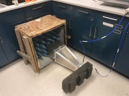
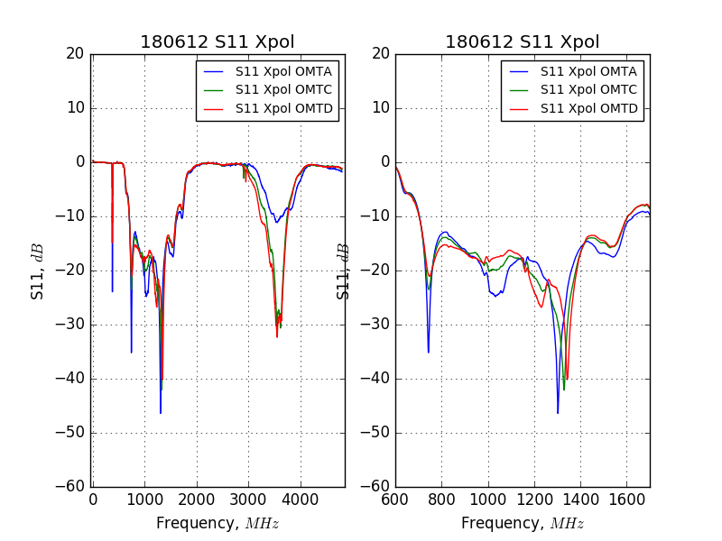
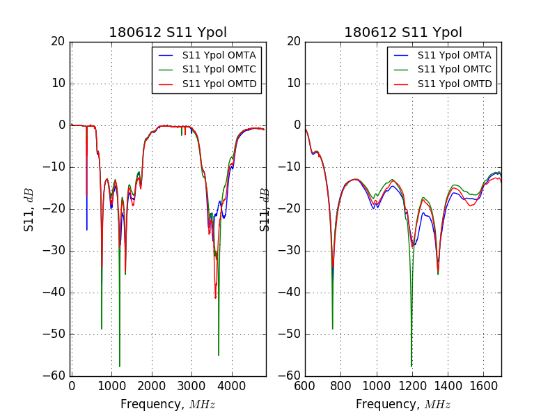

## June 14th, 2018: OMT S-11 Lab Measurements of OMTs

On June 12th, 2018, I measured the S11 parameter on the new OMTs that I
constructed using the VNA. We can compare these measurements to 
[OMT S11 data previously collected ](../20170321_new_omt/index.md), both in a lab
setting with the OMT directed into an absorber, and created in simulations. This
will tell us whether the new OMTs are operating consistently with the previous
one, which is especially important due to some damage sustained by the OMT
pieces in transit.

### S11 Measurements

OMT testing setup

Damage sustained to OMT

The OMT was positioned in the lab pointed into the absorber box, and connected
to the VNA through Channel 1, using first the X polarization connector and then
the Y polarization connector. Each OMT(A, C, D), was measured in both
polarizations, and compared to one another. This gives a reader of the amount of
reflection coming back from the OMT, or the measurement of the power recieved
back from port 1 that had been given off from port 1. OMT A had already been constructed
and measured, so we can compare the three to see how similar their output is.

Comparing these new measurements to the old measurements taken, and
each of the OMTs to one another, the measurements look fairly consistent with
what we would expect. This implies that hopefully the damage to some of the OMT
parts will not significantly affect their performance. 

