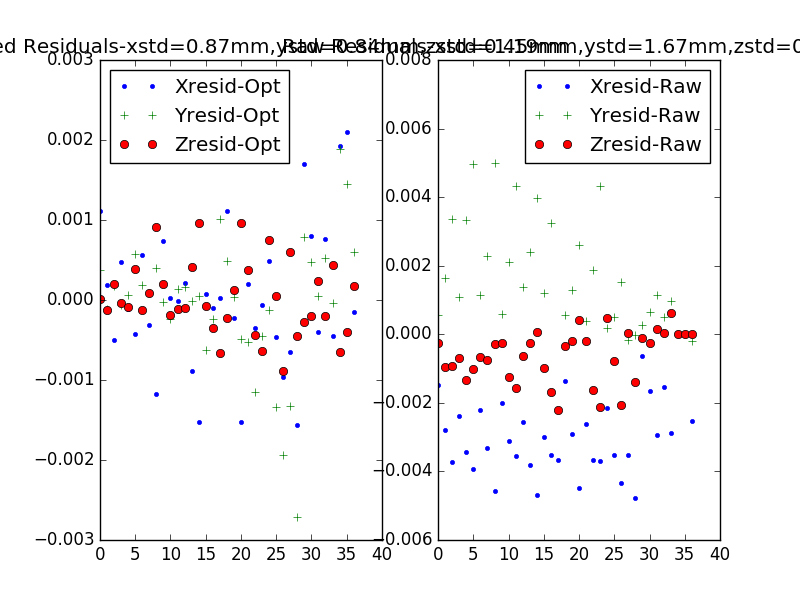
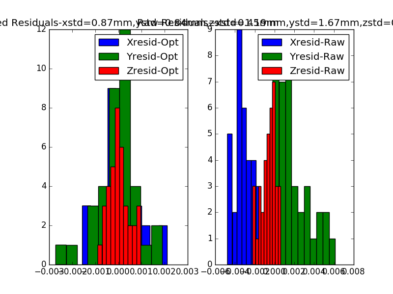

## June 14, 2018

### Photomodeler Residuals

When looking at the residuals between the two subsets of data produced by the Photomodeler, we found that despite being set to measure within the millimeter range, the residuals were almost reaching an order of centimeters. In order to eliminate this great of differences, we wrote a function in order to fit the second subset of data to the first. 

### Optimizing the Parameters
The parameters that we used to modify the second subset of data were scaling, translation, and rotation. Using the minimize function, we were given the most optimal parameters. These parameters were:

x-scaling: 9.99816139e-01, y-scaling: 1.00110130e+00, z-scaling: 1.00085827e+00

x-translation: 1.92439869e-03 m, y-translation- 1.88916851e-03 m, z translation: -6.51510685e-04 m

x-rotation: -4.72766367e-02 degrees, y-rotation: 1.43395276e-02 degrees, z-rotation: 2.52038822e-02 degrees

Where each parameter represents an array of x,y,z scaling, translation, and rotation, in that order.

### Plotting the Residuals
When plotted, the residuals now are all within about a 2 mm range and have a relatively Gaussian distribution. The standard deviations were also substantially reduced in the process. This is the comparison of the optimized data to the raw data:

