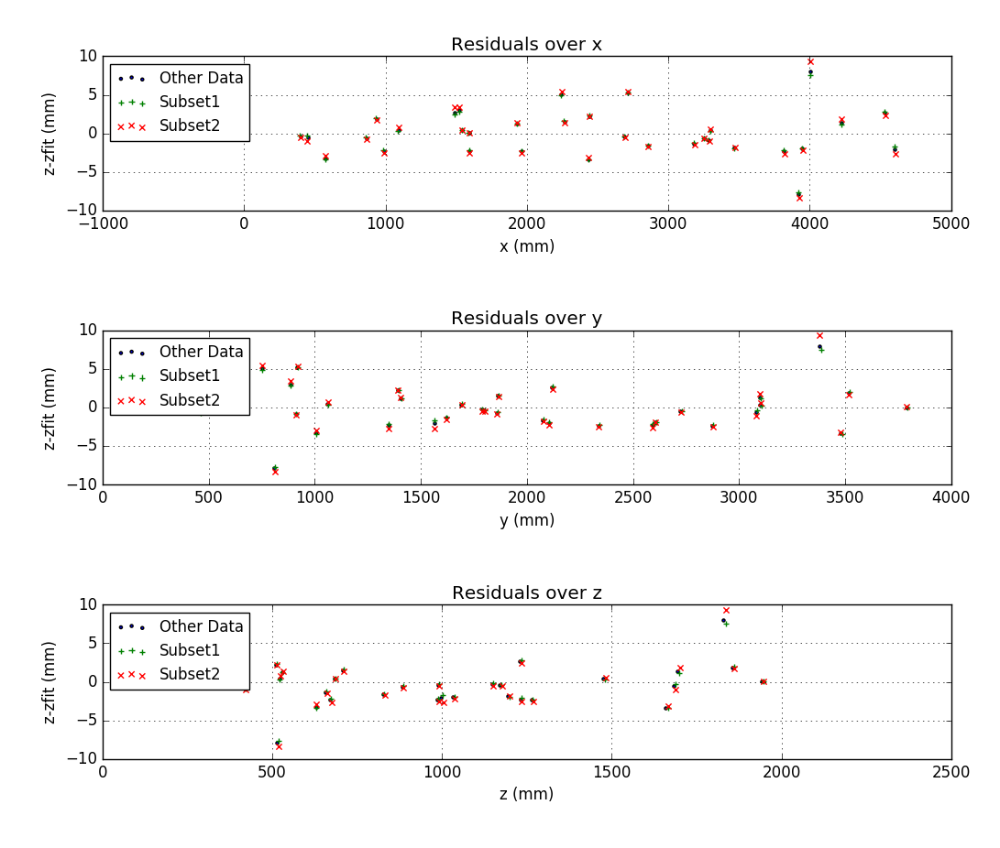

## June 22nd, 2018: Dish With Rotation

### Parameters with Rotation

In order to fit each set of data we had for the dish, we had to minimize the parameters in the same process described in my [previous posting](../20180614_Photogrammetry_Error_Fix/index.md). These parameters now took into account the rotation about each axis. These parameters were: 

#### Subset 1 parameters-

x-scaling: 8.303e-05

x-trans: 2218 mm, y-trans: -843.2 mm, z-trans: 76.97 mm

x-rot: 0.7857 deg, y-rot: 0.9316 deg, z-rot: -16.65 deg

#### Subset 2 parameters-

x-scaling: 8.289e-05

x-trans: 2330 mm, y-trans: -864.5 mm, z-trans: 72.11 mm

x-rot: 0.4213 deg, y-rot: 0.0197 deg, z-rot: -5.206 deg

#### Other Data parameters-

x-scaling: 8.302-05

x-trans: 2319 mm, y-trans: -860.5 mm, z-trans: 73.65 mm

x-rot: 0.3664 deg, y-rot: 0.1138 deg, z-rot: -13.94 deg

These all marked the vertex of the parabola as being around the middle of the platform with respect to the x axis, about one meter in front of the dish, and about 8 cm off of the platform, all of which was previously predicted. The rotation angles indicate that the dish is still pointed roughly at zenith since the x and y rotations are small.

### Fitting the Data

Once the parameters were found, the next step was to evaluate each set of data individually with their best fit parameters and find the residuals between the original and fitted data. All of the sets of data were within an error of 2 mm within each other, which adhered to the errors found in the linked posting above. All three sets are within 10 mm with each of its residuals and are similar to each other in each of the coordinate axes. These findings are reflected in the graphs below.

