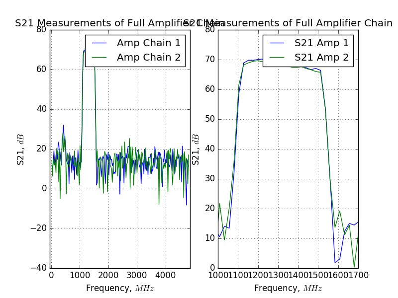

## July 02, 2018: S-21 Lab Measurements of Assembled Amp Chains

On July 2nd, 2018, I measured the S21  parameter on the amplifier chains that I
constructed using the VNA. The chain consists of:  Low Noise Amplifier, High
Pass FIlter (VHF-1080+), Low Pass Filter (VLF-1400+), Low Noise Amplifier, 
Low Pass Filter (VLFX-1350), Stage 3 Amplifier, Band Pass Filter.

I also added 60 DBs of attenuation to the front of the chain in order to avoid
overloading the third amplifier. The measurements were taken at -35 DBs into the 
chain and with a supplying DC voltage of 3 volts. 

We can compare these measurements to 
[Amplifier S21 data previously collected ](../20180410_New_Amps_S21/index.md). 
The data looks to be consistent with what we would expect of the amplifier
chains, and indicated that they are working as expected. 

### S11 Measurements

