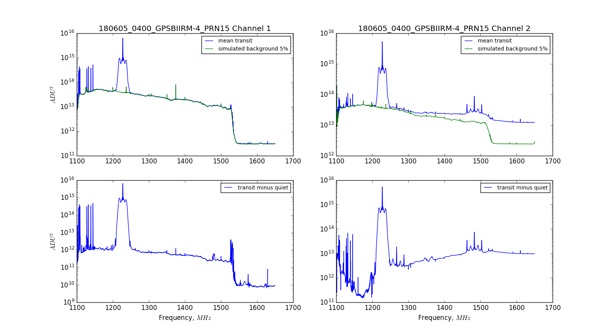
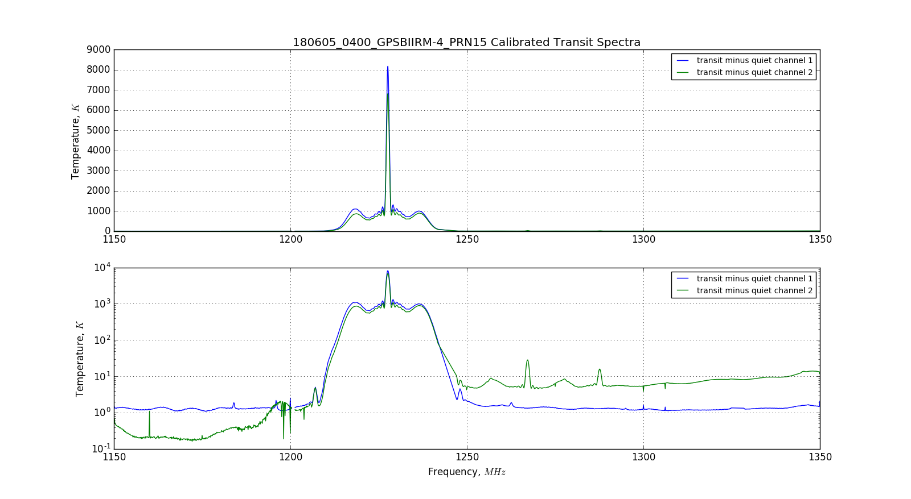
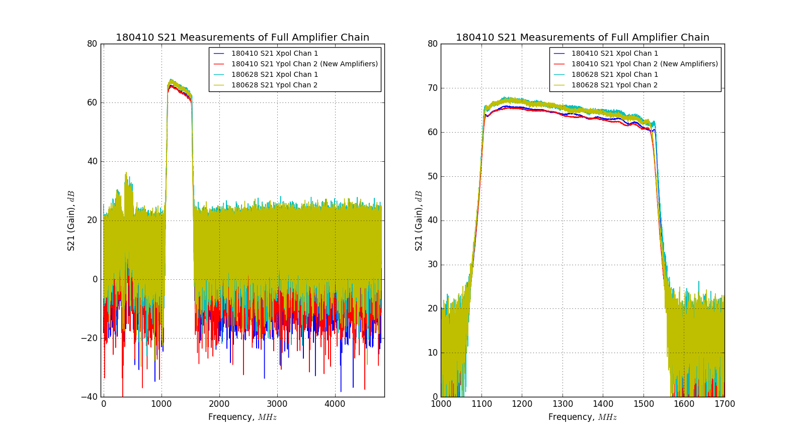
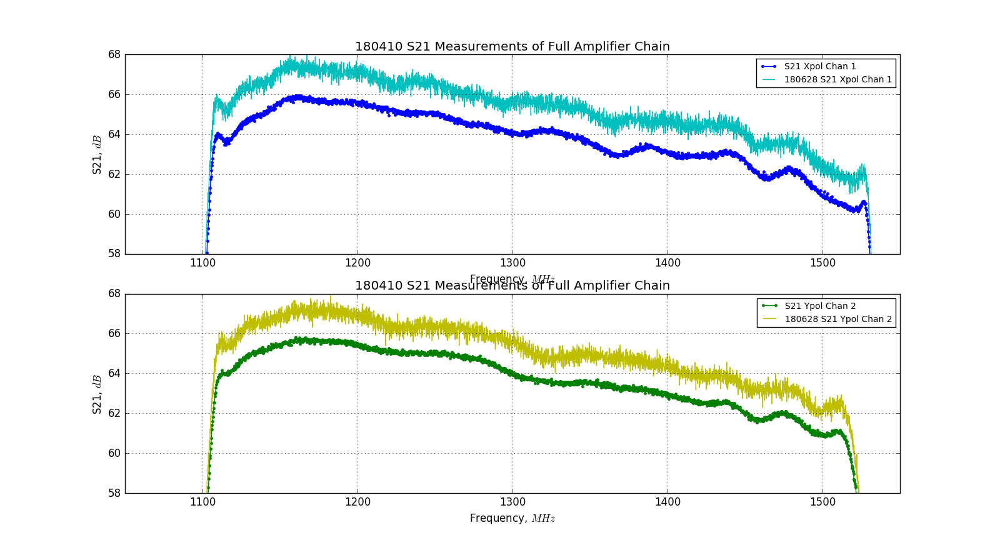

## July 08, 2018 - High Frequency Slope on Channel 2

### Introduction and Problem:

Shortly after the opening salvo in my ongoing war with the wasps, I realized
that I had left a survivor alive. A small hive was clinging to life inside the
electrical outlet cover. I dispatched their dwelling with a foaming liquid
spray, but this victory was not without consequence. The liquid justice tripped
the ground fault circuit interruptor, rendering the BMX instrument without power
for approximately 3 days, after which the system began to display odd behavior
on channel 2 in response to transiting satellites. 

This behavior began on May 24, 2018 when the system was restarted. The first
data file where this behavior begins is '180524_1547.data', though it may be a
coincidence that this happened after killing the daq with wasp spray. It seemed
like things were fine for quite some time, but consulting my satellite script I
found the received power at high frequencies was higher than it should have
been. Here is one example, from June 5th.

** Figure 1: 180605 Temperature Calibrated Spectra **
 

The top row of plots shows the satellite transit spectra in blue, and the
spectra in the absence of signal in green. The system appears to have normal
levels of power at high frequency in the absence of a satellite, but there is an
unusual response to the satellite. This is more apparent in the following plots,
which are the subtracted satellite signal, shown in the bottom panels of this
figure. Since this is raw data, it is extremely unusual to see the difference in
the satellite vs quiet spectra. Indeed, there is excess power at high
frequencies, even extending beyond the filter!

** Figure 2: 180605 Temperature Calibrated Spectra (paper bounds)**
 

The bottom panel of this plot shows the data in log-space, where it is clear
that the added power at high frequencies is an order of magnitude higher than
the power seen on channel 1. At first I thought it was a problem with my
summation methods, but turning to the data browser I verified that the satellite
transit had this appearance on channel 2, but not channel 1.

The power appears to be at normal levels when the diode isn't transiting, and
the gain appears to be the same during the transit as well. So it appears as if
there is excess power, as a function of frequency, in response to the transit,
but only on channel 2.

### Discussion of Possible Causes:

Over a series of conversations with Chris, we devised some potential tests that
were meant to shed light on this problem, but I am still unsure of many
things. During this time, we also used terminators on both channels to observe
the drift of the system from temperature changes, and found that the system
calibration was not producing a flat 300K spectrum. This prompted some questions
as well, which will be addressed in another calibration specific posting. 

One of the first suggestions was that the noise diode was potentially damaged,
resulting in a poor calibration on channel 2. In hindsight, this doesn't seem
like a perfectly accurate picture of the scenario, because the background power
is unchanged, but the transiting satellite spectra is producing added
power, as seen in the raw data in figure 1. Even so, I attempted to resolve this
issue by changing the noise diode to one from the lab. I performed this change
on June 25th, but this problem persisted immediately after this.

I was initially suspecting that the power surge (?) from tripping the GFCI had
damaged some of the active components, so Lindsay and I used the VNA to measure
the S21 parameters across the amplifier chains. We found that the gain of the
amp chains was relatively consistent with previous measurements, with some
overall difference in amplitude. These are shown below, in figures 3 and 4, with
comparisons to previous measurements performed on April 10th 2018.

** Figure 3: 180628 S21 Measurements **

There is some slight change in the offset due to the power level of the test,
and the fact that the test was performed from a different part of the amp
chain (through one low-loss cable, bypass the first cable and the 30dB
coupler). The overall shape of the curve is the same, and there are no glaring
red flags.

** Figure 4: 180628 S21 Measurements (Zoom) **

This is the same data, viewed by channel, compared to the previous measurement
on a more practical scale in-band. 

### Resolution and Summary:

Unfortunately, I wasn't able to find the exact source of this issue. Immediately
after performing this VNA measurement, the system returned to normal operation
on channel 2, and the problem corrected itself. I will keep tabs on this
problem, and try to resolve it if it crops up again. 

Here is a rough timeline of events in this saga:
'180522_1400.data' Spray wasps
'180524_1547.data' High frequency response has slope
'180625_2248.data' Replace Noise Diode on Channel 2
'180628_2227.data' S21 Test of system, restart daq and problem is gone...?

While working on the satellite spectra plots, I kept encountering a problem with
channel 2 data, it resolved itself and I was unable to confirm the cause. Have a
look in the data browser if you want more information.

