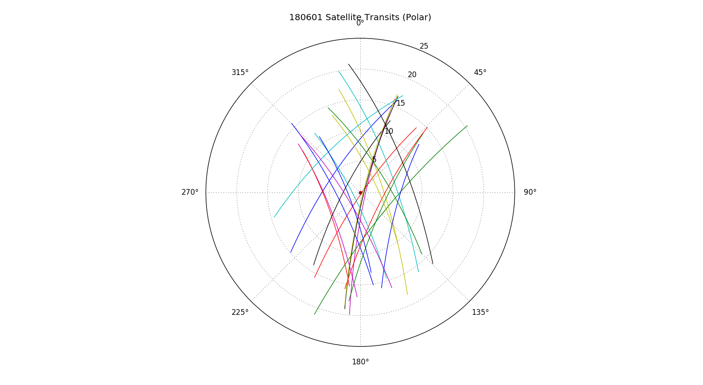

## July 08, 2018 - Satellite Spectra

### Introduction and Motivation:

Several months ago, a [theory paper](https://arxiv.org/pdf/1803.06314.pdf) was
published by Stuart Harper and Clive Dickinson, which showed the potential
impact of global navigation satellite systems (GNSS) on HI Intensity-Mapping
experiments. They suggest that the in-band signal from GNSS constellations could
contaminate surveys interested in redshifts from 0-0.2, but also calculate the
predicted out-of-band leakage that such transmissions could cause at higher
redshifts. To get an idea of the diversity and amount of satellite
constellations, consult table 2 on page 7 of the paper, which lists them and the
characteristics of their transmissions. They list 6 constellations, but neglect
to add the Chinese GNSS project "BEIDOU", which is included in my analysis. The
constellations they simulate are: GPS (IIR), GPS (IIR-M), GPS (IIF), Galileo,
GLONASS (M), and GLONASS (K). The different designations of GPS have noticably
different spectral profiles, which will be evident later in this posting.

This paper was already presented and discussed (and several plots were
recreated) in [Chris's posting](../20180319_satsed/index.md). Shown below
(figure 1) is the simulated spectra produced in the theory paper.

** Figure 1: Simulated Satellite Spectra [Harper/Dickinson] **
 

This is the caption for the plot, lifted from the theory paper:
~~~
Figure 3. Typical spectral energy distribution as measured from the Earth of
GNSS transmissions at frequencies less than 1410 MHz. The top plot shows the SED
for GPS, the middle plot shows Galileo, and the bottom shows
GLONASS. Highlighted regions in the SEDs represent the nominal frequency
allocations for each service and service designation. GPS services are
highlighted in red, Galileo in blue and GLONASS in green. Unhighlighted regions
in the SED are the predicted out-of-band transmissions. The dashed purple line
shows the expected integrated flux density of the quiet Sun for reference.
~~~

What I have prepared over the last month and a half is follow-up work,
developing semi-automated scripts to perform analysis of satellite
transits. The processes performed break down into the following 'steps', which I
will elaborate on in later sections. Throughout this process I have selected
several arbitrary parameters which can be easily changed, and the analysis
re-ran. If you believe one of these parameters are too lenient/strict, I would
love to discuss changes or optimizations. They will be noted as we come across
them, and summarized at the end of this posting.

The analysis steps are as follows:

1) Predict satellite transits 
2) Identify candidates for analysis
3) Import and clean raw data (extract noise diode/weather radar)
4) Extract satellite emission spectra from raw data
5) Subtract background spectra to isolate satellite
6) Calibrate spectra with gain from reduced data

### Step 1: Prediction of Satellite Transits:

First, I would like to thank Guangyu for the introduction to the orbit-predictor
python script, which I have used to predict the times/angles at which the
satellites will transit past BMX. The input for this script is the 'two-line
element set', which is some array of orbit parameters which can be obtained from
this [website](https://www.celestrak.com/NORAD/elements/) . From here, executing
this script will loop over every day of a specified month, and calculate the
predicted transit time and elevation angle for each satellite. (A month is
specified, because that is the frequency with which I update the TLE files.) One
of the default plots is the path of the transit in polar coordinates, with the
zenith at the center. One example is shown in figure 2, below.

** Figure 2: Predicted Satellite Transits (June 1, 2018) Polar **
 

Unfortunately, this method of visualizing the transit doesn't contain time
information, so I made some changes to the script to produce a 24-hour time
series plot, with the peak time and elevation angle plotted as a point. I also
color-coded these points to reflect which satellite Id string is associated with
the transit. An example is shown in figure 3, below.

** Figure 3: Predicted Satellite Transits (June 1, 2018) Time Series **
 

Shown on the x-axis is the time in UTC from midnight, such that the BMX data
files and the points here are coordinated. The y-axis shows the peak elevation
angle of the satellite transit, from zenith. Note that the GLONASS satellite Id
strings are listed as COSMOS, so associate the two, because I may use them
somewhat interchangably. Within a satellite family (GPS, GLONASS, Galileo,
BEIDOU) I don't differentiate between constellation, but this information is
preserved in the output satellite Id list and the final plots of the spectra
which I produce in other scripts.

### Step 2: Identify Candidates for Analysis:

Here we encounter the first two arbitrary parameters used in this analysis
process. First, Note the blue line at 4 degrees elevation angle in figure
3. This parameter is the maximum elevation angle transits I mark for
analysis. Objects farther away from the beam I exclude. To accurately measure
the received signal from a transiting satellite, I believe it is important to
only examine transits where satellites are 'alone' in the beam. The second
arbitrary parameter is the amount of time on either side of a given transit that
must be free from other transits. I have set this parameter to 40 minutes. Thus
if there is another transiting satellite which peaks within 40 minutes (and 10
degrees from zenith) of a  transit, that transit will be omitted from the final
list of candidates. So, the selection criteria for candidates are: transiting
alone (+/- 40 minutes) within 4 degrees of zenith. 

After the script has identified the candidate transits, it exports a list of
satellite Id strings and associated BMX data file names which contain said
transits. This .npz file is the input required for the next analysis script,
which I will eventually weave together into one automated pipeline.

### Step 3: Import and Clean Raw Data:

With the strings from the predictor, I run a large analysis function that
performs most of these steps. The first of which is to create a list of clean
indices (spectra to include in the weighted sum of transit spectra, and to
produce the background spectra). From the full data, I remove the diode pulses
which is relatively trivial. The harder part was developing an automated means
of removing the pulses of the weather radar. First I removed the frequency bins
that contained the radar peaks, but that was far too crude. After realizing that
the weather radar is quite periodic (12s intervals) I developed a temporal comb
to identify and remove it from the clean indices. The results of this can be
observed in figure 4, which is a default output of the transit analysis script.

** Figure 4: Galileo 0214 Trim Parameters: **
 

The top panels of this plot show the power in bin 1690 (roughly 1050 MHz, the
first peak of the weather radar) over the full hour of data, on either
channel. The blue circles are the full raw data from this file, whereas the red
x's show the data trimmed with the diode and radar comb. This indicates that I
was successful in my attempts to remove contaminating power from the final
analysis of the satellite transit. The bottom two panels show example spectra
from 'normal data', the noise diode, and the weather radar for a given data
file. More interesting analysis begins once the contaminating data has been
removed. 

### Step 4: Extract Satellite Spectra from Raw Data:

In this step of the analysis, I examine the peak emitted frequency from the
satellite in question, and fit a gaussian to its transit in order to find its
peak transit time. Because the beam is two ellipses that don't perfectly
overlap, it is no surprise that the transits can peak at different times on the
separate channels, so don't be alarmed by the different fit parameters. The
gaussian fit function I am fitting is the combination of a gaussian function, a
vertical offset (in ADU**2), and a linear drift term (in ADU**2) over the hour
of data. An example is shown below in figure 5.

** Figure 5: Galileo 0214 Gaussian Fit Parameters: **

The top panel again shows the power received in a single frequency bin for only
the trimmed data (1 hour). The bin selected depends on the satellite Id string,
which selects the peak emitted frequency for that satellite family (GPS,
Galileo, GLONASS, BEIDOU). The best fit gaussian for this transit is shown as a
red dashed line, and the fit parameters are included in the legend. Parameters
listed as float numbers are in units of time index, whereas fit parameters
listed in exponential form are in ADU**2. The bottom panel shows the weighting
coefficients used in the weighted sum for calculating the satellite transit
spectra. The weighted transit spectra is calculated by taking the sum of the
transit spectra multiplied by its weighting coefficient, then dividing by the
sum of the weighting coefficients. This method uses an arbitrary parameter,
which is the range of spectra included in the weighted sum. The value of this
parameter is currently one sigma from the mean of the transit.

### Step 5: Subtract Background Spectra: 

In order to examine the satellite signal, I have to subtract out the quiet sky
from the satellite power. In order to create the quiet spectrum I have pursued
two different methods. First, I attempted to create a 'synthetic' quiet spectrum
by taking a percentile of each frequency bin, regardless of time. More
specifically, for a given frequency bin, I construct a histogram of recorded
power over the hour of data, and take the 5th percentile of the power. Doing
this for each frequency bin produces a spectrum that is not indicative of the
system at any time, but seems to work fairly well. This has the advantage of
being quite simple/automatic: I don't need to manually select a time when there
is nothing in the beam, nor do I have to find blocks of time to average
over. Unfortunately, this has a disadvantage of biasing the spectra to the low
side, such that taking the difference between the sky spectra and the quiet
spectra produces some temperature at all frequencies. By varying the percentile
used, I believe I can make it so the difference between the two is effectively
zero, but I haven't attempted this yet. I like this method, but the disadvantage
is quite important. 

The second method I have utilized (and currently utilize) is to take a range
away from the peak of the transit (+/- 4 to 6 sigma away from the mean) and
averaging over these spectra.  This way, I can create an average quiet
spectrum that isn't necessarily biased low in the same way as the synthetic
spectrum. This method also avoids subtracting the satellite transit peak, and is
automated, but I think this will be more prone to including RFI or other
contaminating effects due to the averaging process, and prone to missing the
linear drift if the transit occurs too late or early in the course of the hour.

A hybrid method that was discussed would be to take the 5th to 25th  percentile
of power in the peak frequency band, and taking the average over those time
indices in hopes of avoiding the disadvantages of both methods, while still
constructing a more honest background spectra.

To visualize the transit and background spectra, see figure 6 below.

** Figure 6: Galileo 0214 Raw Spectra: **

In this plot, the top row of plots shows the mean transit spectra in blue, and
the mean background spectra in green. Their difference is shown in blue in the
bottom plots. Left and right again denote channel 1 (xpol) and channel 2
(ypol). The difference data doesn't look terribly special in this format, but
with proper range the shape emerges.

** Figure 7: Galileo 0214 Raw Spectra (paper scale): **

Here are the same plots as in the bottom row of figure 6, now shown with the
same axes as are found in the paper. This is of course still in ADU**2, but to
replicate their results we must perform the final step of the analysis.

### Step 6: Calibrate Using Gain from Reduced Data:

Using the same string for the BMX Filename, I import the raw data and divide the
spectra (ADU**2) by the gain array (ADU**2/K). This gives a calibrated spectrum
in units of Kelvin. And for the sake of continuity I replicate the plots shown
in the previous uncalibrated spectra section.

** Figure 8: Galileo 0214 Calibrated Spectra: **

Again, this shows the transit and background spectra on the top row, and their
difference on the bottom row of plots. I tend to use this plot as a diagnostic
tool, but to better visualize the data, I produce a more palatable final version
shown in figure 9.

** Figure 9: Galileo 0214 Calibrated Spectra (paper scale): **

In this plot, channel 1 (xpol) is shown in blue, whereas channel 2 (ypol) is
shown in green. The top plot shows the calibrated spectra (K) in linear scale,
while the bottom plot is shown in log-scale. I am not satisfied with how
discontinuous the plots are at some points, and I would like to find a better
way to eliminate some of the pointier features. I think these plots have a long
way to go if they are to be publication quality, and I would love to have some
feedback on what I should do in the future when I weave these disparate scripts
together into a more automated process. 

### Problems, Conclusions, and Summary:

So far I have performed this analysis on around 50 satellite transits, ranging
across family/constellation/elevation angle space. Some satellites have been
recorded several times due to their lonely orbit, whereas others that frequently
transit are always close to companions from their own constellation. I could
attempt to fit these transits, despite their temporal proximity to other
satellites if desired. 

I am eager to perform more work on this project and attempt to produce
publication quality analysis/writing/plots, and would love feedback.

Unfortunately, this analysis was hindered by some problems with the data
acquisition, specifically the [high frequency spectra
slope](20180708_Chan2_High_Freq/index.md) I discovered while doing this
analysis. This problem (will be/is) described and addressed in the linked
posting. This briefly put a stop to discussing this work, but I hope this
posting will revitalize this topic and keep me moving forward.

As promised here is a list of the arbitrary parameters which can be changed in
the course of analysis, per recommendations/discussion: 

1) Maximum elevation angle of satellite transits considered for selection?
2) Time buffer on either side of the transit for selection?
3) Range of spectra to include in weighted sum?
4a) Ranges of data to use in background average spectra?
4b) Percentile to use in synthetic background spectra?