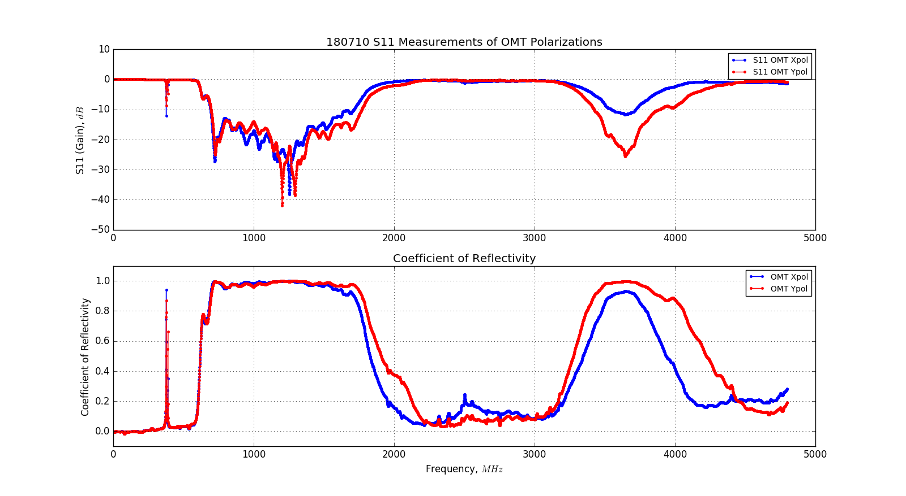
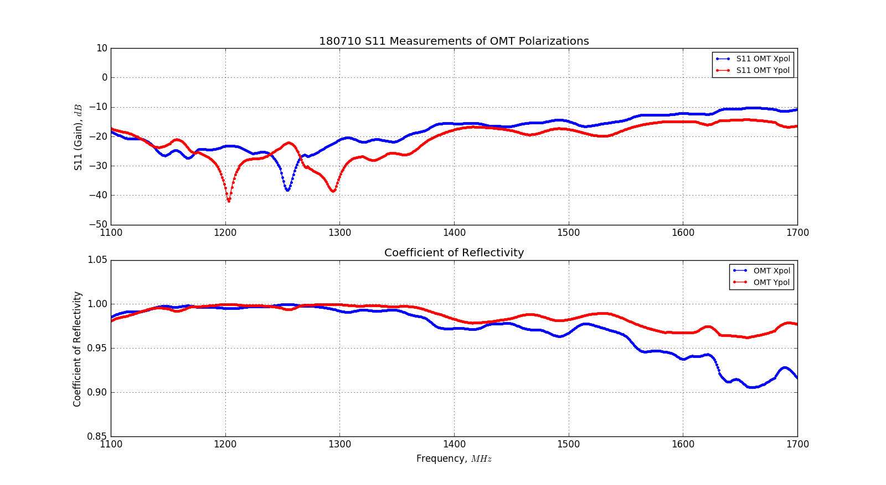
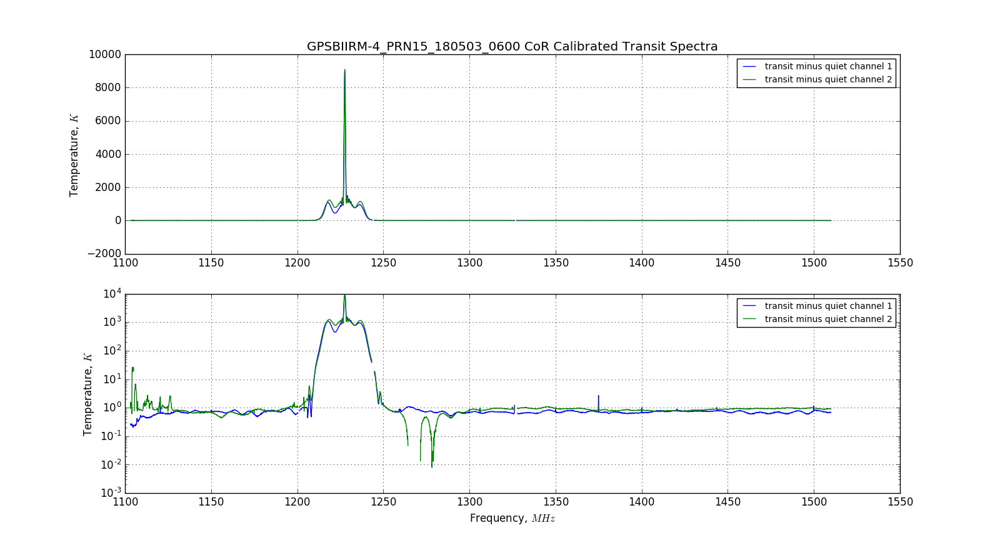
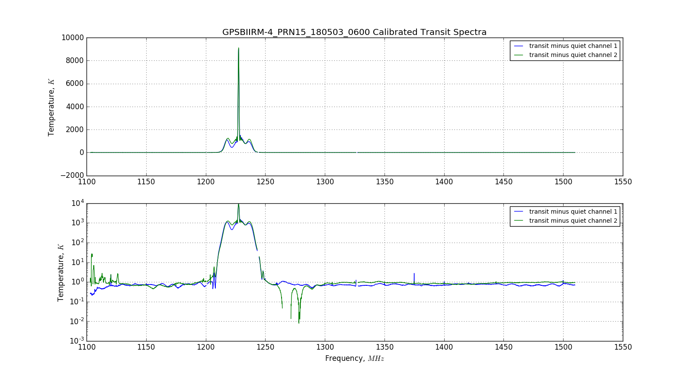
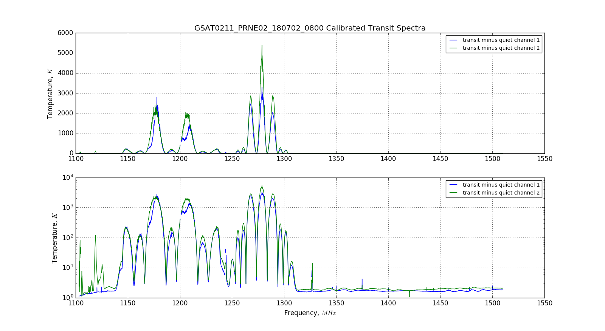

## July 20, 2018 - Measurements of OMT Transmission/Reflectivity

### Introduction and Motivation:

While working on extracting the satellite transit spectra, I encountered some
sub-Kelvin structure that could indicate some power broadcast by the satellite,
or could be caused by the response of our instrument. In making progress toward
the satellite transit analysis, another step is to calibrate out the
transmission/reflectivity effects of the OMT+Horn. The OMT has frequency
dependent transmission properties which act as a filter eliminating high and low
frequencies, but in our band its transmission properties are not trivial. In
this posting I attempt to calculate the coefficient of reflectivity using
measurements of S11, and apply it to satellite transit spectra to observe its
corrective effects.

### S11 Measurements and Coefficient of Reflectivity:

On Tuesday, July 10th 2018, during the process of dissassembling the front-end
components of the BMX single dish, I acquired S11 measurements on both
polarizations of the OMT. These S11 measurements were acquired with the VNA
connected to the data ports of the OMT, and they represent the amount of power
reflected back into the VNA (i.e., the power that isn't broadcast out of the
OMT+Horn and into free space). This is equivalent to the frequency dependent
transmission/reflectivity of the OMT in response to signals entering the
OMT+Horn. Shown below in the top panels of figures 1, and 2 are the S11
parameter measurements from the VNA, first over the full range of the VNA and
second over the band we presently use for the BMX instrument.

The S-parameter measurements are listed in units of dB, but to arrive at a
suitable coefficient I have to manipulate it into a decimal/percentile form. In
order to perform this conversion, I first calculate the coefficient of
transmissivity by obtaining 10**(S11/10), over the full band. This yields a
percentile number between 0 and 1, which is the percentage of incident power
that is transmitted through the OMT. Assuming we have zero loss, then the sum of
the reflected and transmitted power should be 1. Subtracting these coefficients
from 1 yields the reflection coefficient, which is shown in the bottom panels of
figures 1 and 2.

**Figure 1: 180710 S11 and Coefficient of Reflectivity (full VNA band)**

In this figure, the full band of the VNA is featured, using 5001 points, or 5000
frequency bins.

**Figure 2: 180710 S11 and Coefficient of Reflectivity (BMX data band)**

This plot is the same data above, trimmed to match the data recorded using the
BMX single-dish instrument. The coefficients within the band have a very narrow
range, and don't have much of an effect on the satellite transit spectra, as
shown in the following section. Additionally, the reflection coefficients for
each channel show significant variation from each other.

### Application to Satellite Transit Spectra:

As previously stated, the S11 measurements (and hence the derived reflection
coefficients) do not have the same frequency resolution as the bmx data, but
using a linear interpolation I produce an in-band reflection coefficient array
that can be multiplied by the subtracted spectra. This procedure has been
appended to the transit analysis script, and produces another output plot with
the suffix '_CoR.png'

The correction factors are frequency dependent, but the end effect is not enough
to meaningfully alter the spectral profile of the transit, and has a minimal
effect on the appearance of the plots.

Figures 3 and 4 show a transit from May, with the OMT correction as measured on
July 10th.
**Figure 3: 180503 GPS Transit (no CoR correction)**

**Figure 4: 180503 GPS Transit (after CoR correction)**

Figures 5 and 6 show a transit from July, shortly before the S11 measurements
were acquired.

**Figure 5: 180702 Galileo Transit (no CoR correction)**

**Figure 6: 180702 Galileo Transit (after CoR correction)**

Clearly the coefficient multiplication makes little difference in accounting for
the high-frequency structure shown in these plots. I am of the opinion that any
improvements at this level will be a result of improving the background
subtraction method, and using a background spectra that has had RFI removed
(using median rather than mean to ignore the contribution from RFI peaks from
non masked sources.

### Summary:

Using a measurement of the S11 of the OMT, I calculated the reflection
coefficient for the OMT+Horn, and used it to scale the satellite transit
spectra. It works, but the high-frequency sub-Kelvin structure in the transit
spectra remains. I think the way I am utilizing this coefficient is correct, and
that multiplication of the number in ADUs squared from the digitizer, then the
subtraction and calibration would be equivalent to a coefficient multiplication
of the eventual subtracted spectra.
