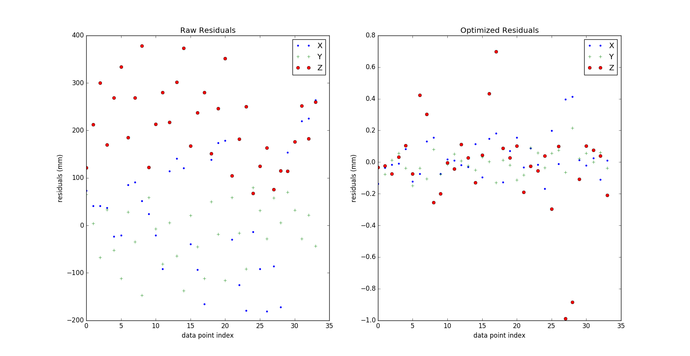
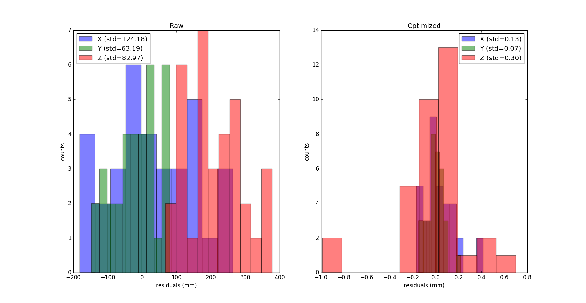
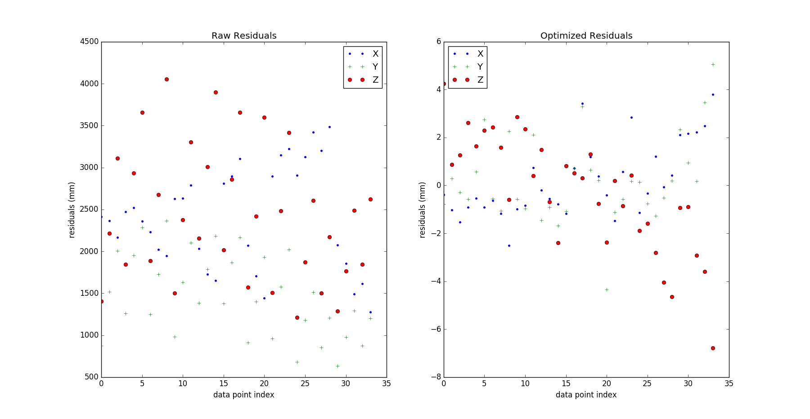
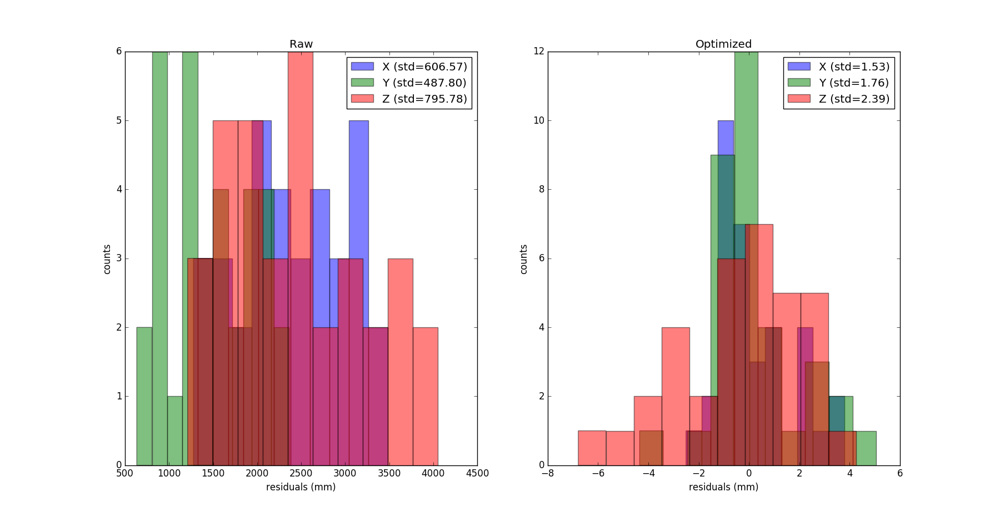

## July 24, 2018: Photomodeler Processing

### Introduction

Now that we have fit a parabola to the pictures in [this posting](../20171106_photomodeler_repeatability/index.md), the next step was to update these photos to see if the dish had moved at all and to also see if this process could be repeated. For this time around, we are using a new camera with a lens that has a fixed focal length instead of a zoom lens. The lens is a 10 mm ultra-wide lens and was chosen so that we could create a field of view wide enough to be able to encapsulate both the dish and the horn for future analysis. 

### The New Process

In order to be able to repeat this in the future, I had to create a process to adhere to so that we could consistently produce clean pictures that Photomodeler would be able to adequately mark. If needed, the software also has the ability to recognize geometries that are within a marked region and creates a subpixel marking that can be referenced to a coded point. The number for each target can be found in a Photomodeler file of the marked photos from November. This is only recommended if at least 75% of the targets are automatically marked since there will be a greater risk of errors once all 34 targets are having to be manually referenced. The lens has the ability to be able to control its f-number, so I had to find the best settings for the aperture size and shutter speed to account for the amount of light the lens would gather and the exposure time. The software seemed to respond better to pictures that were at a higher f-number and had a lower shutter speed. The settings that I used were between f/16-f/20 and a shutter speed of 1000. The difference between f-number comes down to the brightness of the day due to the amount of light that the dish reflects. In addition to this, the software also seems to have an easier time identifying the targets on the dish whenever the camera is positioned at a higher point and angled over the dish. The pictures should also include all of the targets in every photo in the set. I have tried to stitch together pictures by having focused shots where the targets were not all in view and were in a minimum of 4 photos, but the software seems to have trouble exporting all the acquired target coordinates into a text file. This is still being looked into. When all of these conditions are taken into account, you get photos like these:

These photos have both the proper contrast and resolution for Photomodeler to easily use. When this happens, it produces automatic marking for all points in a majority of the photos in the set.

### Analysis of the New Sets

Once I was able to produce consistent photos, the next step was to see the error between subsets of photos using the new 10 mm lens and an f-number of f/16. I used the same process that was described in my [previous posting](../20180614_Photogrammetry_Error_Fix/index.md). These results are shown below.

As you can see from the graphs, the standard deviation of the residuals is remarkably low. This was expected since we are now using a fixed lens rather than a zoom lens. The majority of the residuals also lie within a 2 mm range and there are a few outliers that tend to also stay within 4 mm, with a couple exceptions. This will help to minimize the errors in the future as we begin to use this for the three new dishes being built.

### Difference in New and Old Photos

Once the errors were established, the next step was to see what the difference in the photos from October and the new photos. Using the same process, I fit the new data to the old and plotted the residuals. These results are shown below.

The difference in the two sets indicates that there is no noticable change in the position or orientation of the dish. There is another set of data that had larger residuals, but this is believed to be a problem in the software since the two sets are nearly identical. This is currently being investigated. The next step after this was to take the standard deviations of the [older photos](../20180614_Photogrammetry_Error_Fix/index.md) and the newer photos and find the quadrature of the difference. This is simply the square root of the sum of the variance of each set. The quadratures for each coordinate were:

| Coordinate | X       | Y       | Z       |
|------------|---------|---------|---------|
| Quadrature | 0.88 mm | 0.84 mm | 0.54 mm |

### Looking to the Future

Now that this has been established, we are now able to find the position of the horn and see if it is properly aligned and in the right position. This process can now also be repeated fairly consistently for the new dishes being put up. This will allow for a rapid analysis that can be done by anyone.
