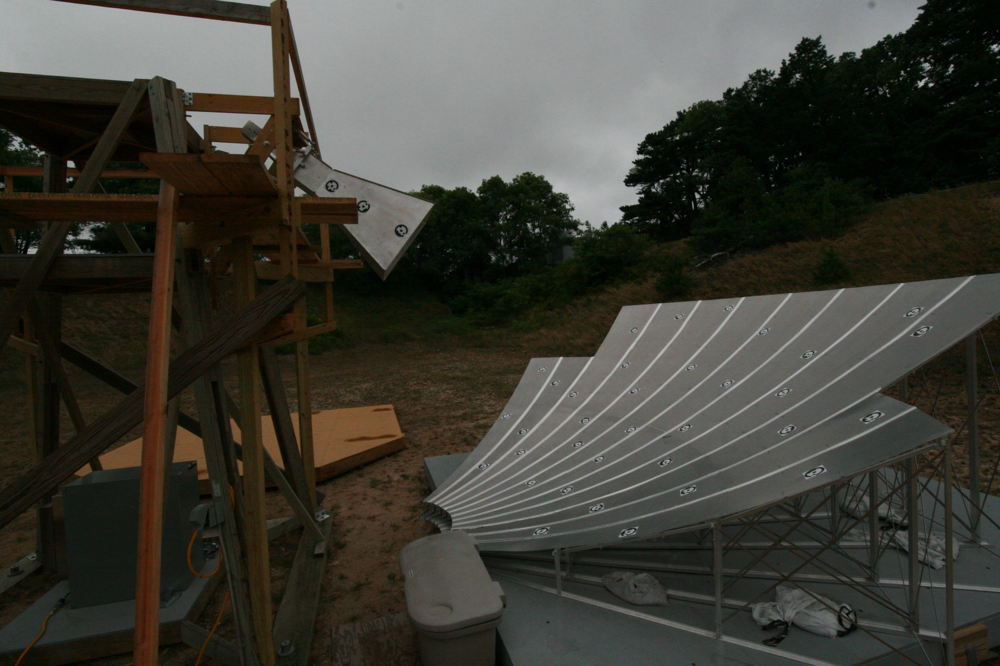
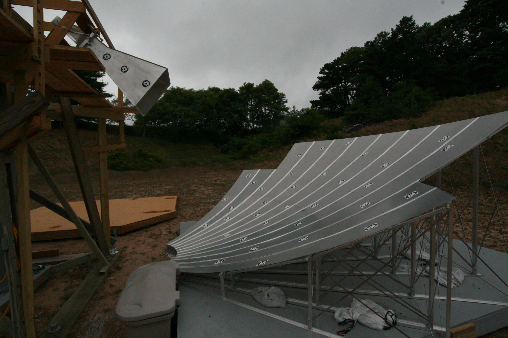
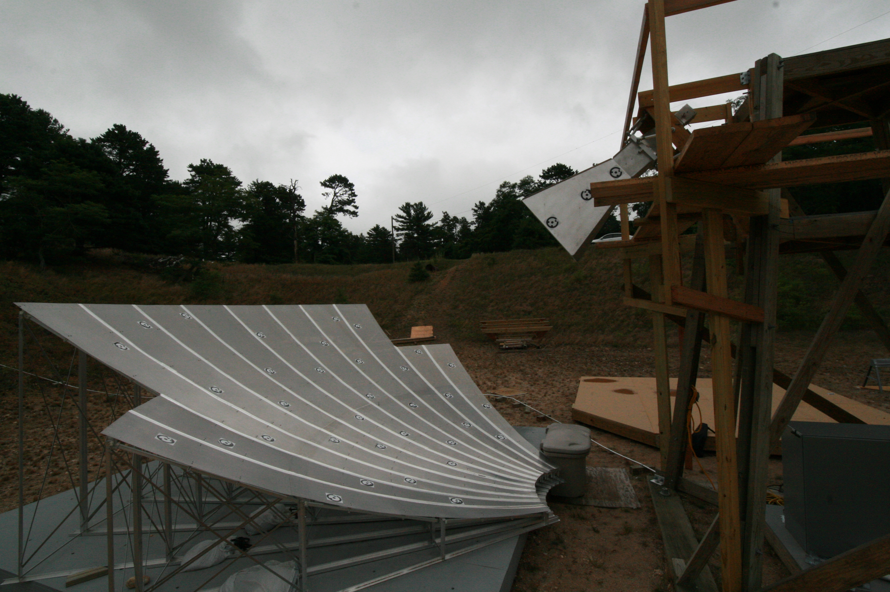
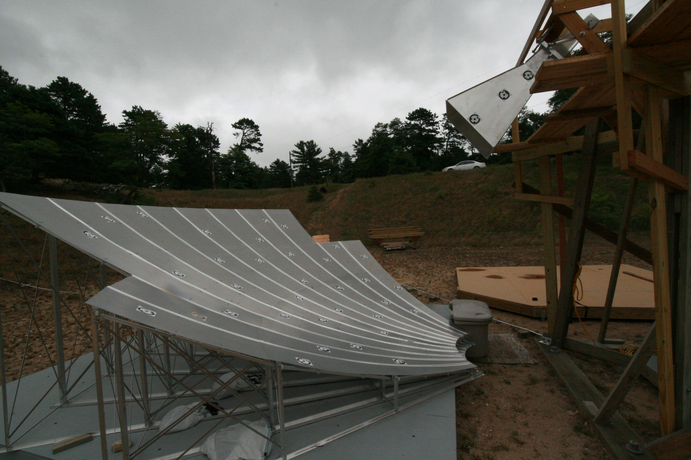
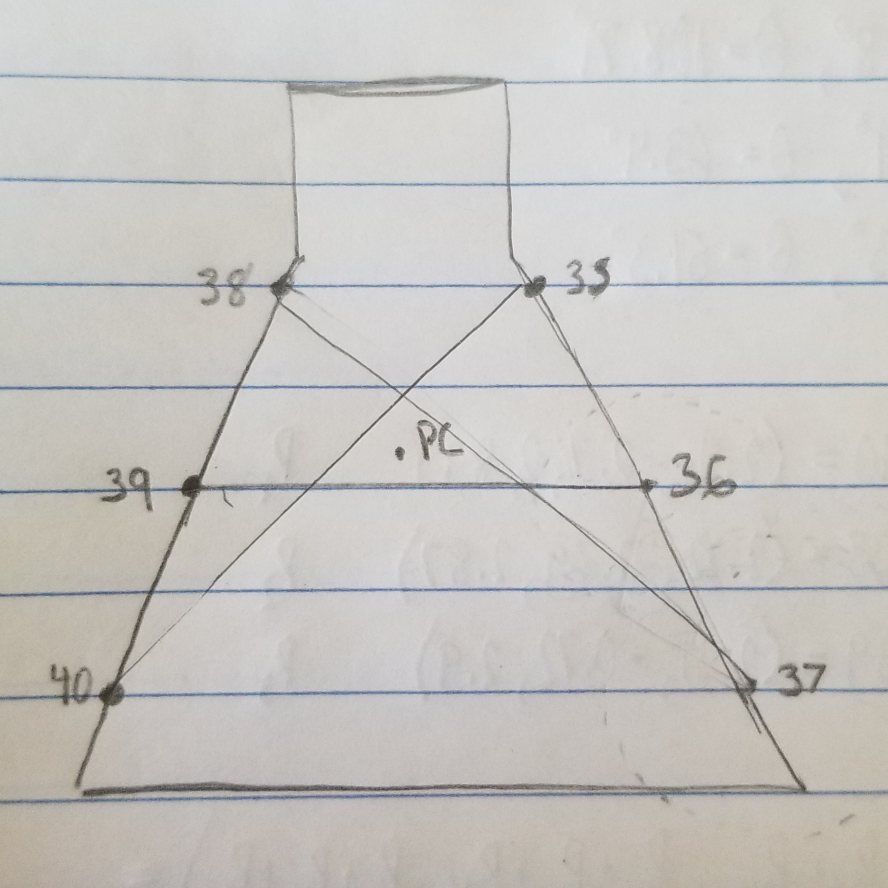

## July 27, 2018: Phase Center Calculation

### Photos of the Horn

In order to find the positions of both the horn and the phase center, it would require another set of photos to be analyzed that have the targets on the horn included. Once these were taken, I used the set of photos from [October](../20171106_photomodeler_repeatability/index.md) as a baseline for defining a coordinate system and scaling. The three targets in the bottom left corner are each 1 meter apart and define the x and y axes. Examples of these pictures are shown below.

The problem that you run into when using the pictures of just the dish and the horn is that there is no defined coordinate system, so the software makes an arbitrary origin according to the orientation of the given photo. Once this was rectified, I could use the positions of the horn targets to calculate the phase center.

### Calculation of the Phase Center

The first step in finding the phase center was to calculate an expected value, where ideally, we would want the phase center to be at the same place as the focal point. I calculated by hand using geometry how far the phase center should be away from each target. The underlying assumption that had to be made for this to work is that all of these points lie within the same plane and that the magnitude of the distance should not change no matter what the rotation is. This would help to check our results later down the road. Once I had attained the coordinates of the targets, I had to calculate the distance to my theorized phase center from these points. I assumed the phase center to be at the 301 cm focal length found in [previous postings](../20180702_Photogrammetry_Fitting_Fixed_Axes/index.md) and was rotated by 0.5 degrees around the x-axis. When this was calculated, the distances were found to be off by around 10 cm. In order to find the true phase center, I used a process that can be visualized below.

As you can see from the picture, I created lines that went from one target to the opposing side. Ideally, all of the midpoints would overlap at the same point. Instead,the midpoints of these lines serve as the vertices of a triangle whose centroid represents the average of these points. This average is also the phase center. Using this process, I found the phase center to be at (2.3 m, -0.7 m, 2.89 m), which is not where it was expected to be. It lies about 10 cm closer to the dish in the y-axis and actually lines up closer to the [290 cm](../20160906_dish_parab_params.md) expected focal length rather than the 301 cm that was found in our previous analysis. 