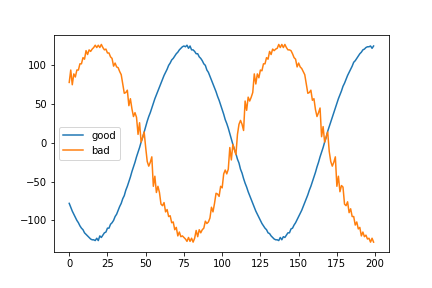
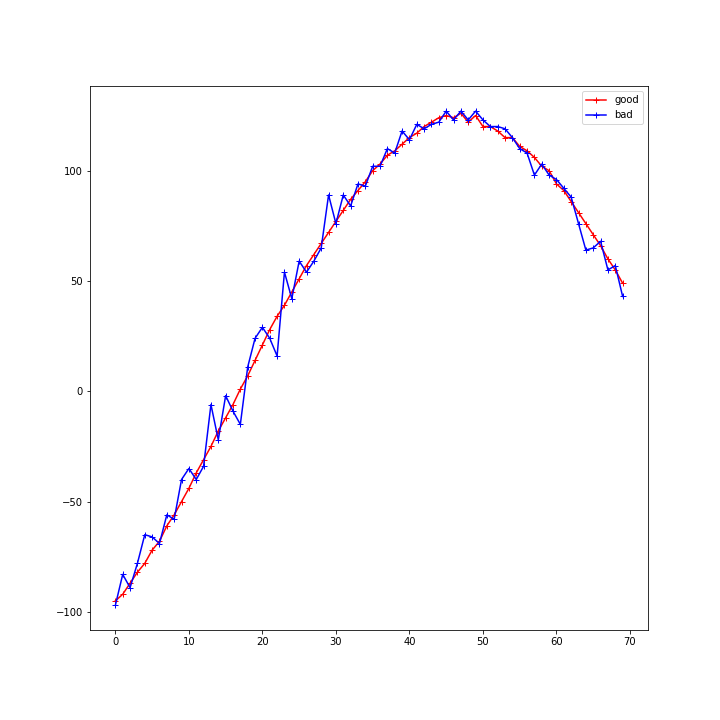

## September 02, 2018: Interleaving Issues with Data Aquisition 
Upon an attempt to start the data aquisition in the 2nd floor lab, Will and I noticed a "funny" looking spectrum on channel two of the digitizer that alleviated itself upon restarting the daq. [In a previous posting by Will ](../20180708_Chan2_High_Frew/index.md), some issues with a sloping frequency on channel 2 in the basin were seen that were never resolved. The issue seemed to dissapear upon restarting the Daq, much as it did in the lab. In both cases, we have only ever seen this issue on channel 2 of the digitizer, with a sample size of 3 digitizer cards (one in the basin, two in the lab). We theorized that the sloping frequency of the channel 2 in the basin could have been caused by the digitizer moving power around when it goes into this "funny state", and that it was potentially due to an interleaving issue. We moved on to test this is the lab with Palantir2.
    
### Diagnosing the issue 
The first thing I did was input the signal from a terminated amplifier chain to channel 2 and restart the daq until we saw the issue again. The input here for channel 1 is a sine wave from a signal generator of 1.104 GHz, with a clock signal of 1.1 GHz. 
This is what a normal input for this state looks like:

And a bad initilization:

Then, I switched the two channels, so the sine wave was input to channel two while it was in this bad state. Low and behold, an apparent interleaving problem appears, with some evidence for "out of ordering" on the sine wave. 

However, the evidence was not entirely convincing yet, as we know we are driving the digitizer out of its normal range of operation, so Anže asked for some more tests with different clock and signal freqencies. 
Here is the data on a 1.2 Ghz clock frequency and a 1.204 signal input:

So we still see the issue. Upon further zooming done, however, the possible interleaving issue becomes more confusing. There seems to be no particular order to the reordering of the data, and it seems "random", so it is not clear that the issue is in fact in the interleaving.

### Next Steps
Anže sent an email to the manufacturers of the digitizer, and they came back with some suggestions for us to try. First, Anže ran a memory test on the cards, which passed. The next things to do are 1. create 2 driver log files. Here you find a description how to create them: https://spectrum-instrumentation.com/en/spcm-enable-driver-debug-logging. Create one log file when the application runs fine and another log file when the application acquires the bad signal. 3. Try the internal clock instead of the external clock and check if there is an improvement.

