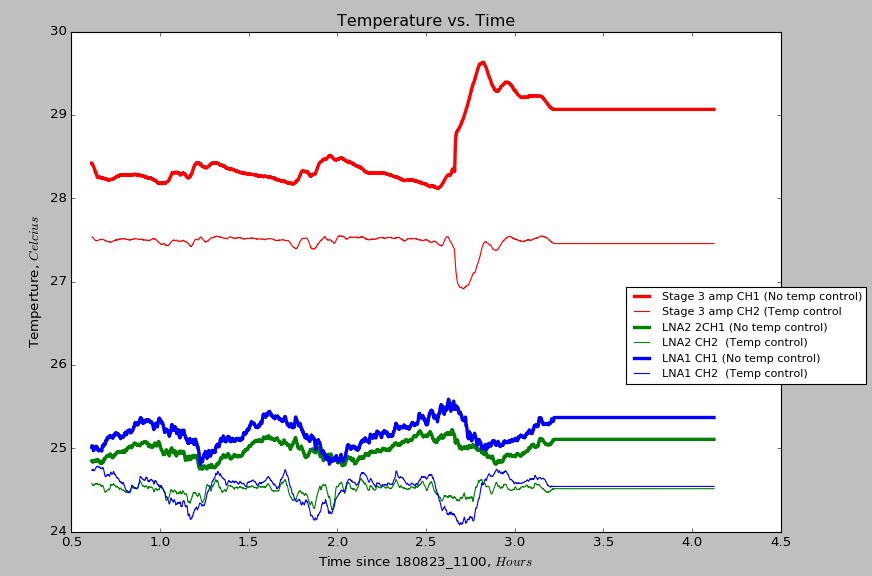
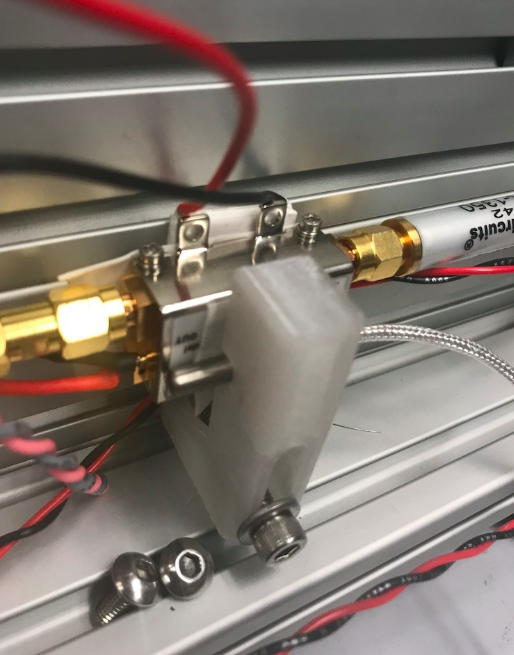
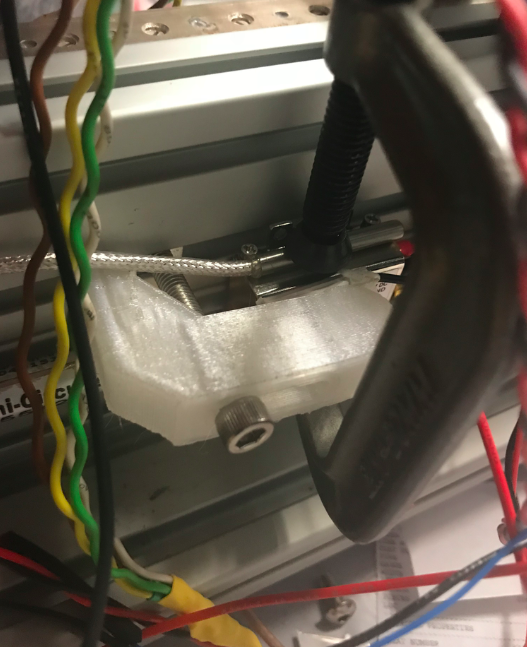
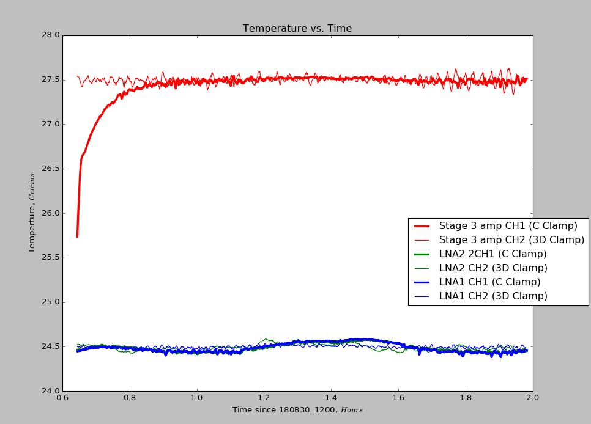
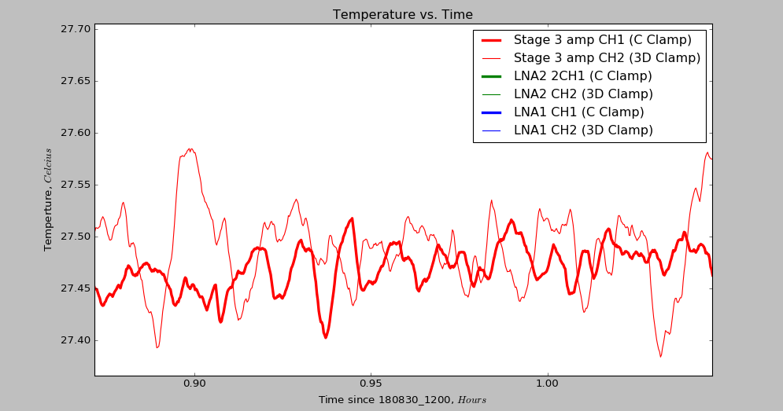
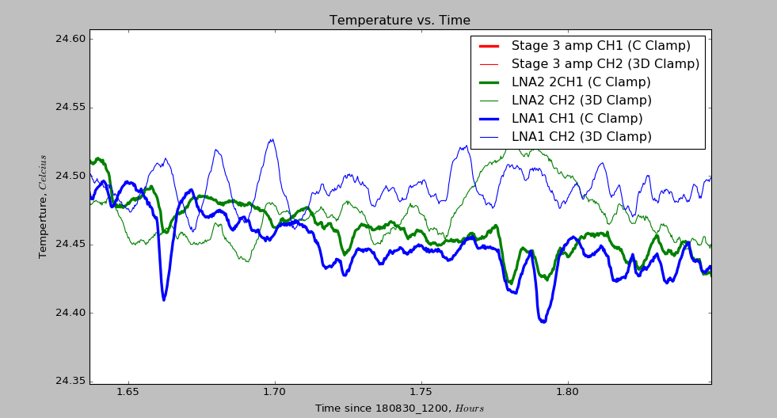

## September 02, 2018: Updates on Temp Control for New Front End Boxes 
In the current state I have left them, 3 of the new front end boxes are fully assembled with most of their physical components and their software running properly. The last box is missing a filter on one of the amplifier chains and one of the microcontrollers is acting up, presenting with an issue diagnosed on the GUI: Object temperature measurement error, External ADC supply voltage out of range <-5% < AVDD <+5%. I have not seen this issue before and could not resolve the cause, I have sent an email to the manufacturing company MeerStetter in order to get an opinion from them ( (9/03 update, They have emailed back with: The error description indicate that des device needs to repair. Probably the measurement circuit of the object temperature measurement is fault.). Currently, on the other three boxes, the main work has been trying to improve the stability of the system by heat sinking everything as optimally as we can. The temperature logged unfortunately putters out after a few hours, but the few hours of data we get can be looked at as we move things around.
    
### Current Data 
A few days prior to this post, we measured this data with channel one uncontrolled and channel 2 being controlled. The evidence seems shakey that the temperature controller is actually doing anything. Upon further inspection, we noticed that some of the peltier coolers were in poor contact with the amplifiers and the thermometer was not making good contact with the amplifiers, as it was simply held on with electrical tape.
  
  
The last test I got the chance to do before leaving was comparing two different setups to see how they compared. One side included a 3D printed clamp for the thermometer with the peltier cooler sandwitched between rails of the box and the amplifier, the other used a C-Clamp to hold the thermometer down with the peltier cooler clamped to the front of the amplifier. There was thermal tape placed between the peltier-amp connections on both sides, and tape between the 3-d clamp and the thermometer.  The test was performed without the amplifier chain powered. The setup and results are below:  
The 3-D clamp and peltier in back:  
   
The 3-D clamp and peltier in front:  
  
Data:  

  
  

### Next Steps

