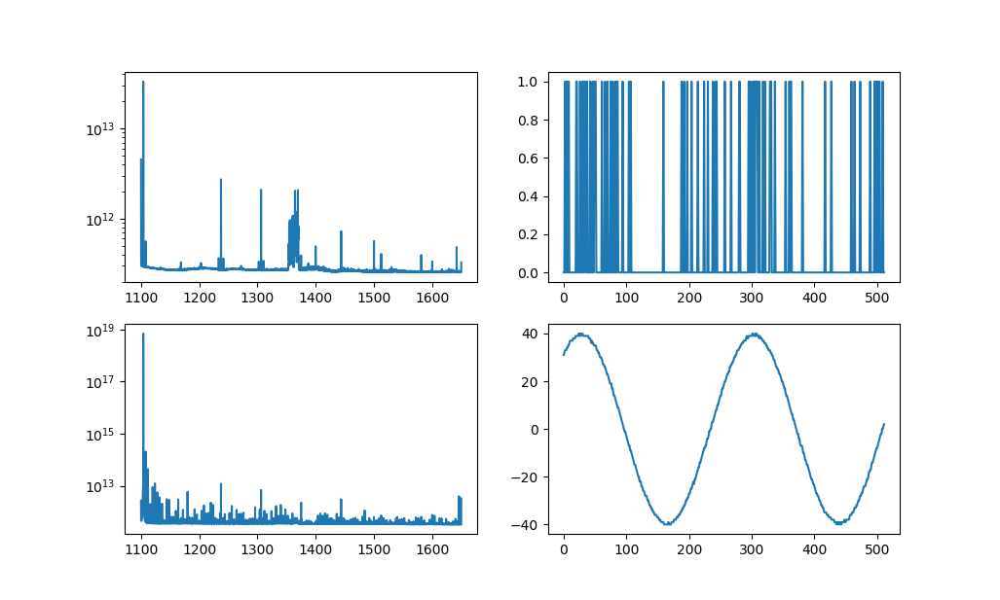
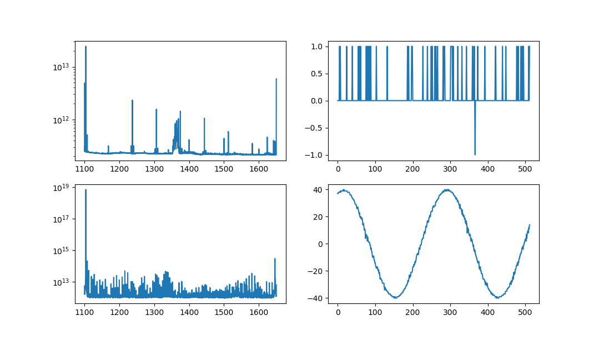

### Investigation into CH2 issues

Anze Slosar, Will Tyndall, Oct 13, 2018

## Reproducing the problem.

The instruction for reproducing the problems are as follows:
 * Set the clock at 1100 MHz
 * Set the another signal generator at 1104Mhz with -10dBm power pure sine wave
 * Connect the second signal generator to CH2 via 3dBM attenuator
 * Run daq.ini with wave.ini as argument. This is vanilla default ini with saving of the waveform
 * Run plotting script with `--log --wf` options

This will result in some +-40 ADU units sine wave on CH2.

Some 15% of the time, the DAQ will go into funny mode on CH2. This is
characterized by a jaggy sine wave and power that goes above 1e13 with several clear overtones.

For completeness, here is a good digitizer:

and here is naughty digitizer:

It really does seem binary, either it is good or it is bad, it is never something in-between.

## Observations

The most important observation is that this behavior is not reproduce
if the digitizer is driven at its specified frequency of 1250MHz. We
have tried this 25 times with internal clock and 25 times with
external clock at 1250MHz and have not managed to see it a single
time.

One possible way to avoid this would be to start digitizer at 1250MHz
and then bring it down to 1100MHz, This would probably involve talking
to the brick.

We have noticed that it does not seem to be cured by either lower and
raising the Vpp voltage of the clock, from 1.1V to 2.0V.

## TODO

From Wilma's email:

Can you please create 2 driver log files. Here you find a description
how to create them:
https://spectrum-instrumentation.com/en/spcm-enable-driver-debug-logging
Create one log file when your application runs fine and another log
file when the application acquired the bad signal.

