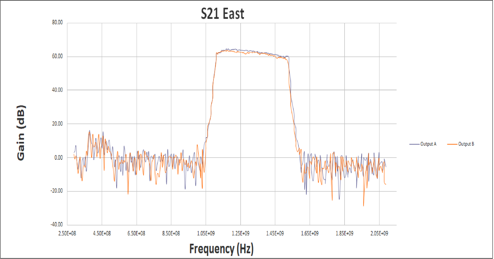
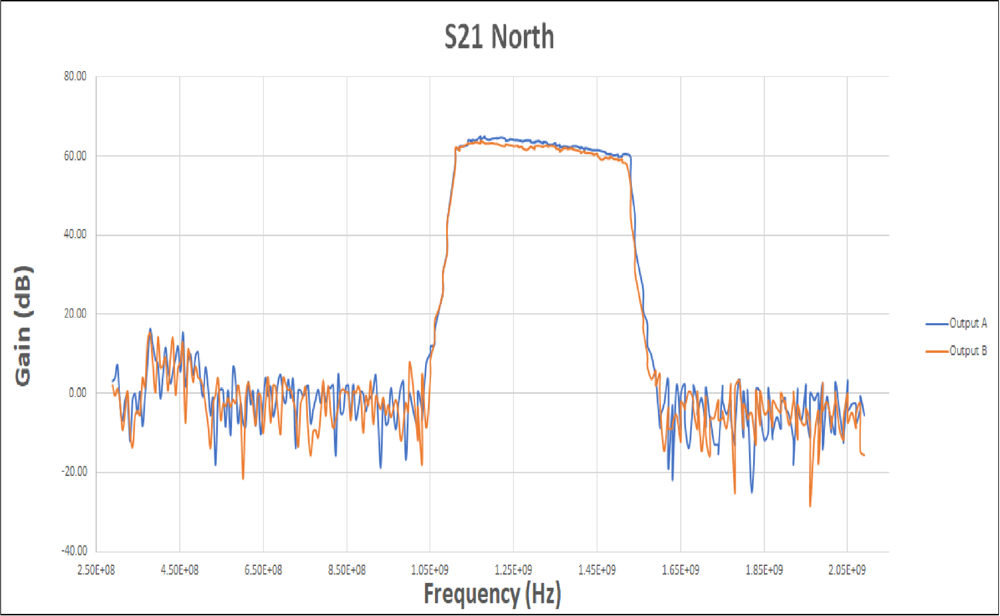
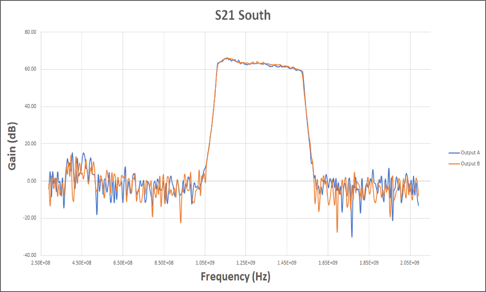
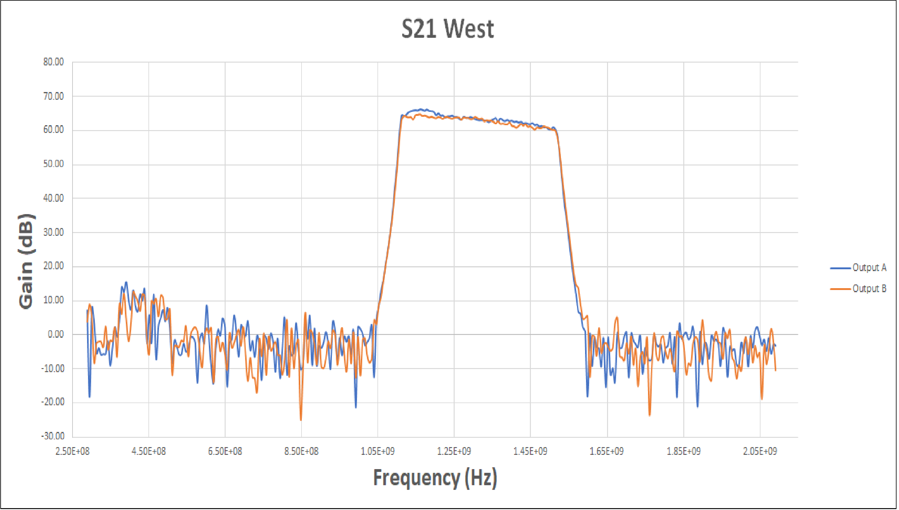

## Amp Chain Gain Measurements

Dana Zimmer, Joe Winiecki, Justine Haupt, Jan 09, 2019

## Update

We've added screw terminal connectors on the amp power connections for easier access in the event an amp needs to be replaced. The noise diodes have all been tested and wiring tied down. The boxes (and covers) are now all labeled north, south, east, or west, and the channels labelled A (left) and B (right, if you're facing the front of the box). We did S21 measurements on each box with results below. All that's left to do are measurements with the nice spectrum analyzer and replacing the cover screws/nuts. Looks like we'll be able to get the boxes installed in the basin tomorrow afternoon.

## S21 Measurement

We used the TR5048 VNA set on the lowest output -55dB with an additional -30dB (total -85dB) attenuator to measure the gain through each channel. Every channel looked fine with roughly 115-120dB total gain. Joe made plots which will be included below. I made a small LabView program to measure the mean gain + other stats, see data below.

EDIT: Paul pointed out that the total gain is ~32 + 30dB, with the VNA measuring the difference from the starting signal, which I interpreted incorrectly above. Note that the plots add back in the 30dB attenuation, but the data below does not.

Box	  CH  Low f cut (MHz)  High f cut (MHz)  Mean Gain (dB)  Std Dev  Var
++++++++++++++++++++++++++++++++++++++++++++++++++++++++++++++++++++++++++
East  A	  1105.40          1531.93           32.26           1.63     2.65
East  B	  1105.40          1525.92           31.69           1.47     2.17
North A   1105.40          1531.93           32.62           1.50     2.25
North B   1105.40          1531.93           32.85           1.87     3.51
South A   1105.40          1531.93           32.42           1.83     3.35
South B   1105.40          1531.93           32.75           1.98     3.91
West  A   1105.40          1525.92           33.22           1.73     2.99
West  B   1105.40          1525.92           32.58           1.60     2.56

