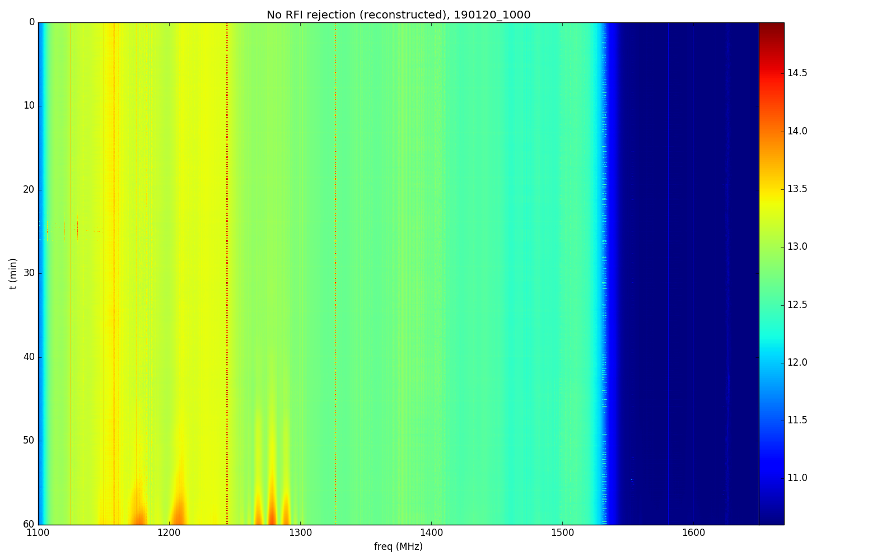

##Reading RFI Data

Dana Zimmer, Feb 07, 2019

###How to read in RFI files

I've written a new method in bmxdata.py to read in this data. Use it like this:

`r = bmxreduce.reduce(tag)`
`r.d.loadRFI(r.rawfname)`

This will store the data in three new variables, each the same shape as `r.d.data`:

`r.d.rfi` - Stores the average of the removed values or zero if none were removed.
`r.d.rfimask` - Stores 1 if there was RFI in that bin, 0 if not.
`r.d.rfinumbad` - Stores the number of bad values out of 128.

Use `r.d.rfi['chan1_0']` to get data from the desired channel.

You can reconstruct the data as if there were no RFI rejection by doing:
`((128-r.d.rfinumbad[chn])*r.d.data[chn]+(r.d.rfinumbad[chn]*r.d.rfi[chn]))/128`

###First look at RFI data

The data shown below is on-sky data from tag 190120_1000, channel 1. I've included the clean data with RFI rejection in Figure 1 for comparison. Figure 2 shows the data reconstructed as if RFI rejection was not applied. Figure 3 shows purely the RFI data saved in `r.d.rfi`.

We can see the weather radar coming in and out in its frequency bands. We also see wide bands where random samples are getting cut, perhaps indicating that the rejection code should be adjusted. 

**Figure 1: Clean, raw data with RFI rejection for 190120_1000**

**Figure 2: Reconstruction of data with no RFI rejection for 190120_1000**

**Figure 3: RFI data for 190120_1000**

In the terminated data, we should expect to see no RFI, which is indeed what we see in Figure 4. There are some sparse pixels here and there that randomly make the cut if you zoom in.

**Figure 4: Terminated RFI data for 190117_2300**

