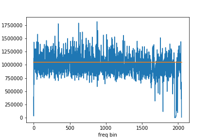
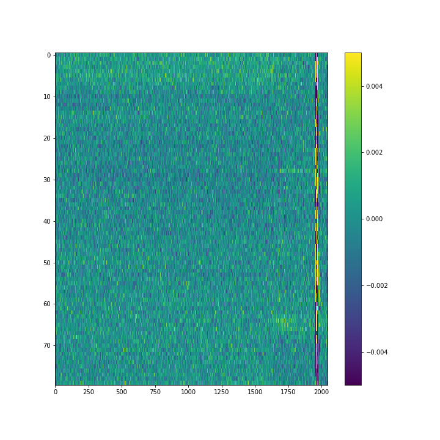
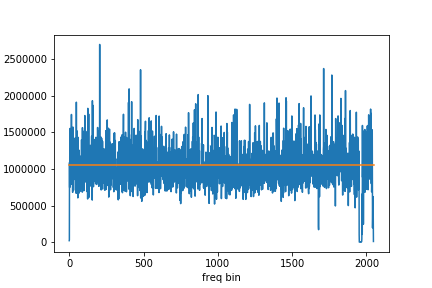
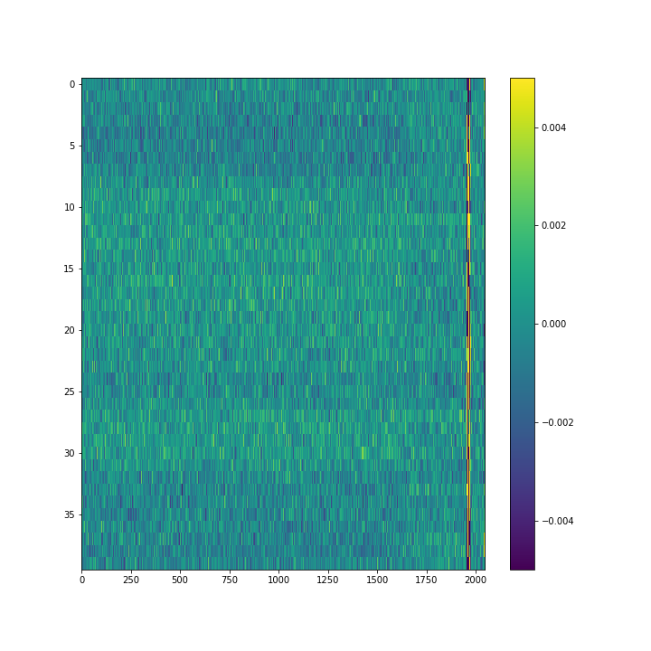
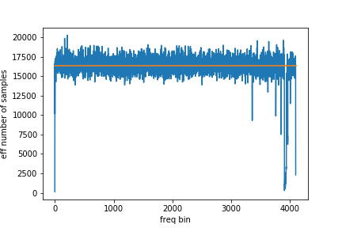
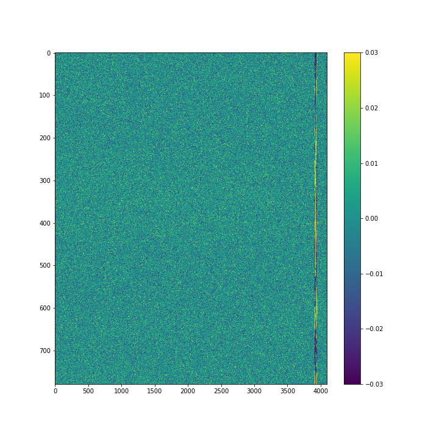

##Excess noise in the new 4-dish daq

Anze Slosar, Mar 18

### Basic idea

We do the following:
 * take data without noise diode
 * take a relatively small chunk of data containing tens of independent samples
 * In each frequency bin, fit a straight line as a function of time and divide by it
 * Calculate the variance around this line (now normalized to unit power)
 * The effective number of samples going into this 1/var (as tested on a toy FFT)
 
We took three files:

 * Case 1: New integration, 2048 freq samples @ 33ms * 128 average, RFI rejection on, Neff=8192*128
 * Case 2: New integration, 2048 freq samples @ 33ms * 128 average, RFI rejection off, Neff=8192*128
 * Case 3: Old integration, 4096 freq samples @ 122ms, no average, no RFI, Neff=16384

Plot below show:

 * Inferred number of samples as a function of frequency bin
 * The residuals after linear regression has been divided out

**Figure: Ch1, Case 1 **

**Figure: Ch1, case 2 **

**Figure: Ch1, Case 3 **

